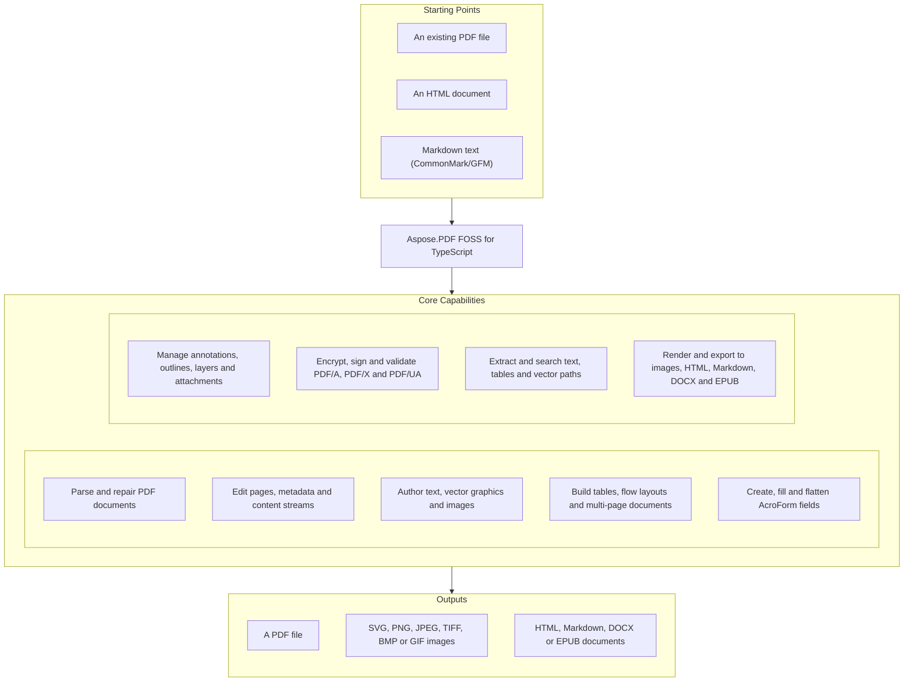

# Aspose.PDF FOSS for TypeScript

[](LICENSE) [](package.json) [](https://github.com/aspose-pdf-foss/Aspose.PDF-FOSS-for-TypeScript/graphs/contributors)

[](https://products.aspose.org/pdf/typescript/)

Aspose.PDF FOSS for TypeScript is a free, open-source, zero-dependency TypeScript library for
reading, manipulating, and writing PDF files in Node.js.

The library parses an entire PDF into an in-memory object model on `Open`. All mutations (page
edits, metadata changes, reordering) act directly on that live model, and `Save()` serializes a
fresh, renumbered document from it — no incremental updates, no temp files.

## Navigation

- [At a Glance](#at-a-glance)
- [Key Capabilities](#key-capabilities)
- [Installation](#installation)
- [Dependencies](#dependencies)
- [Quick Start](#quick-start)
- [Additional Examples](#additional-examples)
- [API Reference](#api-reference)
- [Documentation & Resources](#documentation--resources)
- [Scope and Limitations](#scope-and-limitations)
- [Development and Testing](#development-and-testing)
- [License](#license)

## At a Glance



## Key Capabilities

- Parse both classic cross-reference tables and cross-reference streams, including object
  streams (`/ObjStm`); every filter (`FlateDecode` with PNG/TIFF predictors, `LZWDecode`,
  `ASCII85Decode`, `ASCIIHexDecode`, `RunLengthDecode`) has a matching encoder. When the
  cross-reference structure is damaged, `Document.Open` falls back to scanning the file and
  reports exactly what it repaired and lost through `doc.recovery`.
- Open PDFs protected with the standard security handler — RC4, AES-128 or AES-256 — and write
  encrypted output the same way, or as an `/Adobe.PubSec` certificate envelope for RSA/EC
  recipients. Digital signatures (`await doc.Sign(signer, opts?)`/`doc.Certify`) support the
  `adbe.pkcs7.detached` (CMS) and `ETSI.CAdES.detached` (PAdES) subfilters from a `.p12`/`.pfx`
  keystore, DocMDP certification, RFC 3161 timestamps (`AddDocumentTimestamp`), LTV validation
  data (`AddValidationData`, `/DSS`), and full verification (`VerifySignatures`,
  `VerifyDocumentTimestamps`) including `/ByteRange` integrity and revocation checks.
- Access and edit every page through `doc.Pages` — all five boundary boxes, rotation, resources,
  decoded content — and manipulate the page set with `AddPage`, `InsertPage`, `RemovePage`,
  `Reorder`, `Split`, `ExtractPages`, `Append` and `Document.Merge`.
- Stamp and flow text with `AddText`/`AddTextBlock` and `doc.NewFlow`, using the 12 Standard-14
  Latin fonts or an embedded TrueType/OpenType/WOFF/WOFF2 font, with optional complex-text
  shaping for bidi, Arabic and OpenType GSUB/GPOS scripts.
- Draw vector graphics with `page.Graphics()` (lines, shapes, gradients, tiling patterns) and
  embed raster images (JPEG, PNG, BMP, TIFF) or vector SVG assets with `page.AddSVGObject(data,
  [x, y, w, h], opts?)` — the SVG importer covers gradients, `/SMask`/`/S /Alpha` masks, markers,
  patterns, filters (`opts.filterScale`), `<textPath>`, a real CSS cascade, and an `opts.font`/
  `opts.resolveImage` hook for fonts and non-`data:` image references; anything it cannot draw is
  named in `result.skipped`.
- Stamp a repeating text or image watermark (`doc.AddWatermark(opts)`), fill header/footer bands
  with page/date/Bates tokens (`doc.AddHeaderFooter(opts)`), and stamp a chained Bates sequence
  (`doc.AddBatesNumbering(opts?)`) across a 1-based page range or range string (e.g.
  `'1-5,8,12-'`).
- Build tables (`createTable`, spans, pagination, auto-fit columns) and multi-column flow
  documents (`doc.NewFlow`) with headings, lists, images and floats, including a table of
  contents (`page.AddTOC`) with a leader rule and clickable links.
- Render CommonMark/GFM Markdown or a full HTML document — parsed by a real HTML5 tokenizer and
  tree constructor, styled through a CSS cascade, and laid out as a CSS box tree — into a flow,
  a page rectangle, or a whole document with `AddMarkdown`/`AddHtml`.
- Generate 1D barcodes (Code 128, EAN-13, UPC-A, EAN-8) and QR codes as vector shapes or a 1-bit
  image mask, and impose pages into N-up sheets or a saddle-stitch booklet with `doc.NUp`/
  `doc.Booklet`.
- Extract text (`GetText`, `GetTextFragments`, `GetStructuredText` — composite fonts resolved
  through their `/CIDSystemInfo` and CID-to-Unicode tables), tables (`GetTables`, including
  cross-page stitching and a `{ region }` option to constrain extraction to a page-space
  rectangle), and vector paths (`GetPaths`) from any page, and search or replace text with
  `Search`/`ReplaceText`, including annotation-carried and annotation-drawn text.
- Enumerate and edit embedded images through `page.Images`/`page.InlineImages` — `RawData`
  returns the encoded stream bytes, `img.Replace(data)` swaps the picture in place, and
  `img.Remove()` drops it from the page.
- Redact content by rectangle or by text search (`Redact`/`RedactText`) — glyphs and images under
  the region are truly removed from the saved file, not merely covered — with a mark-then-apply
  workflow via `AddRedact`/`MarkRedactText`/`ApplyRedactions`.
- Create, fill and style AcroForm fields, regenerate their appearance streams so values render
  without `/NeedAppearances`, and round-trip field data through FDF/XFDF import and export.
- Read, write and search annotations (16 subtypes), outlines/bookmarks (including `/Count`),
  page labels, named destinations, document-level JavaScript, embedded-file attachments and
  portfolios (`SetCollection`/`GetCollection`, with per-file custom values via
  `Attachment.SetField(name, value)`), and manage optional-content (OCG) layers including
  authoring, visibility resolution and layer deletion.
- Read and author tagged-PDF structure — `doc.GetStructTree()`/`doc.IsTagged`/`doc.Lang` read it
  back, `AutoTag` infers structure from layout for an untagged document, and
  `doc.CreateStructTree()`/`element.Append(...)`/`element.NextMcid(page)`/
  `PageGraphics.BeginMarkedContent` let you author your own and mark content into it — page
  operations that copy structure (`Split`, `ExtractPages`, `Append`, `Document.Merge`) carry a
  tagged source's tree along automatically unless `{ preserveStructure: false }` opts out — then
  validate against PDF/UA, and validate or convert to PDF/A and PDF/X with a detailed, honest
  report of what was and wasn't fixed.
- Render a page to SVG or a raster image (PNG/JPEG/TIFF/BMP/GIF) with a pure-TypeScript software
  rasterizer, and export a whole document to reflowable or fixed-layout HTML, Markdown, DOCX or
  EPUB — each export verified against browser-rendered or real-application goldens rather than
  the library's own output.
- Optimize a document in place with `doc.Optimize({ fonts, dedup, compress })` — it subsets
  embedded fonts, recompresses photographic images, and prunes unused `/AcroForm` resources
  losslessly, returning an `OptimizeReport` naming anything it skipped — and convert pages or
  images to grayscale.

<details>
<summary>View Full Capability Details</summary>

#### Detailed Capability Reference

- **Parsing** — classic cross-reference tables and cross-reference streams, object streams (`/ObjStm`); stream decoding for `FlateDecode` (with PNG/TIFF predictors), `LZWDecode`, `ASCII85Decode`, `ASCIIHexDecode`, and `RunLengthDecode`, including multi-filter chains. Matching stream **encoders** — `ascii85Encode`, `asciiHexEncode`, `lzwEncode`, `runLengthEncode`, plus `encodeStream(bytes, filter)` — build streams in any of these filters (`FlateDecode` too).
- **Encrypted documents** — opens PDFs protected with the standard security handler: RC4 (V2/R3), AES-128 (V4/R4 `AESV2`), and AES-256 (V5/R6 `AESV3`). Pass the password via `Document.Open(buf, { password })`; a wrong or missing password throws `InvalidPasswordError`. Output is unencrypted unless you ask for encryption — `Save({ encrypt })` writes RC4, AES-128 or AES-256 with the standard handler, or a `/Adobe.PubSec` certificate envelope (see *Encrypted output* below).
- **Page access** — `doc.Pages` exposes one `Page` per page with all five boundary boxes (`MediaBox`, `CropBox`, `BleedBox`, `TrimBox`, `ArtBox` — read/write), `Rect`, `Rotate` (read/write), `Resources`, `Contents` (decoded), and `Annotations`.
- **Page manipulation** — `AddPage`, `InsertPage`, `RemovePage`, `Reorder`. A blank page defaults to A4; pass a `PageFormat` (`.A4`/`.Letter`/`.Legal`, `PageFormat.custom(w, h)`, `.landscape()`/`.portrait()`) to size it. Pages can be copied between documents: pass a `Page` from any document as the argument instead (the copy keeps that page's own size).
- **Split & merge** — `Split()` produces one single-page `Document` per page; `ExtractPages([...])` copies any subset of pages into a new document; `Append`, `InsertPages`, and `Document.Merge(...docs)` combine documents.
- **Content streams** — `parseContentStream` tokenizes a page's content into operators and operands (including inline images); `serializeContentStream` writes them back.
- **HTML parsing** — `parseHtml(src)` turns HTML text into a node tree, following the WHATWG tokenizer and tree-construction stages, including SVG and MathML namespaces, `<template>` content and the adoption agency. Never throws. Anchored by 1,918 of web-platform-tests' 1,936 tree-construction cases. `<?target data?>` is a real processing instruction, per whatwg/html#12118. `parseHtmlBytes(bytes, { encoding? })` is the same parser for bytes, working the encoding out from a BOM, the caller's label, or the document's own `<meta charset>` — with no prescan, which is why it also honours a `<meta>` sitting past the 1024-byte window a browser gives up at.
- **Text stamping** — `page.AddText(text, x, y, options)` stamps text (watermarks, page numbers) using any of the 12 Latin Standard-14 fonts (Helvetica/Times/Courier × regular/bold/italic) or a font embedded via `doc.AddFont`/`AddFontFile` (TrueType subset / OpenType, arbitrary Unicode), preserving existing content; supports font selection, font size, RGB color, rotation, opacity, and left/center/right alignment. `page.AddTextBlock(text, [x, y, w, h], options)` flows multi-line text into a rectangle with word-wrap, `align`/`valign`, custom `leading`, `rotate` (the whole block turns about the rect origin, without reflowing), and overflow remainder. Both accept **text decoration** — `underline`, `strikethrough` and a text-tight `background` fill (metrics-driven by default, or overridden per call), plus `behind` to sink the stamp beneath existing page content — forwarded through flow paragraphs, table cells, TOC rows and watermarks/headers/footers. `page.MeasureText(text, fontSize, font?)` returns the rendered width in points.
- **Complex-text shaping (i18n)** — with an embedded OpenType font (`doc.AddFont(bytes, { shape: true })`, or per call `{ shape: true }`), `AddText`/`AddTextBlock` shape complex scripts: Unicode bidi/RTL reordering (UAX #9, `dir: 'auto' | 'ltr' | 'rtl'`), Arabic cursive joining, GSUB substitution (ligatures, contextual alternates), and GPOS kerning + mark positioning, with optional `script`/`language` OpenType tags. Shaped, ligated, and reordered text round-trips to the original Unicode via `/ToUnicode`.
- **Vector drawing** — `page.Graphics()` returns a buffered `PageGraphics` builder for lines, rectangles (square or rounded), circles/ellipses, arcs, polylines/polygons, and arbitrary paths with stroke/fill state (color, axial and radial gradient fills, tiling-pattern fills via `doc.NewTilingPattern`, line width/cap/join/miter-limit/dash, constant opacity); `apply()` splices the drawing into the page, preserving existing content. It draws *unmarked* content: in a tagged document that is reported by `ValidatePdfUa` as `UntaggedContent`, which is correct — wrap decoration in `BeginArtifact()` … `EndMarkedContent()`, and meaningful content in `BeginMarkedContent(type, element.NextMcid(page))`.
- **Reusable templates** — `doc.NewTemplate(w, h)` returns a Form XObject template whose `page` accepts every authoring API (`AddText`, `AddImage`, `AddTable`, `Graphics()`, `AddSVGObject`); `PlaceOn(page, rect, opts?)` draws it on any number of pages from one allocated object, with `fit`/`opacity`/`rotation` and `/Figure`/`/Artifact` marking. The first placement freezes the template.
- **Image insertion** — `page.AddImage(data, [x, y, w, h], opts?)` embeds a JPEG (`DCTDecode` passthrough — DeviceRGB/Gray/CMYK, with Adobe-APP14 CMYK inversion handled) or PNG (`FlateDecode`; palette, interlaced/Adam7, alpha→`/SMask`, and palette `tRNS`→`/SMask` handled) or BMP (decoded to samples and stored as `FlateDecode`; `BITMAPCOREHEADER` through `BITMAPV5HEADER`, 1/2/4/8-bit palettes kept as `/Indexed`, 16-bit RGB555 and `BI_BITFIELDS`, 24-bit, 32-bit BGRX and BGRA→`/SMask`, RLE4/RLE8, both row orders, and a `BI_JPEG`/`BI_PNG` payload unwrapped to its own route) or a TIFF (`FlateDecode`; both byte orders, strips and tiles, 1/2/4/8-bit gray and palette, 8-bit RGB and CMYK, CCITT G3/G4 through the same decoder the `CCITTFaxDecode` filter uses, LZW, Deflate, PackBits, horizontal differencing, associated and unassociated alpha, and multi-image files through `opts.page`) as an Image XObject and paints it at the given rectangle.
- **SVG embedding** — `page.AddSVGObject(data, [x, y, w, h], opts?)` parses an SVG asset and draws it as a Form XObject fitted to the rectangle, honouring the file's own `viewBox`/`preserveAspectRatio` (override with `opts.fit`: `'meet'`/`'slice'`/`'fill'`) and always clipping to the rect. Covers paths (all commands including arcs), `rect`/`circle`/`ellipse`/`line`/`polyline`/`polygon`, `g`/`defs`/`use`, `clipPath`, `transform` lists, and solid paint (`fill`, `stroke`, widths, caps, joins, dashes, `fill-rule`, opacities) from presentation attributes and inline `style=`. **Gradients** — `linearGradient` and `radialGradient` on a fill or a stroke — become PDF shading patterns: stops (`offset`, `stop-color`, `stop-opacity`, including hard colour edges), `gradientUnits` (`objectBoundingBox` and `userSpaceOnUse`), `gradientTransform`, `spreadMethod` (`pad`, `reflect` and `repeat`, on linear and radial gradients alike), and `href`/`xlink:href` reuse between gradient elements. A **per-stop varying `stop-opacity`** is exact too, rendered through a luminosity `/SMask` — a grayscale twin of the shading inside a transparency group — while a uniform one folds into the constant alpha. Where a shape's fill and stroke need *different* masks the two are painted as separate operations, which is exact; inside a `<text>` element, where that split is not available, the mask is dropped and the gradient named in `result.skipped`. **Text** — `text` and `tspan`, including mixed content and `<text>` reached through `<use>` — renders too: `font-family` (a CSS list, generics included), `font-weight`/`font-style`/`font-size`, per-character `x`/`y`/`dx`/`dy`/`rotate` lists, `text-anchor` (per anchored chunk), `dominant-baseline`, `letter-spacing`/`word-spacing`, `textLength` with both `lengthAdjust` modes, `text-decoration`, gradient fills, and SVG's whitespace collapsing (`xml:space="preserve"` opts out). Two text limitations, both about fonts an SVG cannot carry: a **`font-family` outside the 12 Latin Standard-14 faces is silently substituted** with the nearest of them (serif → Times, monospace → Courier, otherwise Helvetica) and is *not* named in `skipped` — pass `opts.font` with a `doc.AddFont()` handle to supply the real face — while characters the resolved face cannot encode (anything outside WinAnsi, absent such a handle) are dropped and *do* name `text` in `skipped`, since ink that should exist does not. **Masks** — `<mask>` on a shape or a group, through a PDF soft mask, and exact: SVG's mask value is luminance × alpha, and a luminosity group composited over black scales colour by alpha, so the two definitions coincide. `maskUnits` and `maskContentUnits` (both unit systems), the `-10%`/`120%` default region, nested masks, and `mask-type: alpha` (a `/S /Alpha` soft mask) are all handled. A mask whose region has no area, or whose target is missing, draws the element unmasked and names it in `result.skipped`. **Markers** — `marker-start`, `marker-mid`, `marker-end` and the `marker` shorthand on `path`, `line`, `polyline` and `polygon`, drawn as a shared Form XObject placed at each vertex. `markerWidth`/`markerHeight`, `refX`/`refY` (in viewBox coordinates), `markerUnits` (`strokeWidth` and `userSpaceOnUse`), the marker's own `viewBox`/`preserveAspectRatio`, `overflow`, and `orient` (`auto`, `auto-start-reverse`, or a fixed angle) are all handled; mid-vertex angles bisect the adjoining tangents. **CSS** — a `<style>` element anywhere in the document (including inside `<defs>`, and including one that appears *after* the elements it styles) is honoured: type, class, id, universal and grouped selectors plus descendant (`g .a`) and child (`g > rect`) combinators, cascaded by specificity, source order and `!important`. Presentation attributes sit at the bottom of that cascade, where CSS places them, so any matching rule outranks them; inline `style=` still beats a normal rule. Rules reach paint, text, gradient `<stop>` and the reference properties — `clip-path`, `clip-rule`, `mask` and `filter` — alike, so a stylesheet can both apply a clip and switch one off with `clip-path: none`. At-rules (`@media`, `@import`, `@font-face`), attribute and pseudo-class selectors, and sibling combinators are **not** supported and name `style` in `result.skipped` — `@font-face` in particular can never be honoured, since an SVG cannot carry a font program; use `opts.font` instead. **Patterns** — `<pattern>` becomes a PDF tiling pattern: `x`/`y`/`width`/`height` under `patternUnits` (`objectBoundingBox` default or `userSpaceOnUse`), `patternContentUnits`, `patternTransform`, `viewBox` + `preserveAspectRatio`, and `href`/`xlink:href` reuse between pattern elements. Tile content is anything the walker can draw — shapes, groups, `use`, clip paths, gradients, text, and nested patterns behind a cycle guard — emitted as the pattern's own content stream with its own resources. `overflow="visible"` is honoured by growing the pattern's `/BBox` past its step so cells overlap and content spills; where spilled content overlaps a neighbouring cell, PDF leaves the paint order between cells implementation-dependent, so stacking may differ from a browser's. A pattern with no children, or with a zero-area tile, paints nothing and is *not* reported — SVG mandates that outcome, as it does for a stopless gradient. **Images** — `<image>` embeds a `data:` URI carrying a PNG or JPEG as an Image XObject: `x`/`y`/`width`/`height` (an absent dimension takes the image's intrinsic pixel size, or is derived from the other through its aspect ratio) and `preserveAspectRatio` (all nine align keywords with `meet`/`slice`/`none`, the `slice` overflow clipped to the element rect). The declared media type is ignored in favour of the bytes' own magic numbers, since data URIs in the wild carry wrong ones. Two elements sharing an href embed one XObject. An href that is **not** a `data:` URI — a relative path, `http:` — embeds nothing and names `image` in `result.skipped` unless you pass `opts.resolveImage`, a synchronous `(href) => Uint8Array | undefined` the library calls for any href it cannot decode itself (including a `data:` payload whose bytes are not PNG or JPEG). Returning `undefined` declines and reports as before; a throw propagates, since that is a bug in the caller rather than a missing image. The library still performs no I/O of its own, so fetch the bytes first and resolve out of a map. A payload that is **`image/svg+xml`** is parsed and drawn as a nested Form XObject rather than a raster: the `<image>` rect becomes a new viewport, the payload's own `viewBox` and `preserveAspectRatio` fit its content into it (the `<image>`'s own `preserveAspectRatio` is not consulted), and the result is clipped to the rect. The payload is a separate document — its ids, stylesheet and markers do not see the enclosing file's, and vice versa — while anything it could not render is still reported in the outer `skipped`. Nesting is capped at 4 levels, past which the element reports `image`; so do a malformed payload and one whose root is not `<svg>`. A payload that is neither a raster nor SVG is reported the same way; a zero or negative `width`/`height` draws nothing and is *not* reported, as SVG mandates. `fill-opacity` is correctly ignored for an `<image>`, which SVG does not apply it to; only group `opacity` reaches the image's constant alpha. **Filters** — `filter="url(#…)"` covers **all of SVG 1.1's filter primitives** plus `feDropShadow`: `feBlend`, `feColorMatrix` (`matrix`/`saturate`/`hueRotate`/`luminanceToAlpha`), `feComponentTransfer` (`identity`/`table`/`discrete`/`linear`/`gamma`), `feComposite` (Porter-Duff and `arithmetic`), `feConvolveMatrix`, `feDiffuseLighting`, `feDisplacementMap`, `feDropShadow`, `feFlood`, `feGaussianBlur`, `feImage`, `feMerge`, `feMorphology`, `feOffset`, `feSpecularLighting`, `feTile` and `feTurbulence` (`fractalNoise` and `turbulence`, with `stitchTiles`), together with `feDistantLight`/`fePointLight`/`feSpotLight`, `filterUnits`/`primitiveUnits`, per-primitive subregions, `in`/`result` wiring, and `color-interpolation-filters` (linearRGB by default, `sRGB` opt-in). `feImage` resolves a same-document element reference or a `data:` URI raster; an external href is refused unless `opts.resolveImage` supplies its bytes, since the library performs no I/O (with a resolver present such an href reaches rasterization, so one that then declines reports `filter` rather than `feImage`). PDF has no filter model, so a filtered subtree is generally **rasterized**: it renders correctly but is resolution-bound, and its text stops being extractable or searchable. Four chain shapes escape that, because PDF expresses them exactly — a lone `feOffset` (and the one-node `feMerge` that means the same thing), a lone `feFlood`, and `feFlood` + `feComposite operator="in"`, the recolour-an-icon recipe, which becomes an `/S /Alpha` soft mask. These stay vector, keep their text extractable, ignore `filterScale`, and are **not** named in `rasterized`. `opts.filterScale` (default 2, max 8) sets that resolution as a multiple of the placed size, and every element flattened this way is named in the result's **`rasterized`** array — distinct from `skipped`, which still means a fidelity loss. `FillPaint` and `StrokePaint` are supported for solid paint — infinite planes of the element’s own `fill`/`stroke`, with `none` giving a transparent plane; per SVG 1.1 §15.7.3 these are the *paint*, so `fill-opacity`/`stroke-opacity` are deliberately not folded in, and a plane is the filter region rather than truly infinite. An unresolvable `in`, a malformed `feConvolveMatrix` kernel, a lighting primitive with no light source, a `FillPaint`/`StrokePaint` naming a gradient or pattern, or the `BackgroundImage`/`BackgroundAlpha` pseudo-inputs make the element draw **unfiltered** and report — visible ink beats silently dropped content. A filter region with no area renders the element as nothing and is *not* reported, as SVG mandates. `feTurbulence` and the lighting primitives are ports of the spec's published reference implementations, so they are verified against browser-rendered goldens in `test/fixtures/svg-filter/` rather than against themselves. **`<textPath>`** lays text along a path: `href`/`xlink:href` to a `<path>` or SVG 2's inline `path=`, with `startOffset` (a length or a percentage of path length), `side` and `spacing`. Glyphs are placed by the midpoint of their advance and rotated to the path's tangent, so they stay real text — extractable and searchable — and an underline turns with them. Absolute `x`/`y` do not apply to text on a path (only `dx`/`dy` do), and a glyph whose midpoint falls beyond either end is not rendered, as SVG mandates; neither is text on a path with no extent. `method="stretch"` warps the glyph outlines along the curve instead of placing upright glyphs: the run is painted as vector contours — gradients, patterns and strokes all still apply — with an invisible text layer behind it, so it stays extractable and searchable. Standard-14 outlines come from the bundled metric-compatible substitutes, so their shapes are approximate in the same way `ToImage` is; pass `opts.font` for the real face. A face with no outline source falls back to `align` and names `textPath` in `result.skipped`, as does a `href` that resolves to nothing, which draws the text on the baseline rather than dropping it. Group **`opacity`** composites the subtree as a unit through a PDF transparency group, so overlapping children no longer darken where they cross. Where the element paints exactly once — a shape with only a fill or only a stroke, or an `<image>` — the alpha folds into the graphics state instead, which is exact and avoids a Form XObject per faded shape.
- **Table authoring** — `createTable()` builds rows/cells with fixed/fractional column widths, colspan and rowspan (a `rowSpan` group is never cut across a page or column break), plus a table→row→cell style cascade (borders, background fills, H/V alignment, padding); `page.AddTable(table, x, top, { width })` lays it out and draws it, continuing a too-tall table onto further pages (manual remainder or `autoPaginate`), with optional repeating header rows (`setRepeatingRowsCount`) and `table.autoFitColumns()` to size columns from their content instead of splitting the width equally (proportional to each column's widest unwrapped line, floored at its widest single word, falling back to equal shares when even the floors do not fit; Markdown tables use it by default, hand-built ones opt in) and per-cell images (`cell.setImage`). `{ tagged: true }` emits `/Table` > `/TR` > `/TD`/`/TH` logical structure, with borders and backgrounds as artifacts, so a tagged document containing a table passes `ValidatePdfUa`'s `UntaggedContent`.
- **Table of contents** — `page.AddTOC(entries, [x, y, w, h], opts?)` renders a TOC: titles wrapped to a title column and indented by `level`, dot leaders, right-aligned page labels (defaulting to each target page's logical `/PageLabels` label), and one borderless GoTo link per row. Rows are atomic; a too-long TOC returns a re-drawable `remainder` or appends pages with `autoPaginate`.
- **Flow layout** — `doc.NewFlow({ format, columns, columnGap, margin*, paragraphSpacing, tagged })` builds a multi-column document flow. `flow.AddParagraph(text, options)` adds word-wrapped body text, `flow.AddHeading(level, text, options)` adds a heading (level 1–6 → a default size ramp and Helvetica-Bold, both overridable, kept with the element after it by default), `flow.AddList(items, options)` adds a bullet or numbered list (nestable, per-item style overrides), `flow.AddImage(data, options)` places a JPEG/PNG as its own atomic block, and `flow.AddColumnBreak()` forces the next column; every element accepts `spaceBefore`/`spaceAfter` and `clear`. `doc.NewFloatingBox({ width, padding, border, background })` builds a box of paragraphs and images (its `border` takes the table `sides` vocabulary, so a left-rule pull-quote is `sides: { left: true }`) that either `flow.AddFloatBox(box, 'left' | 'right')` floats so surrounding text wraps in the narrowed channel beside it, or `flow.AddFloatingBox(box)` places in the flow itself as an atomic block with nothing beside it. `flow.Render()` appends freshly sized pages (`PageFormat.A4`/`Letter`/`Legal`/`custom`, `.landscape()`/`.portrait()`) and auto-paginates across columns and pages; with `tagged: true` it also emits logical structure (`/H1`–`/H6`, `/P`, `/L`/`/LI`/`/Lbl`/`/LBody`, `/Figure`).
- **Markdown to PDF** — render CommonMark 0.31.2 (and GFM with `{ gfm: true }`) into a flow, into a rect on a page, or a whole document in one call: `flow.AddMarkdown`, `page.AddMarkdown`, `doc.AddMarkdown`. Headings, paragraphs with inline styling, lists (tight/loose, task items), code blocks, block quotes, thematic breaks and figures. An image renders as a block figure when it is alone in its paragraph and **inline, among the words**, when it is not — sized at 0.75pt per intrinsic pixel, the 96-dpi convention, so it matches what `AddHtml` draws for the same picture; `data:` URIs are decoded for you and anything else comes through a `resolveImage: (destination, title) => Uint8Array | undefined` option, so the library touches neither `fs` nor the network. GFM tables become flow-paginated tables that split by row and repeat their header row, with the full inline vocabulary inside each cell; links become clickable `/URI` annotations placed over their own laid-out glyphs, one per line a link wraps onto. Under a tagged flow both participate in the structure tree (`/Table` > `/TR` > `/TH`/`/TD`, and a `/Link` element carrying the link text plus an `/OBJR`), as do code blocks (`/P` > `/Code`) and block quotes (`/BlockQuote`). Supply `lang` and `title` and the result passes `ValidatePdfUa` outright.
- **HTML to PDF** — render an HTML document into a flow, into a rect on a page, or a whole document in one call: `flow.AddHtml`, `page.AddHtml`, `doc.AddHtml`. The source is parsed by a full HTML5 tree constructor and styled through a CSS cascade (a UA sheet transcribed from HTML §15, author `<style>` elements and `style=` attributes, 43 longhands, selectors up to `:has()`), then laid out as a CSS box tree — block and inline formatting contexts, anonymous boxes, used widths per CSS 2.1 §10.3.3, and full margin collapsing — and lowered onto the same flow elements Markdown uses, so it paginates, tags and mixes with hand-built content with no second layout engine. Block backgrounds, borders and padding are painted, and a box split across a column keeps its side borders while drawing its top and bottom exactly once. Headings become `/H1`..`/H6` under a tagged flow and take part in keep-with-next; a run of `display: list-item` siblings becomes one list, so ordinals run continuously and `/L` > `/LI` > `/LBody` follows. `font-family` resolves against the document’s registered font folders first (`RegisterFontFolder`) and falls back to the Standard-14 generics — `serif` → Times, `sans-serif` → Helvetica, `monospace` → Courier — so it renders with no setup at all; note that makes an unstyled paragraph **Times**, since the UA sheet declares `html { font-family: serif }`. `doc.AddHtml` adopts the source’s `<title>` as the PDF title unless you give one. **Tables render** through the same table engine `page.AddTable` uses — spans, repeating `<thead>` rows, per-cell borders and backgrounds, auto-fitted columns, pagination and `/Table` tagging — and an `` renders either as a block figure when it is alone or **inline, on a line of text, among the words** — with `data:` URIs decoded for you and anything else supplied through a `resolveImage: (src, alt) => Uint8Array | undefined` option, so the library touches neither `fs` nor the network. **Floats place**, with text wrapping beside them and `clear` honoured; a few float, table and image cases degrade rather than drop. **Everything that does not render as the source specified names itself in `skipped`** — a list of records carrying the offending element, a construct name and a `kind` of `dropped` (nothing drawn) or `degraded` (drawn, but not as specified); `describeNotRendered(r)` flattens one to a string for logging. Content taller than an empty column **renders rather than refusing the document** — an image scales to fit, anything else draws past the column bottom — and both are reported; because they are decided while placing, a `Flow` (whose `AddHtml` returns before `Render` runs) receives them through an `onNotRendered` callback instead. See [Limitations](#scope-and-limitations).
- **Flow blocks** — `AddCodeBlock`, `AddQuote`, `AddRule` and `AddTable` beside the existing `AddParagraph`/`AddHeading`/`AddList`/`AddImage`, with public element builders (`paragraph`, `heading`, `list`, `image`, `codeBlock`, `quote`, `rule`, `table`) for composing nested content.
- **Barcodes** — `page.AddBarcode(spec, [x, y, w, h], opts?)` generates and places 1D (Code128, EAN-13, UPC-A, EAN-8) and 2D (QR) barcodes as vector rectangles or a 1-bit `/ImageMask` stencil (`render: 'raster'`), with `color`, `quietZone`, human-readable `text` for 1D codes, `layer`, and structure marking (`tag`/`alt`/`artifact` — see below). QR auto-selects mode (numeric/alphanumeric/byte), version (1–40), and mask, at any of the four ECC levels. The pure generators (`makeCode128`/`makeEan13`/`makeUpcA`/`makeEan8`/`makeQr`) return a module model for custom placement. Generation only — decoding is out of scope.
- **Page composition** — `page.StampWith(src, opts?)` places another page's content (from this or another document) onto the page as a shared Form XObject — letterheads, watermarks, backgrounds. The source is imported once and left untouched; by default it is fitted to the page's CropBox and drawn on top (`mode: 'underlay'` draws behind), with `rect`, `opacity`, and an extra clockwise `rotate` (0/90/180/270) options. `doc.Overlay(src, opts?)` is the multi-page convenience: `src` may be a `Page` or a `Document` (first page used), imported **once** and placed on every page (or just `pages: [...]`) — the same `underlay` / `rect` / `opacity` / `rotate` options apply. `doc.NUp(cols, rows, opts?)` imposes the document's pages `cols`×`rows` per sheet into a **new** `Document` (this one untouched), each page scaled-to-fit and centered in its grid cell (`pageSize`, `margin`, `gutter`, row/column `order`, and `drawBorder` to frame each imposed cell for a readable proof sheet). `doc.Booklet(opts?)` imposes the pages as a saddle-stitch booklet into a **new** `Document` — padded to a multiple of 4 and reordered so printing duplex and folding down the middle reads in sequence, two pages per printed side (`binding` for an RTL book, `pageSize`, `margin`, `gutter`, and `creep` to compensate for the fore-edge push-out of nested sheets). By default the whole book is one signature; `sheetsPerSignature` splits it into several separately-folded signatures (40 nested sheets is not physically foldable), the last one short unless `padSignatures` pads every signature full. `page.Resize(box, opts?)` sets the MediaBox/CropBox (optionally scaling content to fill it) and `page.Scale(factor)` uniformly scales a page's content and boundary boxes.
- **Page decoration** — `doc.AddWatermark(opts)` stamps a repeating text or image watermark across a page range (exactly one of `text`/`image`), `doc.AddHeaderFooter(opts)` fills up to three cells per band (`header`/`footer` × `left`/`center`/`right`), and `doc.AddBatesNumbering(opts?)` stamps a Bates sequence, returning the next unused number so a run chains across a document set. Text carries `{page}`/`{total}`/`{label}`/`{date}`/`{time}` tokens (and `{bates}`), resolved per page; an unknown token throws rather than stamping literal text. Pages are selected with a 1-based array or a range string (`'1-5,8,12-'`). Positioning presets (`diagonal`, `center`, the four corners and edge centers) anchor to the page **as displayed**, so stamps land correctly and upright regardless of `/Rotate` or a non-zero CropBox origin, with `opacity`, `rotate`, `margin`, and overlay/underlay options. A diagonal watermark auto-fits to the page diagonal; an image watermark is embedded once and shared across every stamped page.
- **Text extraction** — `page.GetText()` returns the page's visible text with reasonable word/line ordering. It walks the content stream coordinate-by-coordinate and decodes through simple-font encodings (WinAnsi/MacRoman/Standard/PDFDoc + `/Differences`), `/ToUnicode` CMaps, and composite (Type0) fonts, recursing into Form XObjects. A composite font's `/Encoding` resolves through its CMap — an embedded CMap stream or any of the 195 bundled predefined Adobe CMaps (Adobe-Japan1, GB1, CNS1, Korea1, KR, Identity), following `usecmap` chains — so codes of mixed byte-width (Shift-JIS, EUC, Big5, UHC) split correctly and each code maps to the CID that selects its glyph and its `/W` advance; a name outside the bundled set degrades to Identity. A font with no `/ToUnicode` — or a partial one — still extracts: the CID resolves to a character through Adobe's published table for the collection its `/CIDSystemInfo` names (Adobe-Japan1, GB1, CNS1, Korea1, KR, all bundled), with `/ToUnicode` taking precedence wherever it has an answer. A CID neither source can map contributes no text rather than a replacement character, and an unrecognised registry or ordering (including `Identity`, whose CIDs are glyph indices with no character meaning) is left unmapped rather than guessed at. Vertical writing (`/WMode 1`, the `-V` CMaps) is honoured: glyphs advance down the page by `/W2`/`/DW2` and are placed at their per-glyph vertical origins, and extraction reads each column top-to-bottom with columns ordered right-to-left, reporting `vertical: true` on the fragment. A page mixing directions lays each out under its own rule, vertical text first. Returns `""` for pages with no text. `page.GetTextFragments()` returns the same text as positioned `TextFragment[]` — runs of consecutive glyphs sharing one font, size, and baseline, each with a page-space `quad`, `fontSize`, and `fontName`. `page.GetStructuredText()` assembles those fragments into a `TextBlock[]` tree (blocks → lines → fragments) grouped by baseline, vertical gap, and left-edge alignment.
- **Table extraction** — `page.GetTables()` reconstructs ruled and borderless tables from page geometry (vector ruling lines plus positioned text). It returns a `Table[]` model — `rowCount`, `colCount`, and `rows` (`TableRow[]` → `TableCell[]` with `row`/`col`/`rowSpan`/`colSpan`, a page-space `quad`, and cell `text`) — with spanning cells derived from missing interior rules. Each `Table` serializes with `toHtml()` (colspan/rowspan honored) or `toMarkdown()` (GFM pipe table; spans approximated). Pass `{ region }` to constrain extraction to a page-space rectangle. Returns `[]` when no table is found — including for a ruled rectangle with no interior rule, which is page furniture (a card, a callout, a frame) rather than a one-cell table. `doc.GetTables()` runs extraction over every page and stitches continuations across page boundaries into single logical tables (`pageSpans` records the contributing page rectangles, repeated headers dropped); pass `{ stitch: false }` for the flat per-page list.
- **Vector path extraction** — `page.GetPaths()` returns the page's painted vector graphics as positioned `PagePath[]`: each carries its subpaths (lines + cubic beziers, `re` normalized to a closed rectangle, `v`/`y` normalized to full cubics) in the drawing stream's user space, the CTM in effect at paint time, a device-space bounding box (including bezier control points), resolved fill/stroke color (sRGB `[r,g,b]` 0–255) with its colorspace family (`DeviceRGB`/`DeviceCMYK`/`ICCBased`/`Separation`/`Indexed`/`Pattern`/…), the fill rule (`nonzero`/`evenodd`), stroke line width (device units), clip usage (`W`/`W*`), and marked-content `mcid`/`artifact`. One `PagePath` is emitted per paint op (`S`/`f`/`B`/…; a clip-only `W n` too). Descends into nested Form XObjects. Shadings/gradients are reported as `space:'Pattern'` (not evaluated); dash arrays, line caps, and joins are out of scope.
- **Image extraction to disk** — `saveImagesFile(inputPath, outDir, options?)` writes every embedded image as a file: `img-1.jpg`, `img-2.png`, … in document order, **with the extension always taken from the encoder's media type rather than from the source image**, since JPEG bytes under a `.png` give a file no viewer opens. Encoding is `ImageInfo.Save`’s, so the default is faithful and an unmasked `DCTDecode` is extracted byte for byte; pass `format: 'png'` or `'jpeg'` to force one. One file per *distinct* picture — identity is a hash of the encoded bytes, so a logo drawn on forty pages is written once. Returns `{ written, skipped }`: a picture that will not encode names itself, its page and its reason in `skipped` while its neighbours are still written.
- **Artifact enumeration** — `page.Artifacts` lists the `/Artifact` marked-content scopes a page declares: decoration (running heads, rules, page backgrounds) that carries no meaning and that a screen reader skips. Each `PageArtifact` reports what the artifact says about itself — `type` (`Pagination`/`Layout`/`Page`/`Background`), `subtype` (`Header`/`Footer`/`Watermark`), `attached` edges, and the raw `properties` dict for keys the model does not name — plus `addr`, the `ContentAddr` naming the opening `BMC`/`BDC` (with the XObject chain for one inside a form) and `parent` for a nested scope. `bbox` is the declared `/BBox` where there is one and the measured extent of the enclosed ink where there is not, `bboxSource` saying which; an artifact that draws nothing reports no `bbox` at all. Descends into Form XObjects. Read-only — this is the read side of the `artifact: true` marking the authoring APIs already take.
- **Text search** — `page.Search(find)` locates a literal string or `RegExp` over the same word/line assembly as `GetText`, returning `TextMatch[]` — each with the matched substring, one page-space quad per line it spans, and the underlying glyph `hits` (op provenance). A `RegExp` is always applied globally; matches can span inferred spaces and line breaks. Pass `options.region` to restrict the search to a page-space rectangle — a glyph is in or out by its quad **centroid**, the same rule `GetTables` uses, and the filter runs *before* line assembly, so a match straddling the boundary is not found at all rather than partially. The region flows through `ReplaceText`, `RedactText` and `MarkRedactText`, which all search the same way.
- **Annotation text search (carried)** — `page.SearchAnnotationText(find)` finds text an annotation **carries** but never draws: its body (`/Contents`), author (`/T`), subject (`/Subj`) and rich content (`/RC`, an XHTML fragment reduced to plain text, with a line break between block elements). Each hit names the entry it matched. Searches every annotation, hidden ones included, and carries no geometry — the only box available would be the whole `/Rect`.
- **Annotation text search (drawn)** — `page.SearchAnnotations(find)` finds text the page's annotations **draw** — a `/FreeText`'s visible words, a filled form field's value — which live in the annotation's `/AP` appearance stream and are invisible to `page.Search`. Returns `AnnotationMatch[]`: the annotation, the matched substring, and one page-space quad per line. Each annotation is assembled on its own, so a query never matches across two annotations or across an annotation and the page text beneath it; only annotations a static render would draw are searched. Takes the same `options.region`.
- **Text replace** — `page.ReplaceText(find, replacement)` (or `doc.ReplaceText(...)` across all pages) substitutes matched text in place, re-encoding the replacement in the matched glyphs' own font and editing the content stream directly. It is constrained to the same font and encoding with **no layout reflow** (positioning is preserved, so a wider replacement may overlap and a narrower one may leave a gap), and throws `UnsupportedFeatureError` for Type0/composite fonts or characters the encoding can't represent. Returns the number of occurrences replaced.
- **Image extraction** — `page.Images` enumerates embedded image XObjects (descending into Form XObjects), exposing `Width`, `Height`, `Bits`, `ColorSpace`, and `Filter`. `img.Save()` hands the picture back as a file — bytes plus a media type, faithfully by default, so an unmasked JPEG is returned verbatim rather than re-encoded — and `{ format: 'png' | 'jpeg' }` forces an encoding. `RawData` returns the encoded stream bytes; `Decode()` returns decoded samples for `FlateDecode`/`LZWDecode`/ASCII-filter images (with predictors and filter chains), 1-bpp samples for `CCITTFaxDecode` (Group 3 1D/2D and Group 4), 8-bit samples for `JPXDecode` (JPEG 2000 — see *JPEG 2000 decoding* below), and passes JPEG (`DCTDecode`) bytes through. Image masks and `/SMask` are handled gracefully. Images can also be edited in place: `img.Replace(data)` swaps the picture for JPEG, PNG, BMP or TIFF bytes while keeping the placement, and `img.Remove()` drops the image from the page — every draw of it in the page's content and in the Form XObjects the page descends into, plus its `/XObject` resource entry. Both are scoped to the page the handle came from: an image shared with another page is copied rather than mutated on replace, and survives removal from one page while another still draws it, so a handle from `page.Images` never silently edits a page the caller was not looking at. The new image is stretched into the existing footprint, since the `cm` that sizes it lives in the content stream. `Remove({ sanitize: true })` additionally prunes every other resource name the page no longer references. Inline (`BI…EI`) images live in no object and so are absent from `page.Images`; `page.InlineImages` enumerates them separately and each handle can `Remove()` itself. That removes exactly one draw, because an inline image *is* one draw — and because a removal shifts the op indices of every later one, a handle taken before a removal is invalidated and throws rather than cutting the wrong picture. Remove one, enumerate again. Replacing an inline image is not supported.
- **Redaction** — `page.Redact(rects, opts?)` (or `doc.Redact(page, rects, opts?)`) truly removes the text and images under one or more page-space rectangles — covered glyphs are dropped from the content stream (survivors keep their positions), fully-covered images are deleted, and the resources they orphan are pruned so the content is gone from the saved file, not merely hidden behind a box. An opaque marker rectangle (default black, configurable) is painted over each region; annotations covering the region are removed too (a covered form field goes whole, value included) unless `keepAnnotations` says otherwise; `scrubMetadata` also clears `/Info` + XMP. `page.RedactText(find | RegExp, opts?)` (and `doc.RedactText(...)`) redact **by content** — locating text with the same search as `page.Search` and removing every matched region through the same pipeline — and return the occurrence count. Redaction can also be **marked before it is applied**: `page.AddRedact(opts)` and `page.MarkRedactText(find, opts?)` add `/Redact` annotations carrying the overlay (`/IC` fill, `/OverlayText`, `/DA` style, `/Q`, `/Repeat`) without removing anything — the marked text is still extractable, and the mark draws as an outline rather than a filled box so it can never be mistaken for a finished redaction — and `page.ApplyRedactions(opts?)` (or `doc.ApplyRedactions(...)`) then destroys the marked content through the same pipeline, paints each mark's overlay (honoring an `/RO` overlay form when one is present), and removes the marks.
- **Flatten** — `page.FlattenAnnotations()` / `doc.FlattenAnnotations()` bake each annotation's `/AP /N` appearance into the page content (as a Form XObject draw placed onto its `/Rect`) and drop the now-static object from `/Annots`; `doc.FlattenForm()` generates every field's appearance, bakes the widgets, and removes the `/AcroForm` so the form is no longer interactive. Per-object flattening (`field.Flatten()`, `annotation.Flatten()`) bakes one field or annotation and leaves the rest interactive. Hidden/NoView, `/Popup`, and appearance-less annotations are left untouched.
- **Form fields (AcroForm)** — `doc.Form` enumerates fields (name, type, value) and fills text fields, checkboxes, radio groups, and choice fields, regenerating each field's appearance stream (`/AP`) so values render without `/NeedAppearances`; values survive `Save()`. Fields can also be **created**: `form.AddTextField({ page, rect, name, … })` (or `page.AddTextField`) bootstraps `/AcroForm` and its `/DR` font, wires the field into the tree — a dotted `name` builds the intermediate nodes — and generates the widget's `/AP`. Fields can be **styled** — background, border
(five `/BS /S` styles) and text colour — at creation or afterwards with
`field.SetStyle({ … })`.
- **Form data (FDF / XFDF)** — `doc.ExportFdf()` / `doc.ExportXfdf()` write the current field values as a standalone data file, and `doc.ImportFdf(bytes)` / `doc.ImportXfdf(bytes)` read one back into a form, regenerating appearances and returning an `ImportReport` of what was `imported` and what was `skipped` (unknown field names, values the field rejects). Pass `{ annotations: true }` on both sides to carry annotations as well — the 18 XFDF types, with their appearance streams — reported separately as `importedAnnots` / `skippedAnnots`.
- **Optional content (layers / OCG)** — `doc.OptionalContent` enumerates layers, reads/toggles their visibility in the default and named viewing configurations, edits configs (add/remove/rename, locked state), and deletes a layer together with its marked content (`/OC … BDC … EMC`, in page `/Contents` and recursively inside referenced Form XObject streams) and its bound annotations. Any Form/Image XObject used only by the layer — bound by its own `/OC`, or invoked (`Do`) only inside excised layer content — is removed along with its `Do` ops and resource entries (an XObject still drawn by surviving content is kept; one bound via an OCMD is un-layered). It also prunes the deleted layer out of any surviving OCMD's `/VE`/`/OCGs` membership and drops OCMDs left with no members, along with the page `/Properties` entries (direct-OCG or now-empty-OCMD) they orphan. It also **creates** new layers (`AddLayer`, with `/Order` nesting and default visibility) and tags authored content into them — `PageGraphics.BeginLayer`/`EndLayer`, `AddImage({ layer })`, and `Annotation.Layer`. It also resolves the visibility of any `/OC` value — an OCG, or an OCMD via its `/VE` visibility expression (`/And`/`/Or`/`/Not`) or `/P` policy — with `doc.OptionalContent.Default.ResolveVisibility(oc)`. Edits round-trip through `Save()` (classic and compressed).
- **Outlines (bookmarks)** — `GetOutlines` reads the nested bookmark tree (titles, expanded state, `/C` colour and `/F` bold/italic flags, and destinations from explicit `/Dest` or `/A` GoTo actions — page targets resolved, named targets reported by name); `SetOutlines` writes or replaces the whole tree, taking either destination form and wiring up the sibling/child links and `/Count` for you.
- **Page labels** — `GetPageLabels` reads the `/PageLabels` number tree into ascending ranges; `SetPageLabels` writes or replaces it; `PageLabelFor` resolves a 0-based page index to its rendered label (`prefix + numeral`) across `decimal` / `roman` / `Roman` / `alpha` / `Alpha` / `none` styles.
- **Named destinations** — `GetNamedDestinations` merges the `/Names /Dests` name tree and the legacy `/Dests` dict; `SetNamedDestination` / `RemoveNamedDestination` upsert and delete entries (writing a flat name tree, pruning empty containers).
- **Open behaviour and document JavaScript** — `doc.SetOpenDestination(dest)` / `doc.SetOpenAction(action)` author the catalog `/OpenAction` in either shape 32000-1 permits, read back through one `GetOpenAction()`; `doc.SetJavaScript(name, script)` / `GetJavaScripts()` / `RemoveJavaScript(name)` author the document-level `/Names /JavaScript` tree.
- **Viewer preferences** — `doc.GetViewerPreferences()` / `SetViewerPreferences(update)` read and merge the catalog `/ViewerPreferences`, 32000-1 Table 150 in full: the window and chrome flags, `NonFullScreenPageMode`, `Direction`, the view/print area and clip boxes, `PrintScaling`, `Duplex`, `PickTrayByPDFSize`, `NumCopies` and `PrintPageRange` (as inclusive 1-based pairs). The getter reports only what the document states, so a stated `false` stays distinguishable from silence.
- **Page mode and page layout** — `doc.PageMode` and `doc.PageLayout` are the two catalog entries (32000-1 Table 28) that say how a document asks to be opened: which of a viewer’s panels is showing (`UseNone`/`UseOutlines`/`UseThumbs`/`FullScreen`/`UseOC`/`UseAttachments`) and how pages are arranged (`SinglePage`/`OneColumn`/`TwoColumnLeft`/`TwoColumnRight`/`TwoPageLeft`/`TwoPageRight`). `FullScreen` is what makes a viewer *present* a document, so it is what `page.Transition` and `page.Duration` need to add up to a slide deck. Both report only what the document states (`undefined`, never the default), read leniently, validate before writing, and take `null` to remove the entry.
- **Page transitions** — `page.Transition` reads and writes the `/Trans` dictionary, 32000-1 Table 165 in full (the twelve styles, the effect duration, dimension, motion, direction, and Fly's scale and opacity), and `page.Duration` the `/Dur` beside it — how long the page is shown before advancing. Assigning replaces the dictionary wholly and validates before writing, refusing a value the stated style does not admit.
- **Embedded files / attachments** — embed files at the document level (`AddAttachment` / `GetAttachments` / `RemoveAttachment`, surfaced in a viewer's attachments panel via the `/Names /EmbeddedFiles` tree) or as on-page `FileAttachment` annotations (`page.AddFileAttachment`). Bytes are `FlateDecode`-compressed by default (`compress: false` to store raw); `/Params` carries `/Size`, an MD5 `/CheckSum`, and creation/modification dates.
- **Portfolios (collections)** — `SetCollection` / `GetCollection` / `RemoveCollection` author the `/Root /Collection` presentation layer over the attachments: a column schema (built-in `filename` / `size` / dates plus custom `string` / `date` / `number` fields), view mode (`details` / `tile` / `hidden`), sort field, and initial document. Per-file custom values are set on the attachment handle via `Attachment.SetField(name, value)`.
- **Annotations** — `page.Annotations` returns a typed `Annotation` model (subclasses chosen by `/Subtype`, with a `.Dict` raw escape hatch) and live accessors. Create and edit with `AddTextNote` (sticky notes), `AddStamp` (standard-name, custom-text, or image rubber stamps), the text-markup family `AddHighlight`/`AddUnderline`/`AddStrikeOut`/`AddSquiggly` (over `/QuadPoints`), and `AddLink` (internal GoTo or external URI); `RemoveAnnotation` deletes. Stamp and markup annotations get generated `/AP` appearance streams.
- **Metadata** — `GetMetadata`, `SetMetadata`, `ClearMetadata` for the `/Info` dictionary, including custom keys; `GetXmp` / `SetXmp` read and write the document-level XMP packet (`/Root /Metadata`), including arbitrary namespaced custom properties, auto-synced with the shared `/Info` fields (and `ClearMetadata` clears both).
- **Tagged-PDF structure reading** — `doc.GetStructTree()` returns a navigable logical structure tree (`StructTreeRoot` → `StructElement`): structure types resolved through `/RoleMap` (`StandardType` / `IsStandardType`), `/Lang` (own + inherited `EffectiveLang`), `/Alt`, `/ActualText`, `/T`, marked-content items, `/ParentTree` lookups (`ElementFor` / `ElementForObject`), and per-element reading-order text (`GetText()`) via MCID→content correlation. `doc.IsTagged` / `doc.Lang` report document-level accessibility flags.
- **Tagged-PDF structure preservation** — `Split`, `ExtractPages`, `Append`, `InsertPages`, `Document.Merge`, and `AddPage`/`InsertPage` carry a tagged source's `/StructTreeRoot` into the output automatically: surviving structure elements (and their ancestors) are cloned, dead branches pruned, `/ParentTree` and `/StructParents` keys rebuilt, `/RoleMap` unioned (conflicting custom roles auto-renamed), and `OBJR` annotation links re-keyed — so output stays tagged. Pass `{ preserveStructure: false }` to opt out.
- **Tagged-PDF structure authoring** — `doc.CreateStructTree()` builds (idempotently) a `/StructTreeRoot` and marks the document Tagged; `root.Append(type, opts?)` / `element.Append(...)` grow the tree, with live setters for `Alt` / `ActualText` / `Lang` / `Title` / `Expansion` / `ID` and `RegisterRole(custom, standard)` for the `/RoleMap`. Tag authored content by passing a `tag: StructElement` to `AddText` / `AddTextBlock` / `AddImage` — they emit `/<type> <</MCID n>> BDC … EMC` and wire the `/ParentTree` and element `/K` so the read model (`GetText`, `ElementFor`) reads it back. Tag annotations with `element.AddAnnotation(annot)` (`/StructParent` + `OBJR`), and mark hand-built vector content with `element.NextMcid(page)` + `PageGraphics.BeginMarkedContent` / `EndMarkedContent`. `doc.Lang = 'en-US'` sets the document default language. Vector producers — `AddBarcode` and `AddSVGObject` — take the same marking vocabulary: `alt` tags the drawing as a `/Figure` carrying that alternate text, `tag` places it under a `StructElement` you already hold, and `artifact: true` declares it decoration. With none of them the drawing is emitted unmarked and `ValidatePdfUa` reports `UntaggedContent` — only you know whether a given graphic carries meaning, so the library does not guess. `artifact` cannot be combined with `tag` or `alt`.
- **Accessibility auto-tagging** — `doc.AutoTag(opts?)` infers a `/StructTreeRoot` for an untagged document from page layout: headings by font-size clustering (the modal size is body text; larger distinct sizes rank `H1`..`H6`), paragraphs, and images as `Figure` (with `/Alt` from `opts.alt`) or `/Artifact` when undescribed. It marks the document Tagged (and, with `opts.title`, sets the title + `/ViewerPreferences /DisplayDocTitle`; `opts.lang` sets `/Lang`), returning per-type counts (`AutoTagReport`). Detected tables (via `GetTables`) are tagged as `Table > TR > TH/TD` — the first row of a multi-row table becomes a header row (`TH`, `scope` Column) and any `rowSpan`/`colSpan`/`summary` are carried into the table attributes; `opts.tables` (default true) toggles table detection. It is built on `element.MarkContent(page, region)`, which wraps existing page content in `/<Type> <</MCID n>> BDC … EMC` so `GetStructTree` / `GetText` read it back. Heuristic — a starting point for accessibility remediation, not a guarantee of semantic correctness; lists are a follow-up.
- **Tagged-PDF attribute semantics** — `StructElement.TableAttributes` / `ListAttributes` / `LayoutAttributes` interpret the `/A` + `/C` attribute dictionaries (resolving `/ClassMap` classes, `/A`-over-`/C` precedence) into typed views: table (`rowSpan`/`colSpan`/`headers`/`scope`/`summary`), list (`listNumbering`), and the full Layout owner (placement, writing mode, colors, borders, padding, indents, alignment, BBox, columns, ruby, …). `SetTableAttributes` / `SetListAttributes` / `SetLayoutAttributes` author them with typed partials (merged into `/A`; a field set to `undefined` deletes it).
- **PDF/UA validation** — `doc.ValidatePdfUa()` checks a curated, machine-checkable subset of PDF/UA-1 (ISO 14289-1): tagging present, document title and `/ViewerPreferences /DisplayDocTitle`, illustration alt text (`Figure`/`Formula`/`Form`), standard or `/RoleMap`-mapped structure types, heading-level nesting, table/list structure nesting, natural-language specification, and (heuristic, warning-only) untagged page content. Returns a `ValidationReport` with `Issues` / `Errors` / `Warnings` (each a `ValidationIssue` carrying a stable `rule` id, `severity`, ISO/Matterhorn `clause`, and the offending `element`/`page`) and a `Passed` flag (true when there are no errors).
- **PDF/A validation** — `doc.ValidatePdfA(level)` checks a curated, machine-decidable subset of PDF/A (ISO 19005) for parts 1–3 at every conformance level (`'1b'`/`'1a'`/`'2b'`/`'2u'`/`'2a'`/`'3b'`/`'3u'`/`'3a'`): no encryption, file `/ID` present, version ceiling, no external streams or prohibited filters (LZW everywhere; JPX/JBIG2 in part 1), no PostScript/reference XObjects, conformant identification XMP (`pdfaid:part`/`conformance`) and `/Info`↔XMP consistency, a PDF/A `/OutputIntent` with an ICC `/DestOutputProfile` when device color is used, all fonts embedded with valid encodings (and `/ToUnicode` at level `u`/`a`), part-1 transparency limits (`/Group`, `/SMask`, blend modes, `/CA`/`/ca`), annotation appearance/flag/subtype constraints, no JavaScript/prohibited actions, `/NeedAppearances`/XFA form constraints, and (content-scan) device-color-without-intent, inline-image filters, and rendering intents. The structural checks shared with PDF/A-4 — ExtGState `/TR`/`/TR2`, image `/Alternates`/`/OPI`/`BitsPerComponent`, Form XObject `/OPI`, `/N`-only appearance dictionaries, Widget actions, halftones, `/NeedsRendering`, transparency blending spaces and `/DestOutputProfileRef` — apply at exactly the parts the standards carry them, each citing its own part's clause. Three differ by part rather than uniformly: a 16-bit image is legal at parts 2/3/4 and illegal at part 1, `/DestOutputProfileRef` is exempt on a `GTS_PDFX` output intent at parts 2/3 only, and a Widget's `/AA` is prohibited at parts 1–3 while PDF/A-4 exempts it. Level `a` additionally folds in the PDF/UA tagging checks (prefixed `UA:`). Returns the same `ValidationReport` (`Issues` / `Errors` / `Warnings` / `Passed`) as `ValidatePdfUa`, each `ValidationIssue` carrying a stable `rule` id, `severity`, ISO `clause`, and the offending `object`/`page`/`element`.
- **PDF/A conversion** — `doc.ConvertToPdfA(level, opts?)` remediates a document toward PDF/A levels `b`/`u` (parts 1–3) and returns a `ConversionReport` (`applied` / `unresolved` / `passed`). It writes identification XMP (`pdfaid`) mirrored with `/Info`, adds an sRGB `/OutputIntent` (override via `opts.iccProfile`), normalizes annotation flags/opacity and generates field appearances (clearing `/NeedAppearances`), resets non-standard blend modes / `/Interpolate` / image rendering intents, drops `/Encoding` from symbolic TrueType, and (level `u`) synthesizes `/ToUnicode` for simple fonts. Prohibited constructs that can only be removed — JavaScript/actions, multimedia annotations, `/XFA`, optional content (part 1), embedded files (part 1; parts 2/3 get `/AFRelationship`), PostScript XObjects — are removed by default and listed in `applied`; pass `opts.preserve` to keep specific categories (they then surface in `unresolved`) — including `'formActions'`, which keeps a Widget annotation's `/A` and `/AA` rather than deleting a push button's action and a field's keystroke scripts. After the passes, conversion re-runs `ValidatePdfA(level)`, so `unresolved`/`passed` exactly mirror the validator. **PDF/A-4 (`'4'`/`'4e'`/`'4f'`) is remediated too**, and its rule set is not a superset of parts 1–3, so conversion runs in both directions: identification writes `pdfaid:rev="2020"` with the conformance *absent* at the base level (`E`/`F` at 4e/4f), the catalog `/Version` is raised to `2.0` rather than lowered to a ceiling, JavaScript actions are **kept** rather than removed, and embedded files are never removed — instead a file spec gains `/UF` and `/AFRelationship` and the embedded stream a `/Subtype` MIME type. Part 4 additionally clears the ToggleNoView annotation flag and removes `/NeedsRendering`, `/Requirements`, `/AlternatePresentations`, page `/PresSteps`, non-`/DocMDP` `/Perms` keys, ExtGState `/TR` and `/HTO` (forcing `/TR2` to `/Default`), `/HalftoneName`, image `/Alternates` and `/OPI`, Form XObject `/OPI`, `/DestOutputProfileRef`, surplus PDF/A output intents, appearance-dictionary keys other than `/N`, and a Widget's `/A`; an unnamed optional-content configuration is given a name. The casualty is the document information dictionary: ISO 19005-4 permits `/Info` only alongside a catalog `/PieceInfo` and then only holding `/ModDate`, so conversion mirrors its fields into XMP first and then reduces it to `/ModDate` (with a `/PieceInfo`) or removes it (without one) — pass `opts.preserve: ['info']` to keep the dictionary and take an unresolved `InfoRestriction` instead. A PDF/A-4f document with no attachment reports `EmbeddedFilesRequired` unresolved, since conversion cannot synthesize one.
- **PDF/X validation** — `doc.ValidatePdfX(level)` checks a curated, machine-decidable subset of PDF/X (ISO 15930) at `'1a'` / `'3'` / `'4'` / `'4p'`: identification (the `/Info /GTS_PDFXVersion` key for X-1a/X-3, the XMP `pdfxid:GTS_PDFXVersion` packet for X-4/X-4p; both vintages of the legacy strings are accepted, e.g. `PDF/X-3:2002` and `PDF/X-3:2003`), exactly one `GTS_PDFX` `/OutputIntent` — with an embedded `/DestOutputProfile`, a registered characterization name in its place, or (X-4p only) an external `/DestOutputProfileRef` — `/Info /Trapped` set to `/True` or `/False`, page geometry (`/TrimBox` xor `/ArtBox`, boxes nested within `/BleedBox` and `/MediaBox`), all fonts embedded, the version ceiling (1.4 for X-1a/X-3, 1.6 for X-4), prohibited filters, color rules (X-1a permits only DeviceGray/DeviceCMYK/Separation/DeviceN; X-3 and X-4 must not contradict the output intent's component count), live-transparency and optional-content limits (X-1a/X-3), embedded-file limits (X-1a/X-3), transfer functions and halftone types, annotations outside the trim/bleed area, and prohibited actions. Returns the same `ValidationReport` as `ValidatePdfA`.
- **PDF/X conversion** — `doc.ConvertToPdfX(level, opts?)` remediates a document toward PDF/X and returns a `ConversionReport` (`applied` / `unresolved` / `passed`). It writes `pdfxid` identification XMP (and the `/Info` key for X-1a/X-3), adds an `/OutputIntent` — by default one carrying a registered characterization name (`opts.outputCondition`, default `'CGATS TR 001'`), or an embedded profile via `opts.iccProfile`, or an external reference via `opts.outputProfileRef` at X-4p — sets `/Info /Trapped` (`opts.trapped`), derives a `/TrimBox` from the `/BleedBox`/`/CropBox`/`/MediaBox`, declares the version ceiling, and removes prohibited annotations, actions, layers, embedded files and transfer functions (`opts.preserve` keeps chosen categories, which then surface in `unresolved`). `opts.convertColor` opts into an approximate DeviceRGB → DeviceCMYK content rewrite. After the passes it re-runs `ValidatePdfX(level)`, so `unresolved`/`passed` exactly mirror the validator.
- **PDF/UA remediation** — `doc.ConvertToPdfUa(opts?)` mechanically fixes the deterministic PDF/UA-1 defects and returns a `ConversionReport` (`applied` / `unresolved` / `passed`). It sets `/MarkInfo /Marked` on a tagged document, `/ViewerPreferences /DisplayDocTitle`, a document title (from `opts.title` when none is present), the catalog `/Lang` (from `opts.lang`), `/RoleMap` entries for used custom roles (from `opts.roleMap`, only when the target is a standard type), clears `/MarkInfo /Suspects`, and writes `pdfuaid` identification XMP. Defects that require human authoring — alt text, reading order, heading/table/list structure, and tagging of untagged content — are never fabricated; they surface in `unresolved`. After the passes, conversion re-runs `ValidatePdfUa()`, so `unresolved`/`passed` exactly mirror the validator.
- **Rendering (page → SVG)** — `page.ToSvg(options?)` interprets the content stream through a graphics-state machine and returns a standalone `<svg>` string: paths (fill nonzero/even-odd, stroke, dash/cap/join), positioned `<text>`, images as data URIs (JPEG passthrough + PNG re-encode, image masks), clipping, axial/radial gradients (the `sh` operator and PatternType 2 shading-pattern fills via `scn`, on paths and on text alike), and Form-XObject recursion, honoring the page `/Rotate` and `CropBox` (`{ box: 'media' }` selects the MediaBox). Color goes through the full Device/Indexed/ICC/Separation/DeviceN/Lab resolver. Unsupported content degrades (gray fallback / placeholder) rather than throwing. Zero runtime dependencies — the PNG encoder and PDF-function evaluator are pure-TS over `node:zlib`.
- **Rendering (page → PNG/JPEG/TIFF/BMP/GIF)** — `page.ToImage(options?)` rasterizes the page with a pure-TypeScript software rasterizer and encodes it as PNG (default), JPEG (`{ format: 'jpeg', quality }`) or a baseline strip TIFF (`{ format: 'tiff', compression }`, Deflate by default; `doc.ToTiff({ pages })` writes a page range as ONE multi-page TIFF, which is what archival and fax pipelines interchange), sharing the same content-stream interpreter as `ToSvg`. It composites anti-aliased vector fills (nonzero/even-odd) and strokes onto an RGBA canvas using a signed-area coverage-accumulation scanline rasterizer, at device resolution set by `scale` (default 1 → 72 DPI) or a target `width`/`height` (aspect-preserving if only one is given), honoring `/Rotate` and the crop/media box. Strokes are outlined in user space (butt/round/square caps, miter/round/bevel joins, dash pattern + phase) and filled after the CTM, so line width stays correct under anisotropic/skewed transforms; zero-width lines render as ~1-device-pixel hairlines. Clipping paths (`W`/`W*`, incl. Form-XObject `/BBox`) build an anti-aliased coverage mask that fills/strokes/images multiply through, with a save/restore stack so nested clips compose to their intersection. Images are decoded to RGBA (Flate/LZW/CCITT samples, 8-bit Device/Indexed/ICC colorspaces, 1-bit `/ImageMask` stencils painted in the fill color, `/SMask` alpha) and drawn by inverse-mapping each device pixel to image UV with bilinear sampling and the local Y-flip; `/JPXDecode` (JPEG 2000) decodes to samples and renders; `/DCTDecode` (JPEG — baseline, progressive, and the extended arithmetic/lossless/hierarchical modes) decodes through the built-in JPEG decoder and renders, honoring a Flate/LZW or DCT `/SMask`; `/JBIG2Decode` (the whole of ITU-T T.88's coding: generic, symbol-dictionary, text, refinement and halftone regions, arithmetic and MMR and Huffman alike) decodes to 1-bit samples and renders. Text is rasterized from embedded outlines — TrueType (`glyf`, simple + composite), CFF/OpenType-CFF (Type2 charstrings, incl. CID-keyed FDArray/FDSelect), and Type 1 (`/FontFile`: eexec decryption, `/Subrs`, flex through `callothersubr`, and `seac` composites) — filled nonzero, scaled by `fontSize/unitsPerEm` and placed per glyph by the text matrix × CTM (GID for Type0 via the `/Encoding` CMap's CID, then `/CIDToGIDMap` or the CFF charset, or the font `cmap` for simple fonts; a name-keyed program — Type 1, or CFF with no `cmap` — resolves through the glyph name that `/Differences`, the named base encoding, or the program's own `/Encoding` gives the code); non-embedded Standard-14 fonts render real glyph outlines from bundled substitute faces (Liberation for the 12 Latin faces, URW Standard Symbols/Dingbats for Symbol/ZapfDingbats), resolved by Unicode through each substitute's cmap while advances still follow the PDF's own widths; any glyph the substitute cannot resolve falls back to a low-coverage placeholder box. When a simple font's `/Widths` cannot answer — absent entirely, or short of the codes actually shown with no `/MissingWidth` — advances come from the embedded program itself (Type 1 `hsbw`, the CFF charstring width, or TrueType `hmtx`, each normalised out of its own units-per-em) rather than from a Standard-14 face the font is not. Type 3 fonts, whose glyphs are content streams rather than outlines, render by interpreting each code's `/CharProcs` procedure under the font's `/FontMatrix` and its own `/Resources` — so a glyph that draws an image, invokes a form XObject, or shows text in another font renders too — with `/Widths` scaled through that same matrix rather than the usual 1/1000; a procedure that shows its own font is skipped rather than recursed into. Axial (type 2) and radial (type 3) shadings — painted via the `sh` operator or as PatternType 2 shading-pattern fills (`scn`, clipped in pattern space to the filled path — or, for text, to the glyph outlines, so a gradient runs across a line of type rather than flooding its box) — are sampled per device pixel through the PDF-function evaluator and colorspace resolver (sampled, exponential, stitching and PostScript-calculator functions — types 0, 2, 3 and 4; with `/Extend` and a 257-entry color LUT), composited under the active clip; other shading types degrade to a mid-gray fill. Tiling patterns (PatternType 1, colored and uncolored) render by interpreting the pattern cell **once** into an offscreen buffer and replicating it across the `/XStep`/`/YStep` lattice — as `scn` fills and as `SCN` stroke patterns, the latter clipped to the stroke outline; degenerate steps fall back to the `/BBox` extent, and past 65,536 tiles a fill degrades to the cell's mean color. `/ExtGState` is honored (`gs`): constant alpha (`ca`/`CA`) multiplies into coverage, all sixteen blend modes apply (`/BM`, ISO 32000-1 §11.3.5, including the four non-separable ones, and the array form of the key), and `/SMask` soft masks (`/Luminosity` and `/Alpha`, honoring `/BC` and `/TR`) render their `/G` group to an offscreen and composite as a per-pixel mask held separately from the clip, so `/SMask /None` clears the mask without discarding the clip. Transparency groups (`/Group`) that carry group alpha, a blend mode, or an active soft mask render to their own buffer and composite as a unit — regardless of `/I` — so overlapping content inside a group does not double-darken; a non-isolated group whose contents blend seeds its buffer from the page backdrop and subtracts it back out (§11.4.6) so inner blends see the page. Offscreen buffers are allocated over the active region rather than the full page, and nest up to 8 deep. `background: 'transparent'` yields an RGBA PNG with the unpainted area transparent; the default is an opaque white RGB PNG. JPEG output (`{ format: 'jpeg' }`, `{ quality }` 1..100 on the IJG scale, default 75) encodes the same render as baseline JPEG; because JPEG has no alpha channel it **refuses** `background: 'transparent'` rather than compositing onto white, so a transparency request cannot go missing without a signal. Annotation and form-field appearances composite over the page content: each visible annotation's `/AP /N` stream (with `/AS` selecting the sub-state for checkbox/radio widgets) is drawn as a Form XObject mapped from its `/BBox`+`/Matrix` onto its `/Rect`, so stamps, filled fields, and signature appearances render — pass `annotations: false` to draw page content only. Hidden (`/F` bit 2), NoView (`/F` bit 6), and `/Popup` annotations are skipped, as are those without a usable appearance; a malformed appearance degrades on its own without affecting the rest of the page. Unsupported content degrades rather than throwing.

- **Export (PDF → HTML)** — `doc.ToHtml(options?)` and `page.ToHtml(options?)` return a standalone HTML document composed from the existing extractors. The default `mode: 'semantic'` produces reflowable markup: when the document is tagged, the `/StructTree` drives it (headings, lists, `<table>` via `Table.toHtml()`, `` inlining the image its `/Figure` marks — matched by MCID, so `/Alt` stays with the right picture — `/ActualText` overrides, `/Lang`), and the tree is walked once so an element crossing a page break stays one element — `page.ToHtml()` keeps just that page's subtrees, ancestors intact. Untagged documents fall back to heuristics: font sizes are ranked document-wide into headings vs. body text (per line, so a heading clustered with the paragraph beneath it still becomes an `<h1>`), positioned blocks become `<p>`, `GetTables()` supplies `<table>`, and images inline as data URIs. `mode: 'fixed'` instead reproduces page appearance: each page becomes a `<div class="pg">` holding an SVG vector backdrop (paths, images, shadings — the same output as `ToSvg`) with the text as absolutely positioned `<span>`s over it, one `interpret` pass so text is never double-drawn. `backdrop` chooses what sits behind that text: `'vector'` (default) is the inline SVG just described, `'raster'` swaps it for a PNG of the page's graphics with no glyphs in it, and `'page'` rasterizes the whole page — glyphs included — and turns the text layer transparent, so it stays selectable and findable over a pixel-exact backdrop. A raster is exact by construction for the constructs SVG cannot express (a non-isolated group that blends internally, knockout groups, JBIG2), and bounds output size for a graphics-heavy page. `backdropScale` (default 2) multiplies the 72-DPI point size. The text treatment follows from `backdrop` and is never a separate option — the two other combinations are an invisible page and a double-drawn one. A page that fails to rasterize falls back to the vector backdrop with visible text. `forms: true` turns AcroForm fields into real fillable controls — `<input>`, `<textarea>`, `<select>`, `<button type="submit">` — positioned on their widgets and styled from `/MK` and `/DA`, with the converted widgets' appearances suppressed so nothing is drawn twice. A push button converts only when its action is SubmitForm or ResetForm; any other keeps its picture, as does any widget with no `/Rect`. Signature fields become disabled inputs carrying the signer and date the document claims. A document-level `<form>` wraps the pages when a submit button was converted. It requires `mode: 'fixed'` and throws otherwise. Text is placed at its PDF baseline via a per-family calibrated ascent (`top = baseline − ratio·size`); runs carrying rotation or skew keep a `transform: matrix(…)`. By default (`fonts: 'map'`) fonts map to CSS family stacks (Times New Roman / Arial / Courier New) with weight and style, so a viewer lacking a named font sees a small baseline drift. `fonts: 'embed'` instead inlines each embeddable font program as a base64 WOFF `@font-face` with a freshly built Unicode cmap so glyphs and metrics match the PDF (output grows substantially); `fonts: 'embed-all'` additionally embeds fonts whose OS/2 `fsType` marks them Restricted-License (the caller assumes licensing responsibility). `fragment: true` returns body markup without the doctype/head/CSS shell. Never throws — a page that fails mid-walk contributes what it produced and the shell stays well-formed.
- **Export (PDF → Markdown)** — `doc.ToMarkdown(options?)` and `page.ToMarkdown(options?)` return one GFM Markdown document, reconstructed through the same neutral model semantic `ToHtml` reads: ATX headings, paragraphs, pipe tables via `Table.toMarkdown()`, emphasis derived from the producing face, and images inline as `data:` URIs. From a tagged tree it also recovers nested lists (bullet, ordered with `start`, and task), fenced code blocks with their indentation preserved, and block quotes; untagged, it infers those from marker text and monospaced faces. Every escaper is specified by this library's own CommonMark parser — `parseMarkdown(escape(s))` must yield back `s` — so a Markdown → PDF → Markdown round trip reproduces its source. `ToMarkdownAssets` is the variant that hands back the image files rather than inlining them (`images: 'external'`), since a string has nowhere to put bytes — asking `ToMarkdown` for external images throws rather than returning links to files nobody wrote. It never throws on a document it could not fully reconstruct.
- **Export (PDF → DOCX)** — `doc.ToDocx(options?)` and `page.ToDocx(options?)` write a `.docx` (Office Open XML) as `Uint8Array`, through a zero-dependency ZIP and OOXML package writer. `mode: 'flow'` (default) reflows over that same model — `Heading1`–`Heading6`, styled runs, nested/ordered/task lists, hyperlinks, images and tables with their recovered per-cell borders and shading. `mode: 'textbox'` keeps each page's own geometry instead: every run becomes a page-anchored `w:framePr` text frame at its PDF position, one section per page carrying that page's size, optionally over a `backdrop: 'raster'` — a render of the page's graphics with every glyph suppressed, so the frames stay the only drawing of the text. Images travel inside the package either way, so there is no assets variant. Output is byte-reproducible — entry timestamps are a fixed constant, never the clock.

- **Export (PDF → EPUB)** — `doc.ToEpub(options?)` writes a valid EPUB 3 archive as `Uint8Array`, over the same neutral model the HTML, Markdown and DOCX exports read. The archive carries an OCF container (a stored, first-entry `mimetype`, so a reader can identify the file at a fixed byte offset without inflating it), an OPF package document with metadata, manifest and spine, a navigation document, one XHTML content document per chapter, and each distinct image as its own part. The document is split into chapters at its **shallowest heading level present** — an H1-structured book splits at H1, and a document whose top heading is H2 still splits — with content before the first heading kept as a leading chapter and a headingless document staying a single one. The navigation document lists every chapter in spine order. `dc:identifier` comes from an option, else the PDF's own trailer `/ID`, else a hash of the content — every branch deterministic, so two exports of one input are byte-identical. `dc:language` defaults to `und` rather than `en`: something must be written or the file is invalid, but claiming English would state a fact the PDF never did. Sub-headings stay inside their chapter rather than earning their own nav entries.

```typescript
import { Document } from '@asposefoss/pdf';
const doc = Document.OpenFile('in.pdf');
const svg = doc.Pages[0].ToSvg();          // standalone <svg> string
// fs.writeFileSync('page1.svg', svg);
const png = doc.Pages[0].ToImage({ scale: 2 }); // Uint8Array of PNG bytes @144 DPI
// fs.writeFileSync('page1.png', png);
const html = doc.ToHtml();                 // standalone semantic HTML, all pages
// fs.writeFileSync('out.html', html);
const md = doc.ToMarkdown();               // GFM Markdown, all pages
// fs.writeFileSync('out.md', md);
const docx = doc.ToDocx();                 // .docx bytes, reflowed, images in the package
// fs.writeFileSync('out.docx', docx);
const fixed = doc.ToDocx({ mode: 'textbox' });  // .docx keeping each page's own geometry
// fs.writeFileSync('fixed.docx', fixed);
```

- **Saving** — `Save()` returns a `Uint8Array`; `WriteTo(fileName)` writes to disk. The serializer keeps only objects reachable from `/Root` and `/Info`, renumbers them, and preserves the document `/ID`. Pass `{ compressed: true }` to emit a cross-reference stream plus compressed object streams (smaller output for multi-object documents); the default stays a classic xref table for maximum compatibility. Pass `{ incremental: true }` to **append a revision instead of rewriting**: the bytes the document was opened from are preserved verbatim, only the objects that changed are written, and nothing is renumbered — so a signature over an earlier revision stays valid. It requires a document opened from bytes, is not combinable with `compressed`, `encrypt`, `linearized` or `streamFilter`, and refuses encrypted and recovery-opened documents. It also refuses a document signed in the *same session*: `fillSignature` patches bytes rather than the model, so the live `/Sig` is already behind the signed bytes and an appended revision would overwrite the signature with an empty one. Save the signed bytes, reopen them, then edit — that path keeps the earlier signature valid over its own `/ByteRange`, which is what the feature exists for.
- **Linearization (Fast Web View)** — `doc.Save({ linearized: true })` emits a linearized PDF (ISO 32000-1 Annex F): a parameter dictionary first, the first page's objects and a primary hint stream near the front, and two chained cross-reference sections, so a viewer can render page 1 before the whole file downloads. `doc.IsLinearized` reports whether an opened file is linearized, and `verifyLinearization(bytes)` re-checks output offsets and hint tables. Classic-xref, plaintext output only.
- **Encrypted output** — `Save({ encrypt })` writes a PDF protected with the standard security handler: AES-256 (default), AES-128, or RC4. Set user/owner passwords, restrict permissions with named flags, and toggle metadata encryption. Works with classic and compressed output.
- **Public-key encryption (PubSec)** — certificate-based `Save`/`Open` (`/Adobe.PubSec`) with RC4, AES-128, and AES-256, alongside the password-based standard handler. Encrypt to one or more recipient certificates (PEM or DER), RSA or EC; RSA recipients use PKCS#1 v1.5 or opt-in RSAES-OAEP key transport, EC recipients use ECDH-ES key agreement. Give recipients distinct permissions (per-recipient permission groups) or a shared set. Open with the recipient's private key + certificate or a PKCS#12 bundle. Recovered permissions are surfaced via `doc.Permissions`.
- **Stream re-filtering** — `Save({ streamFilter })` re-encodes eligible data streams with a chosen byte-filter (`'ASCII85Decode' | 'ASCIIHexDecode' | 'LZWDecode' | 'RunLengthDecode'`). ASCII targets *armor* over any existing compression (e.g. `FlateDecode` becomes `[/ASCII85Decode /FlateDecode]`), producing 7-bit-clean stream contents while keeping compression; `LZWDecode`/`RunLengthDecode` fully re-encode. Image-codec streams (`DCTDecode`/`CCITTFaxDecode`/`JPXDecode`/`JBIG2Decode`), XMP `/Metadata`, and structural streams are left untouched. Full 7-bit output is a classic (non-`compressed`) property, since compressed output keeps a binary XRef stream. Not supported with `linearized`. Runs before the encrypt pass, so armored bytes are then encrypted.
- **Digital signatures** — `await doc.Sign(signer, opts?)` adds a signature: it builds a `/Sig` AcroForm field, chooses the write path from document state (incremental append for an opened/unmodified or already-signed file — original bytes preserved verbatim; full rewrite for a new/authored/mutated one), reserves a fixed-size `/Contents` placeholder with a computed `/ByteRange`, and embeds a detached PKCS#7/CMS signature (`adbe.pkcs7.detached`, or PAdES `ETSI.CAdES.detached` with the ESS `signing-certificate-v2` attribute via `opts.subFilter: 'PAdES'`) built from `node:crypto` primitives — RSA PKCS#1 v1.5 / RSA-PSS, ECDSA (P-256/384/521), or Ed25519, with SHA-256/384/512. Signatures are invisible by default; pass `opts.appearance = { page, rect, text?, image? }` for a **visible** widget — a generated Form XObject with a name/date/reason/location text block (auto-built from `opts`, or your own `text`) and an optional JPEG/PNG `image` drawn beside it. The `signer` is a credential source — a PEM key + certificate chain (`{ pem: { key, certificates } }`), a PKCS#12 `.pfx`/`.p12` blob (`{ pkcs12, passphrase }`, parsed natively: PKCS#12 KDF + PBES1/PBES2), an external callback that signs without exposing the key (`{ certificates, sign(data, alg) }` for HSM/KMS/smartcard), or a pre-resolved certificate + `KeyObject`. `await doc.Certify(signer, opts?)` instead adds a **certification** (author) signature: the same machinery plus a DocMDP transform (`/Reference`) and a catalog `/Perms /DocMDP` entry declaring which later changes are permitted — `opts.permissions` of `'no-changes'` (default), `'form-fill'`, or `'form-fill-and-annotate'` (`/P` 1/2/3). A document can be certified only once and only before any approval signature. Pass `opts.timestamp` — a callback receiving a DER `TimeStampReq` and returning the TSA's token/response — to embed an **RFC 3161 signature timestamp** as an unsigned `id-aa-timeStampToken` attribute (PAdES-B-T); the `rfc3161` helpers (`buildTimeStampRequest`, `extractTimeStampToken`, `buildTimeStampToken`, `parseTstInfo`, `verifyTimestampToken`) build/parse those tokens and can even stand up a TSA. Pass `opts.cades` (requires `subFilter: 'PAdES'`) to embed CAdES signed attributes — a `commitmentType` (one of `'proof-of-origin' | 'proof-of-receipt' | 'proof-of-delivery' | 'proof-of-sender' | 'proof-of-approval' | 'proof-of-creation'`, or a custom OID string) and a structured `signerLocation` (`country` / `locality` / `postalAddress`), both covered by the signature; `VerifySignatures` reads them back on each `SignatureReport` (`commitmentType`, `signerLocation`). The signed bytes are returned by the following `Save()`/`WriteTo()`. `doc.Signatures` enumerates signature fields (name, subfilter, `/ByteRange`, whether it covers the whole file), and `await doc.VerifySignatures(opts?)` returns a `SignatureReport` per signature — recomputing the `/ByteRange` digest (integrity), verifying the detached CMS (signature), validating any embedded timestamp (imprint binding + TSA signature, with the asserted `genTime`), validating the signer's **certificate path** to caller-supplied `opts.trustAnchors` (building the chain through the CMS/`/DSS` certificates, checking each link's signature, name chaining, validity period, CA basic-constraints, and a basic key-usage check — `trusted`/`untrusted`), checking certificate **revocation** — from `opts.getOCSP`/`opts.getCRL` callbacks, from `opts.offline` material, or automatically from validation data embedded in the document's `/DSS` — by parsing the OCSP response / CRL, verifying its responder/issuer signature, and reporting `good`/`revoked`/`unknown` — reporting whole-file coverage, and diffing which objects changed in revisions appended after each signature. `await doc.AddValidationData({ getOCSP?, getCRL?, extraCerts? })` embeds **LTV** validation data (PAdES-B-LT): for every signature it stores the certificate chain plus the fetched OCSP/CRL bytes as a catalog `/DSS` with a per-signature `/VRI` entry, appended as an incremental update so existing signatures stay valid; `VerifySignatures` then reads it back with no callbacks needed. `await doc.AddDocumentTimestamp(tsa, opts?)` appends a standalone **document timestamp** (`/DocTimeStamp`, `ETSI.RFC3161`) as an incremental update — an RFC 3161 token (from the `tsa` callback) over the whole document image — enabling **PAdES-B-LTA** archival on top of B-LT; `doc.DocumentTimestamps` enumerates them and `await doc.VerifyDocumentTimestamps()` returns a `DocumentTimestampReport` per timestamp (imprint binding + TSA signature, asserted `time`, TSA `signerCert`, and post-timestamp modifications). `VerifySignatures` now also reports each signature's `padesLevel` (`'B-B' | 'B-T' | 'B-LT' | 'B-LTA'`), climbing the ladder as a trusted timestamp, embedded `/DSS` validation data, and an archive document timestamp are present.

- **Optimization** — `doc.Optimize()` losslessly shrinks a document in place, and the next `Save()` writes the smaller file: it subsets already-embedded fonts to the glyphs actually shown (scanning page content, annotation `/AP` streams, tiling patterns, and Type3 charprocs to find them), merges byte-identical streams such as duplicated images and font programs, and recompresses stream payloads. Those three concerns are opt-out (`{ fonts, dedup, compress }`) and each is lossless — content and visual output are preserved exactly. Opting in to `{ images: { dpi, quality } }` adds a **lossy** pass that downsamples images to a target DPI (measured from where each is actually drawn) and recompresses them as JPEG. Returns an `OptimizeReport` with per-font glyph counts, per-image savings, `skipped`/`skippedImages` lists explaining anything it declined to touch, and a `lossy` flag.

- **Colour conversion** — `doc.ConvertColors({ to })` converts a document to one device space in place — `'gray'`, `'rgb'` or `'cmyk'`, with `doc.ConvertToGrayscale(opts?)` as the named shorthand for the first — across page content, form XObjects, tiling patterns, Type 3 glyph procedures, image XObjects, inline images, shadings and annotations. Colour operators are *neutralized* rather than colour spaces retargeted: every `rg`/`k`/`sc`/`scn` becomes the target's operator carrying the converted colour — Rec. 601 luma for `'gray'`, a naive maximum-black `rgbToCmyk` for `'cmyk'` — resolved through the same colour-space machinery the renderer uses — so ICCBased, Indexed, Separation, DeviceN, CalRGB and Lab need no special cases. Images take the cheapest faithful route: an Indexed image converts by palette rewrite alone (lossless, and the only route that works below 8 bits per component), a YCbCr JPEG greys in the coefficient domain when the target is `'gray'` (that route is gray-only, since a YCbCr Y channel IS Rec. 601 luma and no such identity exists for the other targets) — component 0's quantized coefficients and its quantization table are kept verbatim and the chroma dropped, which is exact, smaller and does not set `lossy` — while a JPEG that route declines (CMYK, 12-bit, lossless, or an `'R','G','B'`-id file whose component 0 is red rather than luma) re-encodes as a JPEG in the target space (`quality`, default 90) and sets `lossy`, and other decodable samples become Flate in the target space. Shading functions convert exactly where that is free (type 2 through `/C0`/`/C1`, type 3 by recursion) and are resampled otherwise; a mesh shading (types 4–7) with no `/Function` carries its colour per vertex in its stream data, so that data is re-spliced to the target's components with the coordinate bits copied through untouched. Every colour ends up in the target space, DeviceGray content included (a grey becomes pure K under `'cmyk'`). RGB→CMYK has no colour management by default, so its output is structurally CMYK but not colorimetrically correct; a colour-managed caller passes its own transform through the `transform` option. Returns a `ColorConvertReport` with per-image routes and byte deltas, counts per concern, and a `skipped` list naming what could not convert and why — a filtered inline image, an annotation colour array whose width is not 1, 3 or 4, a `cs` whose `/ColorSpace` resource cannot be resolved, a mesh whose data ends mid-record, an image carrying both a colour-key `/Mask` and an `/SMask` — rather than silently leaving it in colour. Throws `UnsupportedFeatureError` on a signed document.

- **Markdown parsing** — `parseMarkdown(src)` turns CommonMark **0.31.2** text into an abstract syntax tree, verified against all **652** cases of the official spec suite with no allowlist. Blocks (`document`, `block_quote`, `list`, `item`, `paragraph`, `heading`, `code_block`, `html_block`, `thematic_break`) and inlines (`text`, `emph`, `strong`, `code`, `link`, `image`, `html_inline`, `softbreak`, `linebreak`) are plain tagged objects with `isMdBlock`/`isMdInline`/`isMdContainer` guards. A list carries `tight`, `ordered`, `start` and `delimiter`; a link or image carries a resolved `destination` and `title`, with reference and inline links indistinguishable in the tree. Destinations are stored **unencoded**, ready for a PDF `/URI`. The parser never throws — every string is a valid Markdown document, so damage shows up as literal text rather than an error. Nodes carry no source positions. Pass `{ gfm: true }` for the five **GitHub Flavored Markdown** extensions, verified against the **24** extension examples of GitHub's own spec: pipe tables (`MdTable` with per-column `align` and a `header` flag per row), task list items (`MdItem.checked`), strikethrough (`MdStrikethrough`), extended autolinks (bare `www.`, `http://`, `https://`, `ftp://` and email addresses become ordinary `MdLink` nodes), and disallowed raw HTML. The last is defined by the spec as a *rendering* transform, so it leaves the tree alone and is exported separately as `filterDisallowedHtml(html)` for consumers that emit HTML. GFM is off by default, so the default path stays strict CommonMark. Rendering the tree onto a page is `AddMarkdown` (above), which also accepts an already-parsed `MdDocument`.

The only runtime dependencies are Node.js built-ins (`node:zlib`, `node:crypto`, `node:fs`) — nothing from npm.

</details>

## Installation

Install directly from a local clone — as a local file or npm workspace dependency, build once
and the same import specifier resolves:

```bash
git clone https://github.com/aspose-pdf-foss/Aspose.PDF-FOSS-for-TypeScript.git
cd Aspose.PDF-FOSS-for-TypeScript
npm install
npm run build
```

## Dependencies

### Required Package Dependencies

No required third-party package dependencies.

### Native and System Requirements

- Requires Node.js 22 or later (`engines.node` in `package.json`); relies on the `node:zlib`,
  `node:crypto`, and `node:fs` built-ins.

### Development Dependencies

- `@types/node` `^20.0.0` — Node.js type definitions.
- `tsx` `^4.23.1` — run TypeScript sources directly (used by the example scripts).
- `typescript` `^5.5.0` — compiler (`npm run build` / `npm run typecheck`).
- `vitest` `^2.0.0` — test runner (`npm test`).

## Quick Start

Open an existing PDF, edit its pages and metadata, and save:

```ts
import { Document } from '@asposefoss/pdf';

// Open from disk (or Document.Open(uint8array) for in-memory data)
const doc = Document.OpenFile('input.pdf');

// Inspect and edit pages
console.log(doc.Pages.length);
doc.Pages[0].Rotate = 90;
doc.RemovePage(2);                 // 1-based page number
doc.Reorder([3, 1, 2]);

// Metadata
doc.SetMetadata({ title: 'Report', author: 'Jane', custom: { Dept: 'R&D' } });

// Save
doc.WriteTo('output.pdf');         // or: const bytes = doc.Save();
doc.WriteTo('small.pdf', { compressed: true }); // xref stream + object streams
```

To generate a PDF rather than edit one, start from `Document.New` — the counterpart to
`Document.Open`. With no argument it is a zero-page document; pass a `PageFormat` for one blank
page of that size.

```ts
import { Document, PageFormat } from '@asposefoss/pdf';

const doc = Document.New(PageFormat.A4);          // one blank A4 page
doc.Pages[0].AddText('Hello', 72, 720, { fontSize: 14 });
doc.AddPage(PageFormat.A4.landscape());           // append more as you go
doc.WriteTo('scratch.pdf');
```

## Additional Examples

More real, verified snippets are collected below, each demonstrating one operation without
obscuring the primary installation and quick-start path.

<details>
<summary>View Additional Examples</summary>

### Open Encrypted PDFs

```ts
import { Document, InvalidPasswordError } from '@asposefoss/pdf';

try {
  const doc = Document.OpenFile('secret.pdf', { password: 'hunter2' });
  doc.WriteTo('decrypted.pdf');    // output is plaintext
} catch (e) {
  if (e instanceof InvalidPasswordError) console.error('wrong password');
  else throw e;
}
```

### Write Encrypted Output

```ts
const doc = Document.OpenFile('in.pdf');
doc.WriteTo('locked.pdf', {
  encrypt: {
    userPassword: 'open-me',       // required to open (default '')
    ownerPassword: 'full-rights',  // default: same as userPassword
    algorithm: 'aes256',           // 'aes256' (default) | 'aes128' | 'rc4'
    permissions: { copying: false, modifying: false },
    encryptMetadata: true,
  },
});
```

The output re-opens with either password via `Document.Open(bytes, { password })`.
Permission flags (`printing`, `modifying`, `copying`, `annotating`,
`fillingForms`, `accessibility`, `assembling`, `highQualityPrinting`) each
default to allowed. An `algorithm` other than the three names throws `TypeError`.

### Encrypt With Certificate-Based (Public-Key) Encryption

```ts
import { Document } from '@asposefoss/pdf';

// Encrypt to one or more recipient certificates (PEM string or DER bytes):
const bytes = doc.Save({
  encrypt: {
    recipients: [{ certificate: recipientCertPem }],
    algorithm: 'aes256',                 // 'aes256' (default) | 'aes128' | 'rc4'
    permissions: { copying: false },     // shared across all recipients
  },
});

// Open with the recipient's private key + certificate, or a PKCS#12 bundle:
const opened = Document.Open(bytes, {
  recipient: { privateKey, certificate: recipientCertPem },
  // or: recipient: { pkcs12: p12Bytes, passphrase: '…' },
});
console.log(opened.Permissions);         // recovered permission flags (not enforced)
```

Opening a PubSec document without a matching `recipient` throws
`InvalidPasswordError`.

### Split and Merge Documents

```ts
const parts = doc.Split();                       // one Document per page
const chapter = doc.ExtractPages([3, 4, 5]);     // subset (1-based, repeats allowed) as a new Document
const merged = Document.Merge(docA, docB, docC); // new combined Document

docA.Append(docB);                               // copy all of docB's pages onto docA
docA.InsertPage(1, docB.Pages[0]);               // copy a single page across documents
```

### Parse and Serialize Content Streams

```ts
import { parseContentStream, serializeContentStream } from '@asposefoss/pdf';

const ops = parseContentStream(doc.Pages[0].Contents);
// ops: { operator: string, operands: PdfObject[], inlineImage?: {...} }[]
for (const op of ops) {
  if (op.operator === 'Tj') console.log('text op:', op.operands);
}
const bytes = serializeContentStream(ops);       // round-trips operators + operands
```

### Stamp Text on a Page

```ts
const doc = Document.OpenFile('in.pdf');
const page = doc.Pages[0];

// Page number, right-aligned near the bottom-right corner.
const w = page.Rect[2] - page.Rect[0];
page.AddText(`Page ${page.Number}`, w - 40, 20, { fontSize: 10, align: 'right' });

// Semi-transparent diagonal watermark, centered on the page.
page.AddText('DRAFT', page.Rect[2] / 2, page.Rect[3] / 2, {
  font: 'Times-Bold', fontSize: 64, color: [0.7, 0.7, 0.7], opacity: 0.4, rotate: 45, align: 'center',
});

doc.WriteTo('out.pdf');
```

Picks any of the 12 Latin Standard-14 fonts via `font` (default `'Helvetica'`):
`Helvetica`, `Times-Roman`, `Courier` and their `-Bold`/`-Italic`/`-Oblique`/
`-BoldItalic`/`-BoldOblique` variants. Each distinct font is registered into the
page resources (with `WinAnsiEncoding`) at most once. `Symbol`/`ZapfDingbats` are
not available for authoring (no WinAnsi encoder). `MeasureText(text, fontSize?,
font?)` returns the rendered width in points using that font's metrics (handy for
your own layout math). Coordinates are PDF user space (origin bottom-left,
points); characters outside WinAnsiEncoding are dropped.

For multi-line, wrapped text, `page.AddTextBlock(text, [x, y, w, h], options)`
flows `text` into the rectangle, greedily word-wrapping to the box width and
honoring explicit newlines. Space-delimited (Latin) wrapping is unchanged, but a
token too wide for the box is now broken at its **Unicode UAX #14** line-break
opportunities, so space-less scripts (CJK) and complex scripts wrap correctly
instead of overflowing. It clips to the box height and returns the unconsumed
remainder (or `null` when everything fit, or when the text was empty / all
characters were unencodable):

```ts
const rest = page.AddTextBlock(longText, [72, 600, 200, 150], {
  font: 'Times-Roman', fontSize: 11, align: 'justify', valign: 'top', leading: 14,
});
if (rest) page.AddTextBlock(rest, [300, 600, 200, 150]); // continue into a 2nd column
```

`TextBlockOptions` adds `align` (`'left'` | `'center'` | `'right'` | `'justify'`,
default `'left'`), `valign` (`'top'` | `'center'` | `'bottom'`, default `'top'`)
and `leading` (baseline-to-baseline points, default `1.2 * fontSize`) on top of
the shared `font`/`fontSize`/`color`/`opacity`/`rotate` options. A single word
wider than the box overflows horizontally rather than being hyphenated.

`AddTextBlock` also takes a **run list** instead of a string, to mix styles
within one wrapped block:

```ts
const rest = page.AddTextBlock([
  { text: 'Regular, ' },
  { text: 'bold', font: 'Helvetica-Bold' },
  { text: ', and ' },
  { text: 'code', font: 'Courier', background: [0.95, 0.95, 0.95] },
], [50, 700, 400, 60]);
// rest is a TextRun[] (or null), so it continues into another box with its
// styles intact: if (rest) page.AddTextBlock(rest, [50, 600, 400, 60]);
```

A `TextRun` may override `font`, `fontSize`, `color`, `underline`,
`strikethrough` and `background`; anything it leaves unset comes from the block.
`align`, `valign`, `leading`, `rotate` and `opacity` describe the whole block and
stay there. A word is never broken at a style boundary — `**bold**text` wraps as
one word. `Flow.AddParagraph`, `Flow.AddHeading` and a list item's `text` take
the same run list.

Three limits. `align: 'justify'` falls back to left if any run uses an embedded
font, because justification rides on `Tw`, which only moves single-byte spaces.
Complex-text shaping (`shape: true`) is not supported with runs and throws
`UnsupportedFeatureError`. And leading is block-level, so a run whose `fontSize`
exceeds the block's advances by the block's leading and can collide with the line
above.

`rotate` turns the block counter-clockwise about the rect's origin (its
bottom-left corner), the block analogue of `AddText`'s rotation about its anchor
— a diagonal multi-word watermark, a rotated header label, a spine label. The
**box turns with the text**: wrapping, alignment and the overflow remainder are
computed in the rect as given and the laid result is rotated as a unit, so
`rotate` never changes where the lines break and `measureTextBlock` needs no
knowledge of it.

```ts
page.AddTextBlock('DRAFT — NOT FOR DISTRIBUTION', [80, 80, 400, 120], {
  fontSize: 36, align: 'center', color: [0.9, 0.2, 0.2], opacity: 0.3, rotate: 45,
});
```

#### Text decoration

Both `AddText` and `AddTextBlock` accept `underline`, `strikethrough`,
`background` and `behind`. `underline: true` and `strikethrough: true` take
their thickness and offset from the font's own metrics (the Adobe AFM values for
a Standard-14 face, the `post`/OS/2 tables of an embedded one) and the text's own
colour; pass an object to override any of `color`, `thickness` (points) or
`offset` (points from the baseline, positive up). `background` is a bare RGB
tuple, or `{ color, padding }` to inset it — the fill is text-tight (one rect per
laid line, ascender to descender) rather than box-filling. `behind: true` sinks
the whole stamp — fill, glyphs and rules — beneath the existing page content.

```ts
page.AddText('Reviewed', 72, 700, { underline: true, background: [1, 1, 0.6] });
page.AddTextBlock('Struck through', [72, 600, 200, 50], {
  strikethrough: { color: [1, 0, 0], thickness: 1.5 },
});
page.AddText('WATERMARK', 200, 400, { behind: true, opacity: 0.2 });
```

Decoration rotates and aligns with the text, and is carried through the
higher-level authoring layers: flow paragraphs and headings
(`FlowParagraphOptions`), TOC rows (`TOCOptions`, including the per-entry
`style`), and watermarks / headers / footers / Bates numbers. Table cells take
`underline` and `strikethrough` under those names but spell the text fill
**`textBackground`**, because a cell's `background` already means the fill of the
whole cell box — so a cell can carry both.

`behind` is offered on `AddText` / `AddTextBlock` only. Watermarks control
z-order with their own `mode: 'underlay' | 'overlay'`, and flow, table and TOC
content is laid into a container where sinking one element beneath the page has
no coherent meaning.

#### Embedding a font (arbitrary Unicode)

To author text beyond the Standard-14 + WinAnsi ceiling, load a TrueType/OpenType
font and pass the handle as `font`:

```ts
const font = doc.AddFont(ttfBytes);          // or doc.AddFontFile('NotoSans.ttf')
doc.Pages[0].AddText('café — 你好', 72, 700, { font, fontSize: 18 });
doc.Pages[0].AddTextBlock('日本語のテキスト …', [72, 500, 200, 150], { font });
doc.WriteTo('out.pdf');
```

A font can also be found by **family name** rather than by path. Register the
folders to search — and, if you want them, the platform's own font directories —
then ask for a family:

```ts
doc.RegisterFontFolder('./assets/fonts');
doc.RegisterSystemFonts();                       // opt-in

const font = doc.LoadFontByName('Liberation Sans');
if (font) doc.Pages[0].AddText('Hello', 72, 700, { font, fontSize: 24 });
```

Two things are deliberate. The system directories are **opt-in**, because
searching them by default lets the same code build different documents on
different machines — a face found on your laptop and missing in a container,
failing at `Save` rather than at the call. And a name nothing matches returns
**`undefined`** rather than throwing or substituting a default face: a silent
substitution would render the document in metrics and glyphs you did not
choose. Matching is on the family name, trimmed and case-insensitive.
The scan opens files with a font extension (`.ttf`, `.otf`, `.ttc`, `.otc`) and
files with **no extension at all**, since a font checked into a repo or
unpacked from an archive routinely loses one; either way the file's magic
decides. For a font stored under some other extension, `RegisterFontFolder(dir,
{ sniff: true })` widens the scan to every file in the folder — opt-in, because
pointed at a general asset folder it opens every image and blob in it, and
`RegisterSystemFonts()` never sniffs for that reason.
Folders are scanned on first use and cached, so a font file added to a
registered folder later in the same process is not picked up. A `.ttc` or
`.otc` collection is indexed face by face, so each of its families is findable
by name; `AddFont`/`AddFontFile` take one directly through `{ faceIndex }`,
defaulting to face 0.

A family can be asked for by **weight and slant**, and `family` accepts a list:

```ts
const bold = doc.LoadFontByName(['Roboto', 'Liberation Sans'], { weight: 700 });
const family = doc.LoadFontFamily('Roboto');     // { regular, bold?, italic?, boldItalic? }
doc.AddMarkdown('Plain and **bold**.', { style: { font: family } });
```

Selection follows [CSS Fonts 4 §5.2](https://www.w3.org/TR/css-fonts-4/#font-style-matching):
**slant first, then the desired-weight walk.** Two consequences are worth
stating because neither is the obvious one. Slant outranks weight, so asking a
family holding *Regular, Bold, Italic* for `{ weight: 700, italic: true }`
returns the **Italic** face rather than the Bold one. And a list is a preference
chain over **families**, not a search for the best face: the first name any
installed face belongs to wins outright and matching runs inside it, so
`['Arial', 'Liberation Sans']` at weight 700 gives Arial Regular on a machine
whose Arial ships upright only. A style detail never overrides the order you
stated.

Degradation inside a family is silent — ask for bold where only upright exists
and an upright face comes back. `doc.ResolveFontByName(family, opts)` reports
what *would* be loaded, without loading it: the family and subfamily as the font
states them, the derived weight and slant, the path and face index, and an
`exact` flag saying whether your request was met. It is the only way to find
out, since the `EmbeddedFont` handle exposes nothing about the face it holds.

`LoadFontFamily` fills the `bold`, `italic` and `boldItalic` slots only when a
face actually plays that role, leaving them absent otherwise — an absent slot
falls back to `regular`, which is what `AddMarkdown` already does with a family
that states fewer than four faces.

`AddFont(bytes)` parses the sfnt and returns an opaque `EmbeddedFont` handle;
`AddFontFile(path)` reads it from disk. Raw sfnt (`.ttf`, `.otf`) as well as
**WOFF** and **WOFF2** web fonts are accepted — WOFF's per-table zlib and WOFF2's
Brotli stream plus glyf/loca (and optional hmtx) transforms are reconstructed to
sfnt in memory, then fed through the same subset/embed pipeline. So are **Type 1**
programs (`.pfb`, `.pfa`), which are converted to OpenType-CFF on the way in.
That conversion drops the font's hinting — outlines carry none — which costs a
little stem regularity at small sizes in some viewers; everything else about the
face is preserved. A `.pfb` in a registered folder is also findable by family
name, with its `/Weight` and `/ItalicAngle` driving style matching.
Macintosh **`.dfont`** suitcases are accepted too. A suitcase holding several
faces — the usual Mac packaging for a family — exposes each of them, so
`LoadFontByName('Skia', { weight: 700 })` reaches the bold face inside one file.
Unlike every other format here a `.dfont` carries no signature bytes, so it is
recognised by its structure; a classic suitcase stored without its extension is
therefore still found. The font is
**subset and embedded once per
document at `Save`**, covering only the glyphs actually drawn across every page
(text is mapped Unicode → cmap → glyph and emitted as a Type0 / Identity-H
composite font with a `/ToUnicode` map, so the result extracts and copies back as
the original text). TrueType (`glyf`) fonts are subset and embedded as
`FontFile2`; CFF (`.otf`) fonts are subset and embedded as `FontFile3`
`/Subtype /CIDFontType0C` (a compact CID-keyed CFF whose charset carries the
CID→glyph map), falling back to whole-embedding for malformed CFF. Characters
absent from the font's cmap are dropped, matching the WinAnsi path. The same
`font`/`fontSize`/`color`/`opacity`/`align`/… options apply, and `MeasureText`
accepts the handle too — except that `AddTextBlock` `'justify'` falls back to
left alignment for embedded fonts (the `Tw` operator only affects single-byte
text).

#### Complex-text shaping (embedded OpenType fonts)

`AddText` / `AddTextBlock` can shape complex scripts when drawing with an
embedded font (`doc.AddFont(bytes, { shape: true })`, or per call `{ shape: true }`):

```ts
const font = doc.AddFont(arabicTtf, { shape: true });
doc.Pages[0].AddText('السلام عليكم', 72, 700, { font, fontSize: 18, dir: 'rtl' });
```

- Unicode **bidi/RTL** reordering (UAX #9) with `dir: 'auto' | 'ltr' | 'rtl'`.
- **Arabic** cursive joining (init/medi/fina/isol) and ligatures.
- **GSUB** substitution (ligatures, contextual alternates).
- **GPOS** kerning and mark positioning.
- Optional `script` (OpenType tag) and `language` (OpenType language-system tag)
  overrides.

Shaped, ligated, and reordered text still round-trips to the original Unicode
via `/ToUnicode` (verified by `GetText()`). Standard-14 fonts do not shape
(`shape` is ignored); an embedded font with shaping off stays byte-identical to
the 1:1 path.

### Build and Style Tables

Build a table from rows and cells, then draw it onto a page. Column widths are
fixed points or fractions of the available width, and cells can span columns and
rows.

```ts
import { Document, createTable } from '@asposefoss/pdf';

const doc = Document.Open(bytes);
const table = createTable({ font: 'Helvetica', fontSize: 10 });
table.setColumnWidths([{ fixed: 120 }, { fraction: 1 }, { fraction: 1 }]);
table.addRow(['Item', 'Qty', 'Price']);            // string[] shorthand
const row = table.addRow();
row.addCell('Widget', { font: 'Helvetica-Bold' });
row.addCell('3');
row.addCell('$4.00');

doc.Pages[0].AddTable(table, 72, 720, { width: 400 }); // top-left at (72, 720)
```

A cell spans columns with `colSpan` and rows with `rowSpan`. **Rows below a
spanning cell omit the covered cells** — the cursor skips them, as HTML does,
and there is no placeholder vocabulary:

```ts
const t = createTable({ border: { width: 0.5, color: [0, 0, 0] } });
const r0 = t.addRow();
r0.addCell('Region', { rowSpan: 2 });     // occupies column 0 of rows 0 and 1
r0.addCell('Q1');
t.addRow().addCell('Q2');                 // ONE cell: column 0 is already taken
```

A spanning cell's background, border and text box are its full span box, and it
is measured against every column and row it covers. When it needs more height
than those rows supply, the whole shortfall goes to the **last** row it covers,
so a plain cell is never floated in a box taller than its own content asked for.

A `rowSpan` group is **atomic across a page or column break**: `page.AddTable`
and `flow.AddTable` both back off to the last row at which no span is sliced. A
group by itself taller than the page draws anyway and overflows, exactly as a
single oversized row does.

`rowSpan` is clamped, silently, to two things: the table's last row (rows are
appended after `addCell`, so a caller cannot know the final count when they set
the span), and — for a cell in the repeating-header rows — the end of the header
block (a continuation reprints the header and then jumps to the body, so a span
crossing that seam would paint across a discontinuity). In a tagged table the
`/RowSpan` attribute states the **clamped** value, so the structure tree never
claims rows the table does not have.

Style the table, a row, or a cell (cell overrides row overrides table): `border`
and `outerBorder` (a `BorderInfo` `{ width, color, dash?, sides? }`), `background`
fill, `align`/`valign`, `color`, and `padding`.

`padding` cascades with everything else, as a scalar or an object of sides — a
roomier `TOTAL` row or a tight-set numeric column. Each *side* resolves through
the cascade on its own, so a cell's `{ top: 10 }` over a table's `padding: 6`
gives `{ 10, 6, 6, 6 }`; an omitted side inherits rather than collapsing to zero.
`AddTable({ cellPadding })` stands in for the table level, so a row or cell
padding still beats it.

```ts
const t = createTable({ padding: 4 });
t.addRow(['Item', 'Qty']);
t.addRow(['TOTAL', '12'], { padding: { top: 12, bottom: 12, left: 4, right: 4 } });
```

`sides` chooses which edges a border paints — `'all'` (the default), `'none'`, or
an object naming exactly the edges, so `{ bottom: true }` is a header rule and
`{ left: true }` a leading rule. Omitting it emits the same bytes as before the
option existed. Borders are stroked per cell and are not de-duplicated, so two
stacked rows with `{ top: true, bottom: true }` put two coincident rules on their
shared edge.

```ts
const t = createTable({
  border: { width: 0.5, color: [0.6, 0.6, 0.6] },   // grid line on every cell
  outerBorder: { width: 1, color: [0, 0, 0] },       // frame
  padding: 4,
});
t.addRow(['Name', 'Total'], {
  background: [0.9, 0.9, 0.9], align: 'center',
  border: { width: 1, color: [0, 0, 0], sides: { bottom: true } },  // header rule only
});
t.addRow(['Widget', '$4.00']);
doc.Pages[0].AddTable(t, 72, 720, { width: 300 });
```

A row's height is derived from its content. Pass `minHeight` to `addRow` for a
floor — a banner row or a fixed-height header band — and content that needs more
still wins. `valign` then positions each cell's content within the enlarged box,
and the taller row paginates like any other.

```ts
t.addRow(['Quarterly report'], { minHeight: 54, valign: 'center', align: 'center' });

const r = t.addRow();                 // or set it on a row built cell by cell
r.setMinHeight(54).addCell('Quarterly report', { valign: 'center' });
```

A cell can hold an image (JPEG/PNG) via `cell.setImage(bytes, opts?)`. The image
is embedded (see `AddImage`) and drawn aspect-fit to the cell box; it sizes the
row by default (`imgH * innerWidth / imgW`) unless you pass an explicit `height`.
`align`/`valign` position it in the box (defaulting to the cell's), `opacity`
fades it, and it may sit under cell text. In a tagged table (below) the image
becomes a `/Figure` under its cell carrying the `alt` you pass; `artifact: true`
instead declares it decoration, marking it as an artifact with no `/Figure`. The
two are mutually exclusive, and both are ignored when the table is drawn
untagged.

```ts
const t = createTable();
const row = t.addRow();
row.addCell('').setImage(logoPng, { height: 32, align: 'center' });
row.addCell('Acme Corp.', { valign: 'center' });
doc.Pages[0].AddTable(t, 72, 720, { width: 400 });
```

#### Multi-page tables

A table taller than the space on the page paginates. `AddTable` returns an
`AddTableResult` (`{ pages, endY, remainder?, struct? }`). By default it draws the rows
that fit above `bottomMargin` (points from the page bottom, default 0) and
returns the rest as a re-drawable `remainder`:

```ts
let page = doc.Pages[0];
let remainder: ReturnType<typeof createTable> | undefined = table;
let y = 720;
while (remainder) {
  const res = page.AddTable(remainder, 72, y, { width: 468, bottomMargin: 72 });
  remainder = res.remainder;
  if (remainder) { page = doc.AddPage().page; y = 720; }
}
```

Or let `AddTable` append pages for you with `autoPaginate: true`. Appended pages
copy the anchor page's size; `topMargin` sets where each continuation starts:

```ts
const { pages, endY } = doc.Pages[0].AddTable(table, 72, 720, {
  width: 468, autoPaginate: true, bottomMargin: 72, topMargin: 72,
});
// `pages` lists every page drawn onto; `endY` is the bottom of the last row.
```

Rows are atomic: a row that will not fit moves whole to the next page (a single
row taller than a full page is drawn anyway). Each page gets its own outer
border.

#### Tagged tables

Pass `{ tagged: true }` to emit logical structure alongside the ink: the table
becomes a `/Table` of `/TR` rows whose cells are `/TD`, or `/TH` for the
repeating-header rows (`setRepeatingRowsCount`) and for any cell built with
`{ header: 'row' | 'column' }` — `header: false` opts a cell back out, so a blank
corner cell in a header row stays a `/TD`. Cell backgrounds and borders are
marked as artifacts, and a cell image gets a `/Figure` carrying the `alt` passed
to `setImage` (or `artifact: true` for purely decorative artwork). Without
`tagged`, output is byte-identical to an untagged call.

```ts
const t = createTable({ fontSize: 10 });
t.addRow(['Name', 'Amount']);
t.addRow(['Widget', '$4.00']);
t.setRepeatingRowsCount(1);            // row 0 becomes /TH cells, Scope=Column
const { struct } = doc.Pages[0].AddTable(t, 72, 720, { width: 400, tagged: true });
```

A paginated table stays a single `/Table`: automatically in `autoPaginate` mode,
and in manual mode by passing `result.struct` back as `structParent` on the next
call. A header row reprinted on a continuation page appends another `/TR` of
`/TH` cells, in draw order — the ink genuinely exists on both pages.

### Generate a Table of Contents

`page.AddTOC(entries, [x, y, w, h], opts?)` renders a table of contents: wrapped
titles (indented by `level`), a leader rule, right-aligned page labels (defaulting
to each target page's logical `/PageLabels` label), and a borderless GoTo link
per row. Entries that do not fit come back as `result.remainder` for a follow-on
call, or pass `{ autoPaginate: true }` to append pages automatically.

```ts
const { remainder } = page.AddTOC([
  { title: 'Introduction', page: 3 },
  { title: 'Scope', page: 4, level: 2 },
  { title: 'Results', page: 12, style: { fontSize: 14 } },
], [72, 100, 450, 600], { fontSize: 12, rowGap: 4 });
```

Options: `rowGap`, `indent` (default 18), `leader` (`'dots'` | `'none'`),
`leaderGap` (default 4), `links` (default true), `view` (default `{ type:
'Fit' }`), `autoPaginate`, `tagged`, `structParent`, plus the typography of
`AddTextBlock` — everything but `align`/`valign` (a TOC row owns its own column
alignment), including `behind` to sink the whole TOC beneath the page's existing
content. Rows are atomic — a wrapped title never splits across pages, so
each entry keeps exactly one link rect. The call validates every entry before
painting anything, so a rejected `AddTOC` leaves the document byte-identical.

Pass `{ tagged: true }` to emit logical structure alongside the drawing: one
`/TOC` element with a `/TOCI` per entry (`TOCI > Reference > Link`, holding the
title and page-label marked content plus the link annotation as an OBJR),
`level` mapped onto nested `/TOC` elements, and the leader rule marked as an
`/Artifact` so a screen reader does not read it aloud. `structParent` places the
`/TOC` under an existing element; `result.struct` is that `/TOC`, and passing it
back as the next call's `structParent` keeps a manually paginated TOC a single
table of contents — the continuation also resumes the nesting depth the previous
page left open, so a subtree broken across pages stays one subtree.

Call `table.setRepeatingRowsCount(n)` to reprint the first *n* rows at the top of
every continuation page (a header that repeats). It works in both pagination
modes: with `autoPaginate: true` the header is redrawn on each appended page, and
in manual mode the returned `remainder` already carries the header rows, so
re-drawing it reprints them.

```ts
const t = createTable({ fontSize: 10 });
t.addRow(['Name', 'Amount']);        // header row
for (const r of data) t.addRow([r.name, String(r.amount)]);
t.setRepeatingRowsCount(1);          // repeat the header on every page
doc.Pages[0].AddTable(t, 72, 720, { width: 400, autoPaginate: true, bottomMargin: 72 });
```

### Build Multi-Column Flow Layouts

Flow content into multi-column pages that the library appends and paginates
automatically:

```ts
import { PageFormat } from '@asposefoss/pdf';

const flow = doc.NewFlow({
  format: PageFormat.A4.landscape(),
  columns: 2,
  columnGap: 34,
  marginLeft: 48, marginRight: 48, marginTop: 128, marginBottom: 52,
  paragraphSpacing: 7,
});

flow.AddHeading(2, 'Section title');            // 18pt Helvetica-Bold by default
flow.AddParagraph('Body text that word-wraps to the column width…',
                  { font: 'Helvetica', fontSize: 11, leading: 14, spaceAfter: 6 });
flow.AddColumnBreak();
flow.AddParagraph('This starts in the next column.');
flow.AddList(['First point', 'Second point', 'Third point']);          // bullets
flow.AddList(['Step one', 'Step two'], { ordered: true, itemSpacing: 4 }); // 1. 2.

const sidebar = doc.NewFloatingBox({
  width: 120, spacing: 6, padding: 6,
  border: { width: 1, color: [0.2, 0.2, 0.6] }, background: [0.95, 0.95, 1],
});
sidebar.AddImage(pngBytes);                       // auto aspect at content width
sidebar.AddParagraph('Figure 1. Caption.', { fontSize: 9 });
flow.AddFloatBox(sidebar, 'left');                // text wraps to its right

const quote = doc.NewFloatingBox({
  width: 340, padding: 10, spacing: 8,
  border: { width: 3, color: [0.8, 0.2, 0.2], sides: { left: true } },  // rule only
});
quote.AddParagraph('Not everything that counts can be counted.', { fontSize: 13 });
flow.AddFloatingBox(quote);                       // in the flow; nothing beside it

const pages = flow.Render(); // fresh pages appended to the document
```

`Render()` returns the pages it created. It is single-shot — call it once per
flow. Page size comes from `PageFormat` (`.A4`/`.Letter`/`.Legal`,
`PageFormat.custom(w, h)`, `.landscape()`/`.portrait()`). `AddHeading(level, …)`
takes a level 1–6 that sets a default font size (24/18/14/12/10/8) and a
Helvetica-Bold default, both overridable via the options. `AddParagraph` and
`AddHeading` accept per-element `spaceBefore`/`spaceAfter` (points, additive with
the flow's `paragraphSpacing`, dropped at a column top). By default a heading is
kept with the element after it: if the heading fits at a column bottom but the
next element cannot place even one line beneath it, the heading moves to the next
column. Set `keepHeadingsWithNext: false` on `NewFlow` to disable this flow-wide,
or `keepWithNext: false` (or `true`) on an individual `AddHeading` to override the
flow default. Passing
`tagged: true` to `NewFlow` emits logical structure (`/H1`–`/H6` for headings,
`/P` for paragraphs, `/L`/`/LI`/`/Lbl`/`/LBody` for lists, `/Figure`+`/P` for
float boxes) into the document structure tree; the default is untagged.
`AddList(items, options)` takes a string per item and draws a bullet (`bullet`,
default "•") or numbered (`ordered: true`, `start`) marker, with an auto or
explicit `indent`, `itemSpacing` between items, and list-level `spaceBefore`/
`spaceAfter`. List items may nest: pass `{ text, items: [...] }` for a sub-list —
sub-lists indent per depth, ordered numbering restarts per level, and unordered
markers cycle • ◦ ▪ by depth (drawn as vector shapes). An item's
`ordered`/`bullet`/`start` override its own sub-list. An object item may also
carry per-item style overrides — `font`, `fontSize`, `color`, `align`,
`leading`, `spaceBefore`, `spaceAfter`, `indent` — each overriding the
list-level value for that item only (its marker inherits the item's
font/size/colour). `underline`, `strikethrough` and `background` decorate the
list too, at either level (an item's `underline: false` switches the list-level
rule off). The marker and the item body are decorated as **two separate runs**,
so a rule covers the bullet or ordinal and then the body text, leaving the
gutter between them blank; a background behind a vector bullet is as tall as the
font, so it lines up with the body's. `AddImage(data, options)` places a JPEG/PNG image as its own flow
block: `width` defaults to the column width (clamped down if larger, aspect
preserved), `height` auto-derives from the aspect ratio, `align` is `'left'`
(default)/`'center'`/`'right'`, and `alt` tags the image as `/Figure` when the
flow is tagged. An image paginates atomically (it never splits; one taller than a
full column is **scaled down** to fit, aspect preserved — it used to throw).
Content that cannot be scaled and cannot fit an empty column, such as a line
of text larger than the column, is drawn past the column bottom rather than
refusing the render. Both are last resorts: an image arriving near the foot of
a column still moves to the next column at full size, so a picture's size never
depends on what precedes it. `doc.NewFloatingBox({ width, padding, border, background, spacing,
alt })` builds a box (`AddParagraph`/`AddImage`), which goes into a flow one of
two ways. `flow.AddFloatBox(box, 'left' | 'right')` floats it so surrounding text
wraps in the narrowed channel beside it and resumes full width below.
`flow.AddFloatingBox(box)` instead places it **in** the flow — a pull-quote,
callout or formula card: it consumes the vertical space it needs, excludes no
band, and nothing wraps beside it. An in-flow box keeps its own `width` (it is
neither stretched nor clamped to the column) and paginates atomically — one that
does not fit in what is left of the column moves whole to the next, since a
callout split across a column boundary reads as a fault and its border and
background have no defined way to continue. Its `spacing` applies above and
below, on top of the flow's `paragraphSpacing`, as it does for a side float.

A box `border` takes the same `sides` vocabulary as the table `BorderInfo` —
`'all'` (default), `'none'`, or an object naming the edges — so a left-rule
pull-quote is `sides: { left: true }`. The border width is reserved on every side
whichever edges are drawn, so toggling `sides` changes only the ink and never
reflows the text inside the box. A left and a right box can float at once (text
flows in the middle channel), and several boxes on the same side stack
vertically — a box never shares a side, and only sits beside an opposing box
when it still fits the remaining channel. A float never pushes the text pen
past itself, so text fills the channel beside the upper box first and widens as
each box is passed. Floats are per-column: `AddColumnBreak` (and automatic
pagination) clears them. Any element takes `clear: 'left' | 'right' | 'both'`,
which drops it below the floats on those sides before it places — clearing one
side leaves a deeper float on the other still narrowing the region. A float that
does not fit the remaining column height is carried to the top of the next
column, and the content after it keeps filling the current one.

### Draw Vector Graphics

```ts
const g = doc.Pages[0].Graphics();
g.setStrokeColor([0, 0, 1]).setLineWidth(2).rect(50, 50, 200, 100).stroke();
g.setFillColor([1, 0, 0]).circle(300, 400, 40).fill();
g.apply();                       // nothing is written until apply()
```

Operators buffer in memory and are spliced into `/Contents` on `apply()` (a
no-op if nothing was drawn, and idempotent). Coordinates are PDF user space
(origin bottom-left, points). `save()`/`restore()` map to `q`/`Q` and
`transform(a,b,c,d,e,f)` to `cm`.

Beyond `rect`/`circle`/`ellipse` and the raw `moveTo`/`lineTo`/`curveTo`/`close`,
there are `polyline(points)` and `polygon(points)` (at least two `[x, y]` pairs;
`polygon` closes the path), `roundedRect(x, y, w, h, r)` with `r` clamped to half
the shorter side, and `arc(cx, cy, r, startAngle, endAngle)`. Arc angles are in
**radians**, counter-clockwise from the +x axis as in Canvas 2D; a lower
`endAngle` sweeps clockwise, and sweeps wider than 90° are split into several
cubics. An arc joins the path already under construction with a line to its start
point, or opens a new subpath when none is open — so a corner-by-corner outline
composes without hand-rolled Béziers.

```ts
g.setLineJoin(0).setMiterLimit(2)         // clamp sharp miters (default is 10)
 .polygon([[100, 100], [160, 100], [130, 160]]).stroke();
g.roundedRect(50, 200, 200, 80, 12).fill();
g.moveTo(300, 200).arc(320, 200, 20, Math.PI, 0).close().stroke();
```

`setFillGradient` fills — and `setStrokeGradient` strokes — with an axial
(linear) `ShadingType 2` or radial `ShadingType 3` ramp:

```ts
g.setFillGradient({
  kind: 'linear',
  x1: 50, y1: 0, x2: 250, y2: 0,          // page user space
  stops: [
    { offset: 0, color: [1, 0, 0] },
    { offset: 1, color: [0, 0, 1] },
  ],
});
g.rect(50, 500, 200, 100).fill();

g.setFillGradient({
  kind: 'radial',
  cx: 150, cy: 400, r: 80,                // the ramp ends on this circle
  fx: 120, fy: 430,                       // optional focus; defaults to the centre
  stops: [
    { offset: 0, color: [1, 1, 1] },
    { offset: 1, color: [0, 0.3, 0.8] },
  ],
});
g.circle(150, 400, 80).fill();
```

```ts
g.setStrokeGradient({
  kind: 'linear',
  x1: 50, y1: 0, x2: 250, y2: 0,
  stops: [
    { offset: 0, color: [1, 0, 0] },
    { offset: 1, color: [0, 0, 1] },
  ],
});
g.setLineWidth(6).drawLine(50, 300, 250, 300).stroke();
```

A gradient stroke's ramp is pinned to page space, not to the path, so its colour
at a point depends on where that point is rather than on how far along the
outline it lies.

A radial gradient runs from its focal point out to the circle `(cx, cy, r)`; a
focus outside that circle is pulled onto it, as SVG does. Gradient coordinates
are in the page's **default** user space and are not affected by `transform()` —
a PDF pattern matrix is relative to the content stream's default space, not the
CTM. `extend` (default `[true, true]`) pads the ramp beyond its endpoints, and a
uniform stop `opacity` folds into the graphics state — on that gradient's own
channel alone (`ca` for a fill, `CA` for a stroke), so a translucent gradient
stroke does not fade the fill of the same path. A gradient with one stop, a
zero-length axis, or a zero radius is drawn as a solid colour. Stops with
*differing* `opacity` are exact too, rendered through a luminosity `/SMask` — a
grayscale twin of the shading inside a transparency group, the same construct the
SVG importer uses. Both alpha forms **override** an earlier `setOpacity()` in
their channel rather than multiplying with it, and like every graphics-state
setting the mask stays in force until a `restore()`, so wrap the paint in
`save()`/`restore()` if later drawing must be unmasked.

A soft mask has no channel split — one `/ExtGState` holds one `/SMask` and it
dims both paints. So a varying-alpha fill gradient and a varying-alpha stroke
gradient cannot be in force at once: setting the second throws
`UnsupportedFeatureError`. Paint the fill and the stroke as two operations.

A **tiling pattern** repeats a tile of vector content across whatever you fill
or stroke. Create it once on the document — it is page-independent, so the same
hatch on forty pages is one object — and use it from any page's builder:

```ts
const hatch = doc.NewTilingPattern(20, 20, (t) => {
  t.setLineWidth(1).setStrokeColor([0.2, 0.2, 0.6])
   .drawLine(0, 0, 20, 20).stroke();
}, { rotation: 45 });

const g = doc.Pages[0].Graphics();
g.setFillPattern(hatch).drawRect(72, 600, 200, 100).fill();
g.apply();
```

Options are `{ xStep, yStep, x, y, rotation, uncolored }`. The steps default to
the tile's size — larger leaves gaps between cells, smaller makes them overlap.
`x`, `y` and `rotation` (degrees counter-clockwise) place the lattice.

Like a gradient, the lattice is pinned to the page's **default** user space and
ignores the CTM, so a `transform()` before the fill moves the shape and not the
tiling; that is what `x`/`y`/`rotation` are for. Tile content is clipped to the
tile box, so content that should overhang needs a larger tile with smaller steps.

With `{ uncolored: true }` the tile carries shape only and the colour is given
where the pattern is used, so one hatch serves every colour:

```ts
const dots = doc.NewTilingPattern(8, 8, (t) => {
  t.circle(4, 4, 2).fill();
}, { uncolored: true });

g.setFillPattern(dots, [0.8, 0.1, 0.1]).drawRect(72, 500, 200, 60).fill();
```

Colour operators inside an uncolored tile throw, since a viewer ignores them.
The tile callback receives a `VectorGraphics` — every drawing primitive above,
minus `apply()`, which a tile has nothing to commit to.

A **template** is a piece of content drawn once and placed many times, stored as
a single Form XObject however often it is used — a letterhead, a logo block, a
badge. `doc.NewTemplate(w, h)` hands back a template whose `page` is an ordinary
page in template space that simply is not in the document's page tree, so every
authoring API works on it:

```ts
const tpl = doc.NewTemplate(200, 80);
tpl.page.AddImage(logoPng, [8, 8, 48, 48]);
tpl.page.AddText('ACME Corp.', 64, 30, { fontSize: 18 });
tpl.page.Graphics().drawLine(8, 4, 192, 4).stroke().apply();

for (const p of doc.Pages) tpl.PlaceOn(p, [40, 700, 200, 80]);
```

`PlaceOn(page, [x, y, w, h], opts?)` takes `fit` (`'stretch'`, the default,
fills the rect exactly; `'contain'` scales uniformly and centres), `opacity`,
`rotation` (degrees counter-clockwise about the rect's origin, as `AddText`
takes), and the `tag`/`alt`/`artifact` marking options `AddBarcode` and
`AddSVGObject` take — so a placed template can be tagged or artifacted in a
tagged document.

The first `PlaceOn` builds the form and **freezes** the template: drawing into
`tpl.page` afterwards throws, since every placement must show the same content.
Build a second template if you need a variant. A template never drawn into is
refused rather than placed, and one never placed costs nothing in the saved
file.

Logical structure *inside* a template is not supported — `MarkContent` and a
`tag:` on the template's own page would reference a page that is never written.
Tag the placement instead.

### Insert Images

```ts
import { readFileSync } from 'node:fs';

const png = new Uint8Array(readFileSync('logo.png'));
doc.Pages[0].AddImage(png, [40, 700, 120, 60]);          // x, y, w, h in points
doc.Pages[0].AddImage(png, [40, 700, 120, 60], { opacity: 0.5 });
```

JPEG bytes are stored verbatim (`DCTDecode`); PNG is decoded with `node:zlib`
and re-stored as `FlateDecode`, expanding palettes to `/Indexed` and splitting an
alpha channel into an `/SMask`. CMYK JPEG and interlaced PNG throw
`UnsupportedFeatureError`.

### Generate Barcodes and QR Codes

Generate 1D (Code128, EAN-13, UPC-A, EAN-8) and 2D (QR) barcodes and place them
on a page as crisp vector graphics (default) or a 1-bit `/ImageMask` stencil:

```ts
page.AddBarcode({ type: 'qr', data: 'https://example.com', ecc: 'M' }, [x, y, 120, 120]);
page.AddBarcode({ type: 'ean13', data: '5901234123457' }, [x, y, 160, 70]);   // check digit auto
page.AddBarcode({ type: 'code128', data: 'ABC-123' }, [x, y, 200, 60], { render: 'raster' });
```

Options: `render: 'vector' | 'raster'`, `color`, `quietZone`, `text` (human-readable
digits under 1D codes — on by default for EAN/UPC), and `layer`/`tag`. QR supports
all four ECC levels (`L`/`M`/`Q`/`H`) with automatic mode selection and version
sizing (1–40). The low-level generators (`makeCode128`, `makeEan13`, `makeUpcA`,
`makeEan8`, `makeQr`) return a module model for custom placement.

Code128 auto-selects code sets A/B/C, so the full ASCII range (0x00–0x7F),
including control characters used by GS1-128, encodes. Generation only — barcode
**recognition/decoding** is out of scope.

### Manage Optional-Content Layers

`doc.OptionalContent` enumerates and toggles existing layers; it also creates new
ones and tags authored content into them:

```ts
const oc = doc.OptionalContent;
const group = oc.AddLayer('Annotations');               // group heading
const notes = oc.AddLayer('Notes', { parent: group });  // nested, shows in the panel tree
const draft = oc.AddLayer('Draft', { visible: false }); // hidden in the default config

// Tag vector content into a layer
const g = doc.Pages[0].Graphics();
g.BeginLayer(notes).setFillColor([1, 0, 0]).rect(72, 72, 100, 40).fill().EndLayer();
g.apply();

// Tag a whole image or annotation into a layer
doc.Pages[0].AddImage(pngBytes, [0, 0, 200, 120], { layer: draft });
const stamp = doc.Pages[0].AddStamp({ rect: [10, 10, 60, 40], name: 'Approved' });
stamp.Layer = notes;
```

`AddLayer` appends the new group to `/OCProperties /OCGs` and the default config's
`/D /Order` (nested under `parent` when given); `visible: false` adds it to the
config's `/OFF`. `BeginLayer`/`EndLayer` emit `/OC /… BDC … EMC` and register the
group in the page's `/Resources /Properties`. Image and annotation membership is
set on the object's `/OC`. All of it round-trips through `Save()`.

### Extract Text

```ts
const doc = Document.Open(bytes);
console.log(doc.Pages[0].GetText());   // visible text, with word/line breaks
```

Decodes simple-font encodings (WinAnsi/MacRoman/Standard/PDFDoc + `/Differences`),
`/ToUnicode` CMaps, and composite (Type0) fonts, whose `/Encoding` resolves through
an embedded CMap stream or one of the 195 bundled predefined Adobe CMaps (including
`usecmap` chains); with no `/ToUnicode`, CIDs resolve to characters through Adobe's
table for the collection `/CIDSystemInfo` names. Spacing and line breaks are
heuristic: glyph advances come from embedded width tables (`/Widths`, CID
`/W`/`/DW`) when present, and from the Adobe AFM metrics for a Standard-14 font
that omits `/Widths` (as the spec allows and this library's own stamping does),
falling back to a per-em estimate only for a glyph neither source covers;
vertical writing modes are out of scope. Image-only pages return `""`.

For positioned output, `GetTextFragments()` returns the page's text as
`TextFragment[]` instead of a flat string — each fragment is a run of consecutive
glyphs sharing one font, size, and baseline, carrying its page-space `quad`
(`[x0, y0, x1, y1]`), `fontSize`, and `fontName` (the `/BaseFont`):

```ts
for (const f of doc.Pages[0].GetTextFragments()) {
  console.log(f.text, f.fontSize, f.fontName, f.quad);
}
```

Fragments are emitted in content order; a new fragment begins when the font,
size, or baseline changes, or a wide horizontal gap opens. Image-only pages
return `[]`.

`GetStructuredText()` goes one step further, assembling those fragments into a
`TextBlock[]` tree — fragments grouped into lines by baseline, lines grouped into
paragraph-like blocks by vertical gap and left-edge alignment, ordered
top-to-bottom. Each block and line carries its joined `text` and page-space
`quad`:

```ts
for (const block of doc.Pages[0].GetStructuredText()) {
  console.log(block.quad, block.text);
  for (const line of block.lines) console.log(' ', line.text);
}
```

### Extract Vector Paths

```ts
const doc = Document.Open(bytes);
for (const p of doc.Pages[0].GetPaths()) {
  console.log(p.fill?.rgb, p.fill?.space, p.fillRule, p.bbox);
  for (const sp of p.subpaths)
    for (const seg of sp.segments) console.log(seg.op, seg);
}
```

Each `PagePath` describes one paint operation. Geometry is kept **raw**, in the
local user space of the content stream that drew it, alongside the `ctm` that
maps that space to device (page) coordinates — multiply a point by `ctm` (or read
the precomputed device-space `bbox`) to place it on the page. Segments are
uniform: `{op:'move'|'line', pt}` or `{op:'cubic', c1, c2, pt}` (a `re` rectangle
becomes a closed move+3×line subpath; `v`/`y` become full cubics). `fill` and
`stroke` are each `{rgb, space}` or `null` — `rgb` is resolved sRGB (0–255)
through the page's colorspaces (Device\*, ICCBased, Indexed, Separation, DeviceN,
Lab), and `space` names the family. `fillRule` is `'nonzero'`/`'evenodd'`,
`lineWidth` is in device units (0 when not stroked), and `clip` flags a path used
as a clip (`W`/`W*`). Paths inside Form XObjects are included, with `addr.path`
naming the XObject chain and `mcid`/`artifact` reflecting the marked-content scope.
Shadings/gradients are not evaluated (reported as `space:'Pattern'`); dash, cap,
and join are out of scope.

### Search Text

```ts
const doc = Document.Open(bytes);
for (const m of doc.Pages[0].Search('Invoice')) {
  console.log(m.text, m.quads);   // matched text + one [x0,y0,x1,y1] box per line
}
doc.Pages[0].Search(/\d{4}-\d{2}-\d{2}/);   // a RegExp is always applied globally
```

`Search` locates a literal string or `RegExp` over the same word/line assembly
as `GetText` (so matches can span inferred spaces and line breaks). Each match
carries the matched substring, one page-space quad per line it spans, and the
underlying glyph events (`hits`) with op provenance.

`Search` walks page content streams only, so it does not see the text an
**annotation** draws — a `/FreeText`'s visible words, or a filled form field's
value, both of which live in the annotation's `/AP` appearance stream.
`page.SearchAnnotations(find, options?)` searches exactly that:

```ts
for (const m of doc.Pages[0].SearchAnnotations('confidential')) {
  console.log(m.annot.Subtype, m.text, m.quads);
}
```

Results come back in `/Annots` order, reading order within each annotation, and
each annotation is assembled on its own — a query never matches across two
annotations, or across an annotation and the page text underneath it. Only
annotations a static render would draw are searched (not Hidden, not NoView,
not a `/Popup`), the same rule `ToImage`, `ToSvg` and `FlattenAnnotations` use.
`options.region` scopes it by the same centroid rule as `Search`.

Unlike `Search`, an `AnnotationMatch` carries no glyph `hits`: an appearance
stream is not addressable by the content-edit layer, so there is nothing a
caller could act on — which is also why `ReplaceText` has no annotation
counterpart. To redact what `SearchAnnotations` finds, pass the quads to
`Redact`:

```ts
const hits = page.SearchAnnotations('confidential');
page.Redact(hits.flatMap((m) => m.quads));
```

That removes any annotation whose `/Rect` those rects intersect — the whole
annotation, which is the only granularity available without surgery on the
`/AP` stream.

An annotation also **carries** text it never draws: a note's body (`/Contents`),
its author (`/T`), its subject (`/Subj`) and its rich content (`/RC`).
`page.SearchAnnotationText(find)` searches those. `/RC` holds an XHTML fragment
rather than a string, so it is reduced to plain text first — a line break
between block elements, so `<p>a</p><p>b</p>` never matches a query for `ab` —
and a fragment that will not parse contributes nothing rather than throwing.
The same reducer is exported as `richTextToPlain`, and a text field exposes
`RichTextPlain` beside the raw `RichTextValue`, which still returns markup
because FDF/XFDF round-trips it verbatim:

```ts
for (const m of doc.Pages[0].SearchAnnotationText('Lovelace')) {
  console.log(m.key, m.value);       // 'T'  'Ada Lovelace'
}
```

Each match names the entry it came from and carries that entry's whole value.
Three deliberate differences from `SearchAnnotations`, all of which read like
inconsistencies until you know why:

- It searches **every** annotation, hidden ones included. `SearchAnnotations`
  reports what a render *draws*; this reports what the file *carries*, and a
  hidden annotation's text is still in the bytes — and is still what `Redact`
  removes.
- It carries **no geometry**. This text is never drawn, so the only box
  available would be the annotation's whole `/Rect`, and redacting that covers
  whatever innocent content sits under it. Read `annot.Rect` yourself if you
  want it.
- It takes **no options**, including no `region` — scoping could only mean that
  same `/Rect`.

`/RC` (markup rich content) is not searched: it holds an XHTML fragment, and
reducing that to searchable plain text needs a rule this does not yet have.

### Replace Text

```ts
const doc = Document.Open(bytes);
const n = doc.Pages[0].ReplaceText('Draft', 'Final');   // one page -> count replaced
doc.ReplaceText(/\bv1\b/, 'v2');                         // every page, RegExp ok
```

`ReplaceText` substitutes matched text in place, re-encoding the replacement in
the matched glyphs' **same font and encoding** and rewriting the content stream.
There is **no layout reflow**: positioning operators are preserved, so a wider
replacement may overlap following text and a narrower one may leave a gap. A
Type0/composite font, or a replacement character not representable in the font's
encoding, throws `UnsupportedFeatureError`.

### Redact Content

```ts
const doc = Document.Open(bytes);
// Remove all text/images under two regions on page 1 and mark them.
doc.Pages[0].Redact([[72, 700, 300, 720], [72, 640, 300, 660]]);
// Convenience by page number (1-based), with a custom marker colour, plus a
// document-metadata scrub:
doc.Redact(1, [[72, 700, 300, 720]], { color: [1, 0, 0], scrubMetadata: true });
fs.writeFileSync('redacted.pdf', doc.Save());
```

Each rectangle is `[x0, y0, x1, y1]` in PDF user space. Covered glyphs are
removed from the content stream (partial show operators are split so surviving
glyphs keep their positions), fully-covered images are deleted, and the fonts/
XObjects they orphan are pruned so `Save()`'s mark-sweep drops them — the removed
content is not recoverable from the file. Text drawn through a shared Form
XObject is redacted via copy-on-write, leaving other pages untouched. An image
only *partially* covered by a region is decoded, the covered pixels destroyed,
and the image re-encoded under a fresh copy-on-write XObject, so only the covered
area is lost. Partial redaction requires a decodable codec; a rotated or skewed
placement is supported (the covered device region is mapped into the image and its
pixel polygon filled). Images whose samples decode in their own colorspace
(`FlateDecode`/`LZWDecode`/`CCITTFaxDecode` — DeviceGray/RGB/CMYK, ICC, Indexed,
or DeviceN, at 1/2/4/8/16 bpc) are blanked at sample level and keep their original
colorspace and bit-depth, leaving uncovered pixels byte-identical. Baseline,
progressive, arithmetic-coded, lossless, and hierarchical JPEG (`DCTDecode`)
images — Huffman DCT (SOF0/1/2), QM arithmetic DCT (SOF9/10), predictive lossless
(SOF3 Huffman / SOF11 arithmetic), and multi-frame differential/hierarchical
(SOF5-7/13-15 + DHP/EXP), at 8- or 12-bit sample precision — and any
image carrying an `/SMask` or
`/Mask`, are decoded to RGBA, blanked, and re-encoded as DeviceRGB instead (a
DCT-encoded `/SMask` soft mask is decoded so its alpha is
preserved). A JPEG 2000 (`JPXDecode`) or JBIG2 (`JBIG2Decode`) image can't be
re-encoded, so a covered one throws `UnsupportedFeatureError`.
Inline images (`BI…ID…EI`) are redacted the same way, re-encoded in place within
the content stream with the same codec and colorspace support as image XObjects.
An inline `/ImageMask` stencil is handled directly: its covered stencil bits are
blanked to the non-marking value (honoring `/Decode`) and it is re-emitted as an
inline image mask, so only the covered pixels are cleared. A non-mask inline image
that decodes with an alpha channel still throws `UnsupportedFeatureError`, since
transparency cannot be represented inline. A malformed rectangle throws `TypeError`.

#### Mark, then apply

`Redact` destroys immediately. A `/Redact` annotation instead *marks* a region
and carries the overlay to paint later, so marks can be reviewed, saved, and
handed to another tool before anyone commits to destroying anything.

```ts
// Mark — nothing is removed yet, and the text is still extractable.
page.AddRedact({ rect: [72, 700, 300, 720], overlayText: 'REDACTED' });
page.MarkRedactText(/\d{4}-\d{4}-\d{4}-\d{4}/, { overlayText: 'REDACTED' });

// Apply — now the content is destroyed and the overlay painted.
const n = doc.ApplyRedactions();
```

**A mark is not a redaction.** Until `ApplyRedactions` runs, the marked content
is still in the file and still extractable — `page.GetText()` will return it. The
appearance `AddRedact` installs reflects that: it strokes each quad's outline in
the mark colour (`color`, default red) and fills nothing, so a document saved
with marks unapplied never *looks* redacted.

`AddRedact` takes either `rect` or `quads` (exactly one), plus `fill` (`/IC`, the
colour painted on apply, default black), `overlayText`, `repeat` (tile the text),
`align` (`/Q`), `fontSize` and `textColor` (`/DA`), and the usual `contents`,
`author`, `opacity` and `popup`. `MarkRedactText(find, opts?)` takes the same
options minus the geometry and adds one mark per search hit, returning the count.

`ApplyRedactions(opts?)` routes every mark on the page through the same
destructive pipeline as `Redact`, paints each mark's overlay, then removes the
marks — returning how many were applied. It accepts `scrubMetadata` and
`keepAnnotations`. If a mark
carries an `/RO` overlay form (which we read but never author), that form is
drawn instead of the `/IC` fill and overlay text, per §12.5.6.23's precedence.
A page with no marks is left untouched and returns `0`. If the destructive pass
throws — an undecodable partially-covered image — nothing is committed and the
marks stay in place, so the call can be retried.

Redaction also removes annotations covering the region. Any annotation whose
`/Rect` intersects a redacted rect is removed — its text would otherwise survive
in the file, and an annotation with an appearance would keep drawing it over the
marker box, since annotations composite on top of page content. A covered form
field is removed whole (value included), so a radio group with one widget in the
region loses the group. Pass `keepAnnotations: true` to opt out, remembering that
doing so preserves exactly the text the redaction was meant to destroy.

In a tagged document the overlay is tagged too: the marker box is wrapped as an
`/Artifact` (it is decoration) and the overlay text becomes a `/P` element, so a
screen-reader user is told the region was redacted rather than meeting a silent
gap. An untagged document is unaffected.

### Flatten Annotations and Forms

```ts
const doc = Document.Open(bytes);
doc.Pages[0].FlattenAnnotations(); // bake one page's annotations into its content
doc.FlattenAnnotations();          // every page; returns the count flattened
doc.FlattenForm();                 // fields -> static content, drop the AcroForm
fs.writeFileSync('flat.pdf', doc.Save());
```

To bake *some* of a document rather than all of it, flatten the object itself.
`field.Flatten()` bakes one field's widgets and unwires the field from
`/AcroForm /Fields`, leaving every sibling field interactive;
`annotation.Flatten()` bakes a single annotation. Both return whether (or how
much) they baked.

```ts
doc.Form.Get('signature')!.Flatten();   // this field only; the rest stay fillable
doc.Pages[0].Annotations[0].Flatten();  // one annotation
```

Unwiring the field is the point, not a detail: baking a widget's ink while
leaving its field in `/AcroForm /Fields` produces a field that still carries a
value and has no widget anywhere. `annotation.Flatten()` therefore unwires the
field too when the annotation it bakes is a widget.

Flattening bakes each annotation's `/AP /N` appearance into the page content as a
Form XObject draw placed onto its `/Rect` (the standard BBox→Matrix→Rect mapping),
then removes the now-static object. `FlattenAnnotations` drops the baked entries
from `/Annots`; `FlattenForm` first generates every field's appearance, bakes the
widget annotations, and removes the document `/AcroForm`, so the form is no longer
interactive. Hidden / NoView annotations and any without a usable appearance are
left untouched, matching what a viewer would paint. `/Popup` note windows are
never baked either — a viewer only draws one while its note is open — and a popup
whose parent markup *was* baked is dropped from `/Annots`, since the note it
belonged to is now static content. State-bearing appearances (checkbox/radio) bake
the widget's current `/AS` state. Transparency/blend-mode fidelity is best-effort.

### Create and Fill AcroForm Fields

```ts
const form = doc.Form;                  // rebuilt from the live catalog on each access — cache it
for (const f of form.Fields) console.log(f.FullName, f.Type, f.Value);

form.Get('user.name')!.Value = 'Oleg';  // text — regenerates the /AP appearance
form.Get('agree')!.Value = true;        // checkbox — flips /V + /AS
form.Get('color')!.Value = 'Red';       // radio group (validated against widget states)
form.Get('size')!.Value = 'L';          // choice (validated against /Opt)
form.GenerateAppearances();             // (re)build every field's /AP, drop /NeedAppearances
doc.WriteTo('filled.pdf');
```

Setting a field value regenerates that field's **appearance stream** (`/AP /N`),
so the filled value renders in every viewer without relying on
`/NeedAppearances`. Text fields honor `/DA` (font, size, color), `/Q` alignment,
multi-line wrapping, comb cells, and `/MK` border/background; choice fields draw
the selected option(s); checkbox/radio reuse the widgets' existing appearance
states (and synthesize a ZapfDingbats mark when none exist). `Form.GenerateAppearances()`
rebuilds all fields and clears the global flag; `Field.GenerateAppearance()`
rebuilds one. Layout uses Standard-14 (AFM) metrics; non-standard or embedded
`/DA` fonts are measured with Helvetica as an approximation.

Fields can also be **created**. The widget lands on the named page, and a dotted
name creates (or reuses) the intermediate field nodes:

```ts
const field = doc.Form.AddTextField({
  page: 1,
  rect: [72, 700, 272, 722],
  name: 'address.city',   // FullName; '.' separates hierarchy levels
  value: 'Prague',
  font: 'Helvetica',      // Standard-14 face for /DA; default Helvetica
  fontSize: 0,            // 0 (default) auto-sizes to the box
  textColor: [0, 0, 0],
  required: true,         // /Ff bits; readOnly likewise
  multiline: true,        // wrap across lines
  maxLen: 200,            // /MaxLen; 0 or absent means unlimited
});

// Equivalently, from the page:
doc.Pages[0].AddTextField({ rect: [72, 660, 272, 682], name: 'address.zip' });

// Flags are also live on any text field, including one read from a file:
const f = doc.Form.Get('address.city') as TextField;
f.Multiline = false;
f.MaxLen = 9;
f.Comb = true;            // MaxLen evenly spaced cells
f.Password = true;        // appearance shows bullets, never the value
f.FileSelect = true;      // the value is a file pathname to submit
f.RichText = true;        // the value is rich text, carried in /RV
f.RichTextValue = '<body><p><b>bold</b></p></body>';
f.DoNotSpellCheck = true; // the viewer skips spell-checking this field
f.DoNotScroll = true;     // the field refuses text past what its box holds
```

`/AcroForm`, its `/DR` font resource and any missing field nodes are created on
demand. The appearance stream is generated at creation, so the field renders
without relying on `/NeedAppearances`, which is never set. A rejected call — a
malformed name, an out-of-range page, a duplicate name, or a name routed through
an existing terminal field — throws and leaves the document unmodified.

A **password** field's appearance shows one bullet per character — the value
never reaches the content stream, including when `GenerateAppearances()` or
`FlattenForm()` regenerates it. **Comb** requires `MaxLen > 0` and cannot be
combined with `multiline`, `password` or `fileSelect`; each forbidden pairing
throws rather than silently rendering as something else.

A **rich text** field carries its markup in `/RV` and its plain-text equivalent
in `/V`. `RichTextValue` reads either shape a producer may have written (a
string or a stream) and writes the string form; it requires the `RichText` flag,
since `/RV` without it is a payload every viewer ignores. The generated
appearance draws the plain `/V` — nothing here renders markup.

**DoNotSpellCheck** and **DoNotScroll** are editing hints for the viewer, set at
creation (`doNotSpellCheck`, `doNotScroll`) or live on the field. Neither
affects the appearance we generate, which draws the value it is given either
way.

Every field type takes **additional actions** (`/AA`), the form-scripting
triggers, at creation or afterwards:

```ts
const amount = doc.Form.AddTextField({
  page: 1, rect: [72, 600, 272, 622], name: 'amount',
  actions: { format: { type: 'javascript', script: 'AFNumber_Format(2,0,0,0,"$",true);' } },
});

amount.SetActions({
  validate: { type: 'javascript', script: 'AFRange_Validate(true,0,true,1e6);' },
  format: null,                    // remove that trigger; absent keys are kept
});
amount.Actions.validate;           // read them back
```

The four triggers are `keystroke` (`/K`), `format` (`/F`), `validate` (`/V`) and
`calculate` (`/C`). `SetActions` merges, like `SetStyle`: an absent key is left
alone and `null` removes that trigger. Only those four keys are touched — a
created field is a merged field/widget dictionary, so its `/AA` also holds the
annotation's own triggers, and `/AA` is removed only once nothing is left in it.
This is distinct from `ButtonField.Action` (`/A`), which is what *activating* a
push button does; a button has both.

Checkboxes and radio groups are created the same way. A radio group's buttons
each carry their own page, so one group may span pages:

```ts
const agree = doc.Form.AddCheckbox({
  page: 1, rect: [72, 700, 88, 716], name: 'agree',
  exportValue: 'On',   // the /AP on-state name and the export value; default 'Yes'
  checked: true,
});

const color = doc.Form.AddRadioGroup({
  name: 'color',
  selected: 'green',
  options: [
    { page: 1, rect: [72, 660, 88, 676], export: 'red' },
    { page: 1, rect: [72, 640, 88, 656], export: 'green' },
    { page: 2, rect: [72, 660, 88, 676], export: 'blue' },
  ],
});
color.Options;   // ['red', 'green', 'blue']
color.Value;     // 'green'
color.Value = 'red';
```

Both get real `/AP` appearance states at creation — a ZapfDingbats check or
filled circle — keyed by the export value you chose. `'Off'` is reserved for
the unselected state and is rejected as an export value. There is no
`page.AddRadioGroup`, since a group is not bound to a single page.

Choice fields carry an option list. An option is a bare string when its export
value and displayed text are the same, or `{ export, display }` when they
differ:

```ts
const size = doc.Form.AddComboBox({
  page: 1, rect: [72, 600, 272, 620], name: 'size',
  options: ['Small', 'Medium', 'Large'],
  value: 'Medium',
  editable: true,          // the user may type a value outside the list
});

const country = doc.Form.AddListBox({
  page: 1, rect: [72, 500, 272, 580], name: 'country',
  options: [
    { export: 'us', display: 'United States' },
    { export: 'gb', display: 'United Kingdom' },
  ],
  multiSelect: true,
  value: ['us', 'gb'],
});
country.Options;   // ['us', 'gb'] — the export values
country.Value;     // ['us', 'gb']
```

`/V` holds the **export** value, and the generated appearance draws the
**display** text. `Editable` applies only to a combo box and `MultiSelect` only
to a list box; setting either on the wrong type throws.

The list can be changed afterwards:

```ts
country.AddOption({ export: 'fr', display: 'France' });  // appended
country.RemoveOption('gb');                              // by export value
country.Options;   // ['us', 'fr']
country.Value;     // ['us'] — 'gb' was selected, so it was dropped too
```

`AddOption` rejects an export already in the list. `RemoveOption` matches on the
export half only — that is the identity `/V` carries — and rejects a value that
is not there. Removing an option keeps the rest of the field consistent: it is
dropped from the selection, `/I` is renumbered around the gap, and the
first-visible index is pulled back inside the shortened list. Free text on an
editable combo is left alone, since it never named an option.

Push buttons have no value — they carry an appearance and an action:

```ts
const submit = doc.Form.AddPushButton({
  page: 1, rect: [72, 400, 172, 428], name: 'submit',
  caption: 'Submit',
  rolloverCaption: 'Send it',      // shown while hovered
  downCaption: 'Sending…',         // shown while pressed
  icon: pngOrJpegBytes,            // optional
  iconPosition: 'icon-above-caption',
  action: {
    type: 'submit',
    url: 'https://example.com/post',
    format: 'fdf',                 // or 'html' | 'xfdf' | 'pdf'
    fields: ['name', 'email'],     // omit to submit every field
  },
});
submit.Action;                     // read it back
submit.Action = { type: 'reset' }; // or undefined to clear
```

Three appearance streams are generated — `/N`, `/R` (hover) and `/D` (pressed,
on a darkened face) — so the button reacts in any viewer. `iconPosition` covers
all seven layouts PDF 32000-1 table 189 defines; each name says where the
**icon** goes relative to the caption:

| `iconPosition` | `/MK /TP` | Layout |
|---|---|---|
| `'caption-only'` | 0 | caption fills the box; no icon |
| `'icon-only'` | 1 | icon fills the box; no caption |
| `'icon-above-caption'` | 2 | caption in a strip along the bottom |
| `'icon-below-caption'` | 3 | caption in a strip along the top |
| `'icon-left-of-caption'` | 4 | icon in a column on the left |
| `'icon-right-of-caption'` | 5 | icon in a column on the right |
| `'caption-over-icon'` | 6 | icon fills the box, caption centred over it |

The icon is drawn into all three streams, aspect-fit and centred, and is also
published as the widget's `/MK /I` form XObject with an `/IF` fit dictionary, so
a viewer that regenerates the face draws the same thing.

The same action model drives link annotations, so a link may carry any of
`goto`, `uri`, `submit`, `reset` or `javascript`:

```ts
page.AddLink({ rect: [10, 10, 110, 30], action: { type: 'javascript', script: 'app.alert(1)' } });
```

A field can also be **removed**, by full name or by handle:

```ts
doc.Form.RemoveField('address.city');   // true when it removed something
doc.Form.RemoveField(field);            // a handle works too
```

Removal unwires the field from `/AcroForm /Fields` (or its parent's `/Kids`),
drops its widgets from every page they sit on, and prunes intermediate nodes it
leaves empty — removing the last child of `address` removes `address` as well.
It returns `false` and changes nothing for a name that is not there or a handle
whose field is already gone, so it is safe to call twice. The objects themselves
go at the next `Save()`, which writes only what is still reachable.

In a tagged document, removal also unwires the widget from the logical structure
tree — the `/OBJR` kid that names it, its `/ParentTree` slot, and any structure
element the removal leaves with no kids at all. `page.RemoveAnnotation` does the
same for a tagged annotation. Without it the `/OBJR` reference, which hangs off
`/StructTreeRoot` and so is reachable from `/Root`, would keep the removed
annotation in the saved bytes with no `/Annots` entry pointing at it.

Creation, removal, filling and `ImportFdf`/`ImportXfdf` all edit the **AcroForm**
half of a form and nothing else. An `/AcroForm /XFA` packet is never parsed or
rewritten, so in a **hybrid XFA** document it keeps describing the field set it
was authored with: an XFA-aware viewer (Acrobat prefers the packet whenever one
is present) still shows the old fields and values, while every other viewer
reads the AcroForm and sees the edit. Such a document is edited rather than
rejected, because its AcroForm half is usually perfectly editable. To make the
AcroForm authoritative, delete `/XFA` from the `/AcroForm` dictionary and clear
the catalog's `/NeedsRendering` (both reachable through `doc.catalog()`) before
editing.

#### Field styling

Every creation entry point takes the same styling keys, and `Field.SetStyle`
applies them to a field that is already in the document:

```ts
// Style at creation.
doc.Pages[0].AddTextField({
  rect: [72, 700, 300, 722], name: 'email',
  backgroundColor: [0.97, 0.97, 1],                    // /MK /BG
  borderColor: [0.2, 0.2, 0.6],                        // /MK /BC
  borderWidth: 1, borderStyle: 'beveled',              // /BS /W, /BS /S
  font: 'Helvetica', fontSize: 11, textColor: [0, 0, 0], // /DA
});

// Restyle a field that was already there.
doc.Form.Get('signature.name')!.SetStyle({
  borderColor: [1, 0, 0], borderStyle: 'dashed', dashPattern: [4, 2],
});

// Turn a field's contents inside its unchanged rectangle (/MK /R).
doc.Form.Get('spine.label')!.SetStyle({ rotate: 90 });
```

`borderStyle` is one of `'solid'`, `'dashed'`, `'beveled'`, `'inset'` or
`'underline'`, and all five are drawn into the generated `/AP` rather than left
for a viewer to interpret. Colours are RGB triples in 0..1; `null` paints
nothing (the specification's empty colour array), which is how a push button's
default grey face is suppressed. An absent key is left unchanged — `SetStyle`
with only `textColor` keeps the existing face, size, border and background.

`textColor` also colours a checkbox's check and a radio button's fill mark, which are
drawn in the `/DA` colour.

`rotate` is a counter-clockwise quarter turn — `0`, `90`, `180` or `270` — of
the field's contents inside its unchanged `/Rect`. The appearance is composed in
the turned box, so a 200×50 field rotated 90° wraps and aligns its text against
the 50×200 edges a reader actually sees. It applies to every field type.

### Import and Export Form Data (FDF / XFDF)

Export the current field values to a data file, and import them back:

```ts
const doc = Document.OpenFile('form.pdf');
doc.Form.Get('name')!.Value = 'Ada';

const xfdf = doc.ExportXfdf({ file: 'form.pdf' });   // or ExportFdf()

const other = Document.OpenFile('form.pdf');
const report = other.ImportXfdf(xfdf);               // or ImportFdf()
report.imported;  // ['name']
report.skipped;   // [{ name, reason }] — unknown fields and rejected values
```

Annotations travel through the same pair of files, opt-in on both sides:

```ts
const xfdf = doc.ExportXfdf({ annotations: true });

const report = other.ImportXfdf(xfdf, { annotations: true });
report.importedAnnots;  // [{ page, subtype, name }] — page is 0-based
report.skippedAnnots;   // [{ page?, subtype?, reason }]
```

Each annotation is added to the page index it carries, replacing any annotation
already on that page with the same `/NM` — so importing the same file twice
leaves one copy, not two. Widget annotations are never carried this way; they
are form fields and travel as `/Fields`. Popup and reply (`/IRT`) links between
exported annotations are preserved.

Export omits fields with no value; pass `{ includeEmpty: true }` for a complete
snapshot. Signature and pushbutton fields are never exported. Import sets values
through the same path as `Field.Value`, so appearance streams are regenerated and
invalid values are rejected — a rejected field is reported in `skipped` and left
untouched rather than throwing. Only a container that cannot be read at all (a
bad `%FDF-` header, malformed XML, a missing `/Root`) raises `PdfParseError`.
The data file's `/F` source reference and `/ID` are surfaced on the report as
`sourceFile` / `sourceId`, but are not enforced — comparing them is the caller's
policy.

### Read and Write Outlines (Bookmarks)

```ts
const outline = doc.GetOutlines();   // OutlineItem[] (nested tree)
for (const item of outline) console.log(item.Title, item.Dest);

doc.SetOutlines([                     // replaces the whole tree
  { Title: 'Cover', Dest: { page: 1 } },
  {
    Title: 'Chapter 1',
    Dest: { page: 2, view: { type: 'XYZ', left: 0, top: 792, zoom: null } },
    Open: true,
    Color: [0.8, 0, 0],               // bookmark-panel colour (/C)
    Bold: true,                       // /F bit 2; Italic is bit 1
    Children: [{ Title: 'Section 1.1', Dest: { page: 3 } }],
  },
  { Title: 'Appendix', Dest: { name: 'appendix' } },   // named destination
]);
doc.SetOutlines([]);                  // removes the outline entirely
```

A destination is either `{ page, view? }` or `{ name }`. Destination pages are
1-based and validated against the document; the optional `view` mirrors the PDF
destination types (`XYZ`, `Fit`, `FitH`, `FitR`, ...), where `null` means
"retain the current value".

Prefer `{ name }` (paired with `SetNamedDestination`) for anything that must
outlive an edit: a page destination is resolved when it is written, so inserting
a page ahead of it silently retargets the bookmark, while a named one resolves at
view time and follows its page. The name is not required to exist yet — a forward
reference is legitimate — and `GetOutlines` reports a named target back as
`{ name }` rather than resolving it, so re-writing what you read preserves the
indirection. Use `GetNamedDestinations()` when you want the page number.

`Color` is RGB 0..1 and `Bold`/`Italic` map to the `/F` flag bits. All three are
omitted from the output when unset.

### Read and Write Page Labels

```ts
const labels = doc.GetPageLabels();   // PageLabel[] (ascending ranges)

doc.SetPageLabels([                   // replaces /Root /PageLabels
  { startIndex: 0, style: 'roman' },               // i, ii, iii, ...
  { startIndex: 3, style: 'decimal', start: 1 },   // 1, 2, 3, ...
  { startIndex: 9, style: 'decimal', prefix: 'A-' }, // A-1, A-2, ...
]);

doc.PageLabelFor(0);                  // "i"   (0-based page index -> label)
doc.PageLabelFor(3);                  // "1"
doc.SetPageLabels([]);                // removes the labels entirely
```

Ranges are sorted by `startIndex` and the first must start at `0` (else a
`RangeError`). Styles are `decimal` / `roman` / `Roman` / `alpha` / `Alpha` /
`none`; `PageLabelFor` renders `prefix + numeral(style, start + offset)` and
falls back to the decimal page number where no range applies.

### Manage Named Destinations

```ts
const dests = doc.GetNamedDestinations();   // NamedDestination[] (sorted by name)
for (const { name, dest } of dests) console.log(name, dest.page);

doc.SetNamedDestination('intro', { page: 1, view: { type: 'XYZ', left: 0, top: 792, zoom: null } });
doc.SetNamedDestination('appendix', { page: 9 });   // defaults to /Fit
doc.RemoveNamedDestination('intro');
```

`GetNamedDestinations` merges the modern `/Root /Names /Dests` name tree with the
legacy `/Root /Dests` dict (legacy wins on a name clash). `SetNamedDestination`
upserts into the name tree, writing a single flat node (no balanced-tree
rebalancing); `RemoveNamedDestination` deletes from both sources and prunes the
empty containers.

### Set Document Open Behaviour and Document-Level JavaScript

The catalog's `/OpenAction` says what happens when the document is opened, and
32000-1 permits two shapes — a destination, or an action. They are separate
calls because they are not interchangeable:

```ts
doc.SetOpenDestination({ page: 3, view: { type: 'Fit' } }); // open at page 3
doc.SetOpenAction({ type: 'javascript', script: 'app.alert("Hello");' });

doc.GetOpenAction();
// -> { kind: 'dest', dest: { page: 3, view: { type: 'Fit' } } }
// or { kind: 'action', action: { type: 'javascript', script: '...' } }
doc.RemoveOpenAction();
```

`GetOpenAction()` is `undefined` both when there is none and when the document
carries one this library does not model — the position an annotation's `/A`
already takes.

Document-level scripts live in the `/Names /JavaScript` tree, which a viewer
runs at open in name order:

```ts
doc.SetJavaScript('init', 'var total = 0;');
doc.GetJavaScripts();      // [{ name: 'init', script: 'var total = 0;' }]
doc.RemoveJavaScript('init');   // true
```

An entry that is not a JavaScript action is skipped rather than reported, since
there is no script to give back. The library stores script text and never
interprets it. Note `ConvertToPdfA` and `ConvertToPdfX` remove both constructs
unless you preserve them — they are prohibited in those profiles.

### Set Viewer Preferences

The catalog's `/ViewerPreferences` says how a document should open and print —
32000-1 Table 150 in full, all 17 entries:

```ts
doc.SetViewerPreferences({
  hideToolbar: true,
  fitWindow: true,
  direction: 'R2L',                  // predominant reading order
  nonFullScreenPageMode: 'UseThumbs',
  printScaling: 'None',              // print at 100%
  duplex: 'DuplexFlipLongEdge',
  numCopies: 2,
  printPageRange: [[1, 4], [9, 12]], // inclusive, 1-based
});

doc.GetViewerPreferences();
// -> { hideToolbar: true, fitWindow: true, direction: 'R2L', ... }
```

**The getter reports only what the document states.** An entry it does not carry
is `undefined` rather than the spec default, so a stated `false` stays
distinguishable from silence; each field's default is on its doc comment. Values
are read leniently — one of the wrong type, or a name outside its enumeration,
reads as `undefined` rather than throwing.

`SetViewerPreferences` merges: `undefined` leaves an entry alone, `null` deletes
it, a value sets it. Only the keys you state are touched, so an entry this
library does not model — PDF 2.0's `/Enforce`, say — survives a read-modify-write.
The dictionary is created on the first write and removed when its last entry
goes. A bad value throws `TypeError` (wrong kind of thing) or `RangeError`
(outside the permitted set) *before* anything is written, so a rejected call
leaves the document byte-identical.

`/PrintPageRange` is modelled as inclusive 1-based `[first, last]` pairs rather
than the flat array on the wire; writing range-checks each pair against the page
count, while reading reports whatever the producer wrote. `doc.DisplayDocTitle`
remains as a named shorthand for the one flag PDF/UA requires.

### Set Page Mode and Page Layout

Two catalog entries beside that dictionary — 32000-1 Table 28 — say how the
document asks to be **opened**:

```ts
doc.PageMode = 'FullScreen';       // present it, rather than show a page in a window
doc.PageLayout = 'TwoPageRight';   // spreads, first page on the right

doc.PageMode;                      // -> 'FullScreen'
doc.PageMode = null;               // remove the entry
```

`/PageMode` is which of a viewer's panels is open (`UseNone`, `UseOutlines`,
`UseThumbs`, `FullScreen`, `UseOC`, `UseAttachments`) and `/PageLayout` is how
pages are arranged (`SinglePage`, `OneColumn`, `TwoColumnLeft`,
`TwoColumnRight`, `TwoPageLeft`, `TwoPageRight`); the `...Left`/`...Right`
pairs differ in which side the *first* page falls on, which is what puts a cover
opposite the right-hand first page of a book.

`FullScreen` is the one that changes what a viewer does with the file: without
it, a document carrying `page.Transition` and `page.Duration` opens as an
ordinary document that happens to have transitions attached.

Both follow the viewer-preferences rules: they report only what the document
states (`undefined` rather than the `UseNone`/`SinglePage` default), read
leniently (a name outside the enumeration reads as `undefined`), and validate
before writing, so a rejected assignment throws `RangeError` or `TypeError` and
leaves the document byte-identical. Removing an entry the catalog has not got
does nothing at all — deliberately, since marking a document modified would turn
a later sign-on-save from an incremental append into a full rewrite.

### Add Page Transitions

A page's `/Trans` says what a viewer plays on *arriving* at it, and `/Dur` how
long the page then stays — 32000-1 Table 165 in full:

```ts
const page = doc.Pages[0];

page.Transition = {
  style: 'Glitter',   // Split Blinds Box Wipe Dissolve Glitter R Fly Push Cover Uncover Fade
  duration: 0.5,      // /D — how long the EFFECT runs, in seconds
  direction: 315,     // 0 | 90 | 180 | 270 | 315 | 'None'
};
page.Duration = 4;    // /Dur — show the page for 4s, then advance

page.Transition;      // -> { style: 'Glitter', duration: 0.5, direction: 315 }
```

`Split` and `Blinds` also take a `dimension` (`'H'`/`'V'`); `Split`, `Box` and
`Fly` a `motion` (`'I'` inward, `'O'` outward); `Fly` alone a `scale` and
`opaque`.

**The two durations are different clocks.** `Transition.duration` is `/D`, how
long the effect runs; `page.Duration` is `/Dur`, how long the page is displayed
before advancing. A viewer honours both.

Assigning **replaces the dictionary wholly** — unlike `SetViewerPreferences`,
which merges — because a transition is a unit, a style plus that style's
parameters; merging would leave a stale `scale`, or a Glitter-only `315`, beside
a newly-set style. `null` deletes it. Reading is lenient (an entry of the wrong
type or outside its enumeration reads as absent, and a present-but-empty `/Trans`
reads as `{}`), while writing throws `TypeError` or `RangeError` *before* writing
anything — including for a value the stated style does not admit, `315` off
Glitter and `'None'` off Fly. A merely inapplicable key, a `scale` on a `Wipe`,
is written as given and ignored by the viewer.

Neither key is inherited from the page tree. Note that presenting a document
also needs the catalog's `/PageMode /FullScreen`, which this library does not
model yet.

### Create and Search Annotations

```ts
const page = doc.Pages[0];

// Read: typed handles, chosen by /Subtype (.Dict is the raw escape hatch).
for (const a of page.Annotations) console.log(a.Subtype, a.Rect, a.Contents);

// Sticky note.
page.AddTextNote({ rect: [72, 700, 96, 724], contents: 'Please review', icon: 'Comment', author: 'QA' });

// Rubber stamps: standard name, custom text, or an image.
page.AddStamp({ rect: [400, 700, 540, 740], name: 'Approved' });
page.AddStamp({ rect: [400, 660, 540, 690], text: 'DRAFT', color: [1, 0, 0] });
page.AddStamp({ rect: [40, 40, 140, 100], image: new Uint8Array(readFileSync('seal.png')) });

// Text markup over /QuadPoints (four corner points per marked quad).
const quads = [72, 540, 240, 540, 72, 528, 240, 528];
page.AddHighlight({ quads, color: [1, 1, 0] }); // translucent by default (/CA 0.4) so text shows through; pass opacity to override
page.AddUnderline({ quads });

// Geometric shapes: rectangle, ellipse, and line (with optional arrowheads).
page.AddSquare({ rect: [72, 440, 240, 500], color: [0, 0, 1], fill: [0.9, 0.9, 1], width: 1.5 });
page.AddCircle({ rect: [260, 440, 380, 500], color: [1, 0, 0] });
page.AddLine({ line: [72, 420, 380, 420], color: [0, 0, 0], endEnding: 'ClosedArrow' });

// Path shapes: closed polygon, open polyline (with arrowheads), and freehand ink.
page.AddPolygon({ vertices: [72, 200, 200, 200, 136, 300], fill: [0.9, 0.9, 1] });
page.AddPolyline({ vertices: [220, 200, 300, 260, 380, 200], endEnding: 'OpenArrow' });
page.AddInk({ paths: [[72, 160, 120, 190, 170, 150], [180, 150, 220, 180]] });

// Free text, optionally with a callout leader pointing at something.
page.AddFreeText({ rect: [72, 360, 240, 410], contents: 'A typed note', fontSize: 11, align: 'left', fill: [1, 1, 0.8] });
page.AddFreeText({ rect: [260, 360, 380, 410], contents: 'See here', callout: [200, 300, 240, 340, 260, 380] });

// Popups: bind one to an existing markup, or pass `popup: {}` to any Add* call.
const note = page.AddSquare({ rect: [72, 300, 200, 340] });
page.AddPopup({ parent: note, open: false });

// A caret marking where text should be inserted, with a paragraph sign.
page.AddCaret({ rect: [72, 340, 84, 356], symbol: 'paragraph', contents: 'insert a clause here' });
page.AddHighlight({ quads, popup: { open: true } }); // one-call companion popup

// Links: jump to a page, or open a URL.
page.AddLink({ rect: [72, 500, 200, 514], action: { type: 'goto', page: 3 } });
page.AddLink({ rect: [72, 480, 200, 494], action: { type: 'uri', uri: 'https://aspose.com' } });

// Delete.
page.RemoveAnnotation(page.Annotations[0]);
```

`page.Annotations` returns `Annotation` handles whose subclass follows
`/Subtype`: `TextAnnotation` (`Icon`/`Open`/`Author`), `StampAnnotation`
(`StampName`), `MarkupAnnotation` (`MarkupType`/`QuadPoints`), `LinkAnnotation`
(`Action`/`Dest`), `FileAttachmentAnnotation` (`Icon`/`FileName`/`GetBytes()`),
`SquareCircleAnnotation` (`ShapeType`/`InteriorColor`/`BorderWidth`),
`LineAnnotation` (`Line`/`LineEndings`/`BorderWidth`),
`PolyAnnotation` (`PolyType`/`Vertices`/`InteriorColor`/`BorderWidth`/`LineEndings`),
`InkAnnotation` (`InkList`/`BorderWidth`),
`FreeTextAnnotation`
(`Alignment`/`FontSize`/`TextColor`/`BorderWidth`/`InteriorColor`/`Intent`/`CalloutLine`/`CalloutEnding`),
and `PopupAnnotation` (`Open`/`Parent`). Any markup-family `Add*` method accepts
a `popup` option to attach a companion popup in one call.
Every handle shares the base accessors
(`Rect`, `Color`, `Contents`, `Name`, `ModDate`, `Flags`, `Print`, `Hidden`,
`Opacity`) and a `.Dict` escape hatch. Created annotations default to printable
(`/F` = 4); stamp and markup annotations get a generated `/AP` appearance, while
text notes and zero-border links render natively. Coordinates are PDF user space
(origin bottom-left, points).

### Embed Files and Attachments

```ts
// Document-level attachment (shows in a viewer's attachments panel).
doc.AddAttachment('report.csv', bytes, { mimeType: 'text/csv', description: 'Q2 figures' });
for (const a of doc.GetAttachments()) console.log(a.Name, a.Size, a.GetBytes().length);
doc.RemoveAttachment('report.csv');

// On-page attachment icon (FileAttachment annotation).
doc.Pages[0].AddFileAttachment({ rect: [72, 700, 92, 720], name: 'note.txt', bytes, icon: 'PushPin' });
```

Bytes are `FlateDecode`-compressed by default; pass `compress: false` to store
them raw. `AddFileAttachment` is annotation-only by default — pass
`addToCatalog: true` to also list the file in the document attachments panel
(one shared filespec). Each `GetAttachments()` entry decodes lazily via
`GetBytes()`.

`AddAttachment` (and `GetAttachments()`) return an `Attachment` handle. Promote
the attachments into a **portfolio** by giving each file custom field values and
declaring a `/Collection` schema:

```ts
// Turn attachments into a portfolio with custom columns.
const a = doc.AddAttachment('q2.csv', bytes, { mimeType: 'text/csv' });
a.SetField('reviewer', 'Alice');
a.SetField('approved', new Date());
doc.SetCollection({
  fields: [
    { name: 'name', type: 'filename', displayName: 'File', order: 0 },
    { name: 'reviewer', type: 'string', displayName: 'Reviewer', order: 1 },
    { name: 'approved', type: 'date', displayName: 'Approved', order: 2 },
  ],
  view: 'details',
  sortBy: 'approved',
});
```

Built-in field types (`filename`, `description`, `size`, `compressedSize`,
`creationDate`, `modDate`) are derived from the file itself; custom types
(`string` / `date` / `number`) read their value from each file's `/CI`, set via
`Attachment.SetField`. `GetCollection()` reads the settings back;
`RemoveCollection()` drops the portfolio.

### Read and Write XMP Metadata

```ts
const xmp = doc.GetXmp();                 // XmpMetadata: dc/xmp/pdf fields + raw packet
console.log(xmp.title, xmp.authors, xmp.createDate);

doc.SetXmp({                              // merged over the current packet
  title: 'Annual Report',
  authors: ['Jane Doe', 'John Roe'],      // ordered dc:creator
  subjects: ['finance', '2024'],          // dc:subject bag (XMP-only)
  producer: null,                         // null deletes a field
  custom: [{                              // your own namespaced property
    namespace: 'http://acme.example/ns/1.0/', prefix: 'acme',
    name: 'BatchId', value: 'B-4711',
  }],
});
doc.WriteTo('out.pdf');
```

`GetXmp()` parses the `/Root /Metadata` packet (Dublin Core, XMP basic, and PDF
schemas) leniently — malformed packets never throw, and the original text is
returned in `raw`. `SetXmp(update)` merges the update over the current packet
(`null` deletes), rebuilds a well-formed packet, and installs it as an
uncompressed metadata stream picked up by `Save()`. Shared fields auto-mirror
with `/Info` in both directions (`SetMetadata` → XMP, `SetXmp` → `/Info`):
`title`↔`dc:title`, `author`↔`dc:creator`, `subject`↔`dc:description`, plus
`keywords`, `producer`, `creator`(tool), and the create/modify dates. XMP-only
fields (`subjects`, `rights`) and `/Info` custom keys stay on their own side.

`custom` carries properties outside those schemas — a private provenance
namespace, or a PDF/A custom schema. Each entry is emitted as an
`rdf:Description` with its `xmlns:` declaration (entries sharing a prefix are
grouped into one), and `GetXmp` reads them back using the packet's own prefix
bindings. Simple literal values only: containers (`rdf:Alt`/`Seq`/`Bag`),
structs and language alternatives are not modelled and are skipped on read. A
prefix already bound by a built-in schema (`dc`, `xmp`, `pdf`, `pdfaid`,
`pdfuaid`, `pdfxid`, `rdf`, `x`, `xml`) is rejected.

### Extract and Replace Embedded Images

```ts
for (const img of doc.Pages[0].Images) {
  console.log(img.Name, img.Width, img.Height, img.ColorSpace, img.Bits, img.Filter);
  const raw = img.RawData;     // encoded stream bytes (still Flate/DCT-encoded)
  const data = img.Decode();   // Flate/JPX -> decoded samples; DCTDecode -> JPEG bytes
}
```

**Extracting an image as a file** is `Save`, which returns the bytes and their
media type:

```ts
import { imageExtension } from '@asposefoss/pdf';

for (const img of doc.Pages[0].Images) {
  const { bytes, mediaType } = img.Save();
  await writeFile(`${img.Name}.${imageExtension(mediaType)}`, bytes);
}
```

With no `format` the encoding is **faithful**: an unmasked JPEG hands back its
embedded bytes *verbatim* — no re-encode, no generation loss — and anything else
becomes a PNG, carrying alpha where the image has an `/SMask` or `/Mask`. Pass
`{ format: 'png' }` or `{ format: 'jpeg' }` to force one; a forced format the
faithful encoding already satisfies changes nothing. JPEG has no alpha channel,
so `'jpeg'` composites transparency onto white — naming an opaque format is the
request to flatten — and `{ quality }` (1..100, default 75) applies wherever
JPEG bytes are actually produced, which excludes the passthrough. An image that
cannot be decoded, or a format outside the two, throws `UnsupportedFeatureError`.

Take the extension from the media type rather than from the source: a `.png`
holding JPEG bytes is a file no viewer opens.

Beyond reading, an image can be swapped or dropped in place:

```ts
const img = doc.Pages[0].Images[0];
img.Replace(fs.readFileSync('new.png'));           // JPEG, PNG, BMP or TIFF
doc.Pages[0].Images[1].Remove();                   // drops the draw and the resource entry
doc.Pages[0].Images[0].Remove({ sanitize: true }); // …and every other orphaned resource
```

`Replace` keeps the placement: the new image is stretched into the footprint the
old one occupied, whatever its proportions, because the `cm` that sizes an image
lives in the content stream rather than in the XObject. It builds and validates
the new image before touching anything, so a call that throws leaves the document
byte-identical, and it builds the image dict fresh — a stale `/SMask` from the
old picture cannot survive, with `/OC` the one entry carried over. Pass
`{ format }` to override magic-byte detection and `{ page }` to pick an image out
of a multi-image TIFF.

Both methods are scoped to the page the handle came from. An image shared with
another page is copied rather than mutated on replace, and removing it from one
page leaves the other page still drawing it; the object itself is swept by
`Save()` once nothing points at it. Inline (`BI…EI`) images are not enumerated by
`page.Images`, so they cannot be replaced or removed — use `Redact` over their
rectangle.

`Decode()` decodes `FlateDecode`, `LZWDecode`, `ASCII85Decode`, `ASCIIHexDecode`,
and `RunLengthDecode` (singly or chained), returns 1-bpp samples for
`CCITTFaxDecode` (Group 3 1D and 2D, and Group 4 — honoring `BlackIs1`,
`EncodedByteAlign`, `EndOfLine`, and `EndOfBlock`), returns 8-bit samples for
`JPXDecode` (JPEG 2000 — see *JPEG 2000 decoding* below), returns 1-bpp samples
for `JBIG2Decode` (arithmetic generic, symbol-dictionary, and text regions, plus
MMR/Group-4 generic, generic refinement regions, refinement within symbol
dictionaries and text regions (REFAGG/SBREFINE), and pattern dictionaries and
halftone regions (arithmetic and MMR grayscale bitplanes, HENABLESKIP), and
custom Huffman table segments, and Huffman-coded symbol dictionaries and text
regions — so every JBIG2 *coding* feature decodes; what remains is a segment
type T.88 does not assign, which throws `UnsupportedFeatureError`, and the
`0xffffffff` unknown segment data length, which throws `PdfParseError`), and
passes `DCTDecode` (JPEG) bytes
through. `RawData` and enumeration never throw.

**JPEG 2000 decoding** — `JPXDecode` images decode to 8-bit interleaved samples
(`Image.Decode()`) and render through `ToImage`/`ToSvg`. The decoder has no third-party library behind it — it is a from-scratch implementation of the
codestream: JP2 box container and bare J2K,
a single tile, multiple quality layers, all five progression orders
(LRCP/RLCP/RPCL/PCRL/CPRL), the 5/3 reversible (lossless) and 9/7 irreversible
(lossy) wavelet transforms with the full MQ arithmetic coder and EBCOT
Tier-1/Tier-2 entropy path, and 1-component (grayscale) or 3-component (RGB) with
the RCT/ICT multiple-component transforms. Component precision above 8 bits is
downshifted to 8-bit output. Not yet supported (throws `UnsupportedFeatureError`):
multiple tiles, custom precinct partitions, region of interest (`RGN`), more than
three components, and component sub-sampling.

### Use File-Based Helper Methods

Convenience wrappers that handle reading and writing for you:

```ts
import {
  splitPdfFile, readMetadataFile, updateMetadataFile, clearMetadataFile, savePageImageFile,
  saveImagesFile,
  exportFdfFile, exportXfdfFile, importFdfFile, importXfdfFile, htmlFileToPdf,
} from '@asposefoss/pdf';

await splitPdfFile('input.pdf', 'out/');             // writes out/page-1.pdf, page-2.pdf, ...
const meta = await readMetadataFile('input.pdf');
await updateMetadataFile('in.pdf', 'out.pdf', { title: 'New', author: null }); // null deletes a field
await clearMetadataFile('in.pdf', 'out.pdf');
await savePageImageFile('in.pdf', 0, 'page1.png', { scale: 2 }); // rasterize page 1 → PNG

// Every embedded image, one file per distinct picture: out/img-1.jpg, img-2.png, ...
// The extension comes from the encoder's media type, never from the source image.
const { written, skipped } = await saveImagesFile('in.pdf', 'out/images');
await exportXfdfFile('form.pdf', 'data.xfdf');                   // or exportFdfFile
await exportXfdfFile('doc.pdf', 'notes.xfdf', { annotations: true });
const report = await importXfdfFile('form.pdf', 'data.xfdf', 'filled.pdf'); // outPath defaults to in-place
await importXfdfFile('doc.pdf', 'notes.xfdf', 'out.pdf', { annotations: true });

// HTML in, PDF out. The encoding comes from the bytes (BOM, then the
// document's own <meta charset>), and a relative  is read from beside
// the HTML file — confined to its directory, so a URL, an absolute path or a
// `..` climb is refused and reported instead of fetched or followed.
const { skipped } = await htmlFileToPdf('page.html', 'out.pdf', { format: PageFormat.A4 });
```

### Optimize Fonts, Images and Structure

`doc.Optimize(opts?)` shrinks the live model in place; the next `Save()` writes
the smaller document.

| Option | Effect |
|---|---|
| `fonts` | Subset already-embedded fonts to the glyphs actually shown |
| `dedup` | Merge byte-identical streams (duplicate images, font programs) |
| `compress` | Flate unfiltered streams; re-deflate Flate streams at max level |
| `dr` | Remove `/AcroForm /DR` resources nothing in the document names |
| `images` | **Lossy.** Downsample images to `dpi` and recompress them as JPEG at `quality` |

`fonts`, `dedup`, `compress`, and `dr` are lossless and default **on**. `images` is
lossy and is **off unless supplied** — there is no `images: true` shorthand, so
the pass cannot run at settings you did not choose. `report.lossy` records
whether it ran.

```ts
const report = doc.Optimize({ compress: false });
console.log(report.bytesSaved, report.skipped);
doc.WriteTo('smaller.pdf');

// Opt in to the lossy image pass.
const r = doc.Optimize({ images: { dpi: 150, quality: 75 } });
console.log(r.lossy, r.images, r.skippedImages);
```

Returns an `OptimizeReport`: per-font glyph counts (one entry per font *program*
— a program two font dicts share is shrunk once, against the union of what both
show), a `skipped` list explaining any font left untouched, per-image dimensions
and savings, a `skippedImages` list, and an **estimated** `bytesSaved` (a
raw-delta sum, not a file-size delta — only `Save()` produces bytes).

The `dr` pass removes `/AcroForm /DR` entries — in every category, not only
`/Font` — that nothing in the document can name. A reference is a name in any
`/DA` string (the AcroForm default, a field's, a widget's, a `FreeText`
annotation's) or a name an `/AP` appearance stream cannot resolve against its own
`/Resources`. This is what collects the face a field registered at creation and
kept after `Form.RemoveField` unwired it. `report.dr.removed` names the removed
keys (`'Font/TiBo'`), and `report.dr.bytesSaved` counts the payload of the
streams the removal orphaned.

The pass declines outright — reporting `report.dr.skipped` and changing nothing —
for a document carrying `/AcroForm /XFA`, whose packet can name `/DR` faces this
library never reads, or one whose appearance streams cannot all be decoded and
parsed. A scan that cannot prove itself complete does not get to call a resource
unused.

The image pass measures each image's *effective* DPI from the CTM at every place
it is drawn and downsamples to the most demanding one, so no placement degrades;
it never upsamples, and it replaces a stream only when the re-encode is strictly
smaller. Images are skipped — and reported in `skippedImages` with a reason —
when they are image masks, non-8-bit, indexed, bilevel (JBIG2/CCITT), carry a
`/Mask` or `/Decode`, use a colorspace with no JPEG equivalent, or are never
drawn by the content scan (which is what leaves an `/SMask` untouched).

### Convert Colours to Gray, RGB or CMYK

`doc.ConvertColors({ to })` converts a document's colour to one device space in
place — `'gray'`, `'rgb'` or `'cmyk'` — across page content, form XObjects,
tiling patterns, Type 3 glyph procedures, image XObjects, inline images,
shadings and annotations. `doc.ConvertToGrayscale(opts?)` is the named
shorthand for `{ to: 'gray' }` and produces byte-identical output.

```ts
const report = doc.ConvertColors({ to: 'cmyk', quality: 90 });
report.images;   // one entry per converted image, with its route and byte delta
report.skipped;  // what could not convert, and why
report.lossy;    // true when a JPEG was re-encoded
```

`skipped` is the field to read to answer "did this document fully convert".
Each entry carries a `reason` and a `what` — `'image'`, `'shading'`,
`'content'`, `'inline-image'` or `'annotation'` — with `objNum` naming the
object it could not convert. For `'inline-image'` that is the content stream
that **drew** it, an inline image having no object of its own; expect the
form's stream rather than the page's when one is drawn inside a form XObject.
Such an entry also carries `opIndex`, the index of its `BI` within that
stream, since one stream may draw several — `parseContentStream(inflateStream(obj))[opIndex]`
resolves it. No other kind carries one; they address an object, not an
operator inside one.
An entry means the construct is still in its original colour space: an inline
image that is filtered, carries a `/Decode` array, is not 8 bits per component
or names a colour space outside the six device spellings cannot be rewritten by
a pass that decodes nothing, and an annotation colour array whose width is not
1, 3 or 4 states no colour that can be read, so it is reported and left rather
than guessed at.

Every colour ends up in the target space, DeviceGray content included: a grey
becomes pure K under `'cmyk'`, which renders identically but costs four
operands where one would do. The postcondition is deliberately simple — after
the call, every colour in the document *is* the target space, **except what**
`skipped` **names**. The one entry that means colour genuinely survives is a
`cs` whose `/ColorSpace` resource could not be resolved: its operators are left
exactly as the document wrote them rather than converted from a space nobody
established, since guessing there turns red into white.

**RGB → CMYK is naive and has no colour management by default.** Without the
destination profile there is no way to know what ink these values produce, so
the result is structurally CMYK but **not** colorimetrically correct; do not
send it to press expecting matched colour. This is the same transform PDF/X
remediation uses, and for the same reason it is opt-in there.

If you *are* colour managed, hand the leg in and the library will use it
everywhere — content operators, image samples, shading functions, mesh
vertices and annotation colours alike:

```ts
import { iccCmykTransform } from '@asposefoss/pdf';

const report = doc.ConvertColors({
  to: 'cmyk',
  transform: iccCmykTransform(profileBytes),   // or your own (r,g,b) => [c,m,y,k]
});
report.cmykTransform;   // 'supplied' | 'naive'; absent for a non-cmyk target
```

`iccCmykTransform(profile, { intent })` builds that transform from an ICC
destination profile's `B2A` tag, so the conversion is genuinely colour
managed — a mid grey inks all four channels the way the profile says, where
the naive transform leaves three empty. It supports **ICC v2 CMYK output
profiles with a Lab connection space**, which is what press profiles are;
`intent` selects `B2A0` (perceptual, the default), `B2A1` (media-relative) or
`B2A2` (saturation). CLUT interpolation is tetrahedral, which is what a
reference CMS does — verified against Windows Color System, and matching
littlecms and Adobe. A v4 profile, absolute
colorimetric, a non-CMYK device space and a profile with no `B2A` are each
**declined before anything converts**, so a rejected profile leaves the
document byte-identical. If you already have a CMS, pass its output instead.

It replaces that one leg and never the pivot, so a transform sees the same RGB
triple whatever space the document declared. It is validated once before
anything converts — four finite numbers, probed at four corners — so a rejected
call leaves the document byte-identical, and results are clamped to 0..1 on the
way out. Passing it with `to: 'gray'` or `'rgb'` throws rather than being
ignored. **This does not make the library colour managed**; it lets its caller
be. Declaring *which* output condition the numbers are for is a separate job —
an `/OutputIntent` is a standards claim, and `ConvertToPdfX` owns it.

Conversion is lossy in general and **not** reversible. An unknown target throws
`RangeError` before anything is converted, so a rejected call leaves the
document byte-identical. A signed document throws `UnsupportedFeatureError`,
since converting one would invalidate the signature and `Save()` would discard
the change.

Every colour goes through one rule — Rec. 601 luma, `0.299R + 0.587G + 0.114B`
— reached through the same colour-space resolution the renderer uses, so
ICCBased, Indexed, Separation, DeviceN, CalRGB and Lab all convert without
special cases. Colour *operators* are neutralized rather than colour spaces
retargeted: `rg`/`k`/`sc`/`scn` become `g`/`G`, `cs` becomes `/DeviceGray`, and
the named `/ColorSpace` entries are simply left unreferenced for `Optimize`'s
`dr` pass to collect.

Images take the cheapest faithful route. An **Indexed** image greys by
rewriting its palette alone — lossless, smaller, and the only route that works
below 8 bits per component.

A **YCbCr JPEG** — which is nearly every photographic JPEG — takes a shorter
route still, and only when the target is `'gray'`. Its Y channel already *is*
Rec. 601 luma, so greying it needs no decode at all: component 0's quantized coefficients and its quantization table
are carried over untouched and the two chroma components dropped, giving an
exact, generation-free greying that is smaller than the original and reports
`route: 'jpeg-exact'` without setting `lossy`. Progressive and arithmetic JPEGs
take it too, and come out baseline.

A JPEG that route declines — any target but `'gray'`, or CMYK or YCCK, 12-bit,
lossless, hierarchical, or a three-component file whose colour transform is 0,
where component 0 is red rather than luma — re-encodes as a JPEG in the target
space at `quality` (default 90), which is
the one thing here that loses information beyond the colour, and sets
`report.lossy`. A decline is not a `skipped` entry: the image converts either
way, and `route` is what says how. Other decodable samples become Flate in the
target space;
a JPX image takes that route too, since the library has a JPEG 2000 decoder and
no encoder, and will usually grow — `bytesDelta` says so rather than surprising
you.

Shading functions convert exactly where that is free (type 2 through `/C0` and
`/C1`, type 3 by recursion) and are resampled into a one-output sampled function
otherwise, with one output per target component. A mesh shading (types 4–7)
with no `/Function` states its colour per
vertex in its own stream data rather than in a function, so it is converted by
re-splicing that data: each colour tuple is replaced by the target's components,
the coordinates are copied bit for bit so the geometry cannot drift, and
`/Decode` keeps its coordinate ranges and gains one [0 1] per target component.

A colour-key `/Mask` is converted rather than refused, and not by re-deriving
the range: two colours can share a luma — (255,0,0) and (0,130,0) both grey to
76 — so no grey range is faithful. `/Mask` may be a stencil image as well as a
colour-key array, so the pass records WHICH PIXELS the key matched as a 1-bit
stencil in that same entry, which is exact. An Indexed image needs no
conversion at all: its key indexes sample values, and the palette route leaves
those untouched.

What cannot convert is reported in `skipped` rather than silently
left in colour: a mesh whose data ends mid-record, or whose `/Decode` states no
range for its colour components; an image carrying both a colour-key `/Mask`
and an `/SMask`, which 32000-1 makes mutually exclusive; an
image carrying a `/Decode` array; and a filtered inline image.

`/OutputIntents` is deliberately left alone — a DeviceCMYK intent on a greyed
document is odd but not invalid, and replacing it is PDF/X remediation's job.

### Render and Export a Page or Document to Other Formats

```ts
import { Document } from '@asposefoss/pdf';

const doc = Document.OpenFile('in.pdf');
const svg = doc.Pages[0].ToSvg();          // standalone <svg> string
// fs.writeFileSync('page1.svg', svg);
const png = doc.Pages[0].ToImage({ scale: 2 }); // Uint8Array of PNG bytes @144 DPI
// fs.writeFileSync('page1.png', png);
const html = doc.ToHtml();                 // standalone semantic HTML, all pages
// fs.writeFileSync('out.html', html);
const md = doc.ToMarkdown();               // GFM Markdown, all pages
// fs.writeFileSync('out.md', md);
const docx = doc.ToDocx();                 // .docx bytes, reflowed, images in the package
// fs.writeFileSync('out.docx', docx);
const fixed = doc.ToDocx({ mode: 'textbox' });  // .docx keeping each page's own geometry
// fs.writeFileSync('fixed.docx', fixed);
```

</details>

## API Reference

The public entry points are organized around `Document` and `Page` (the core object model),
`Font`/`EmbeddedFont` (text authoring), `Annotation` and `Field` (interactive content), and
per-capability builders such as `PageGraphics`, `Flow` and `Table` — 356 public types plus 131
functions and classes, grouped below by capability. Every name `index.ts` exports appears in one
of these tables.

<details>
<summary>View the Full API Surface</summary>

### Core API

| Class | Description |
|---|---|
| `Background` | A bare RGB tuple, or the object form when `padding` is wanted. |
| `BarcodeModel` | Class in the PDF TypeScript API. |
| `BarcodeSpec` | Which barcode to draw. |
| `BorderSides` | Which edges of a border box are painted: every edge, no edge, or exactly the ones flagged true (an omitted flag is false, so `{ bottom: true }` is a bottom rule only). |
| `BorderStyle` | Class in the PDF TypeScript API. |
| `ButtonIconPosition` | Where a push button's icon sits relative to its caption — all seven layouts PDF 32000-1 table 189 defines. |
| `CellBuilder` | One cell in a table row: a text string, optional per-cell style, and how many columns it spans. |
| `CellHeader` | How a cell is marked in a tagged table: a /TH carrying the given /Scope, or a /TD. |
| `ChoiceOption` | One option of a choice field. |
| `CollectionFieldType` | A schema column: built-in fields derive from the filespec; custom fields (string/date/number) read their value from each file's /CI. |
| `CollectionView` | How a viewer presents the portfolio. |
| `ColumnWidth` | A column-width spec: an absolute width in points (`fixed`), or a share of the leftover space after fixed columns are allotted (`fraction`). |
| `CommitmentType` | Standard CAdES commitment-type identifiers, or a custom dotted OID string. |
| `ContentItem` | A marked-content reference owned by a structure element. |
| `ConvertCategory` | Class in the PDF TypeScript API. |
| `Decoration-svgtext` | Class in the PDF TypeScript API. |
| `Decoration-textdecor` | `true` uses the font's metrics and the text's own colour; `false` is off. |
| `DigestAlgorithm` | Class in the PDF TypeScript API. |
| `Document` | Class with 109 methods and 26 properties. |
| `Edged` | A single value, or one-per-edge [top, right, bottom, left]. |
| `EditableContent` | Editable per-stream view of a page's content (Phase 4 foundation, F1). |
| `EmbeddedFont` | An opaque handle to a font program registered with AddFont. |
| `FieldActionsUpdate` | A field-actions update: an action to set, `null` to remove that trigger, and an absent key to leave it as it is — the same shape `SetStyle` takes. |
| `FieldBorderStyle` | How a widget's border is drawn (/BS /S). |
| `FloatingBox` | A padded/bordered/filled box of paragraphs and/or an image, floated into a Flow column by `flow.AddFloatBox`. |
| `Flow` | A flow layout container. |
| `FlowClear` | Which side's floats an element must clear before it places. |
| `FlowListNode` | A list node: a bare string leaf or a FlowListItem that may nest. |
| `Form` | The document's interactive form: terminal fields of the /AcroForm tree. |
| `GoToAction` | A GoTo action: jump to a page in this document. |
| `Gradient` | Class in the PDF TypeScript API. |
| `ImageInfo` | A single embedded image XObject: a live, read-only handle over its stream. |
| `InlineImageInfo` | A single `BI … EI` image drawn on a page, addressed by its position in the content stream that draws it. |
| `InvalidPasswordError` | Class with 1 method. |
| `JavaScriptAction` | A JavaScript action. |
| `Layer` | A single optional-content group (layer): a live handle over its /OCG dict. |
| `LayerConfig` | A viewing configuration (/D or a /Configs entry). |
| `MdAlign` | GFM table alignment, from the `:` markers on the delimiter row. |
| `MdBlock` | Class in the PDF TypeScript API. |
| `MdInline` | Class in the PDF TypeScript API. |
| `MdNode` | Class in the PDF TypeScript API. |
| `OpenAction` | What a document does when it is opened: go to a view, or run an action. |
| `OptionalContent` | The document's optional-content properties (/OCProperties). |
| `Padding-floatbox` | Class with 4 properties. |
| `Padding-tableauthor` | Inner cell padding: one value for every side, or an object naming the sides that differ. |
| `Page` | A single PDF page: a live, mutable handle over its real page dict. |
| `PageFormat` | A page size in points (1/72"). |
| `PageGraphics` | A buffered builder for drawing vector content onto a page. |
| `PathSegment` | Class with 8 properties. |
| `PdfALevel` | Conformance target: part (1/2/3) + level (b/u/a). |
| `PdfAction` | Any action this library models, for an annotation's /A. |
| `PdfParseError` | Class with 1 method. |
| `PdfXLevel` | PDF/X conformance target. |
| `PubSecRecipient` | Class with 4 properties. |
| `QrEcc` | Class in the PDF TypeScript API. |
| `RGB-annotdraw` | Class in the PDF TypeScript API. |
| `RGB-structattr` | Class in the PDF TypeScript API. |
| `Rect-tablemodel` | Class extending TextRect. |
| `Rect-text` | A page-space rectangle [x0,y0,x1,y1] (corners in any order). |
| `ResetAction` | A ResetForm action: clear the named fields, or every field. |
| `RevocationFetcher` | A fetcher for revocation material: given the target and its issuer (DER), return the OCSP response / CRL bytes, or undefined when none is available. |
| `RevocationStatus` | A revocation verdict for one certificate. |
| `RowBuilder` | One row: an ordered list of cells plus an optional row-level style. |
| `SaveOptions` | Options for Save/WriteTo. |
| `Severity` | Class in the PDF TypeScript API. |
| `Signer` | Any accepted signer: a credential source, or a pre-resolved CmsSigner (certificate DER + `KeyObject`) for callers that already hold a key. |
| `StdFont` | Class in the PDF TypeScript API. |
| `StreamFilterName` | Byte-filters this pass can re-encode a stream into. |
| `StructElement` | A node in the structure tree: a live handle over its real /StructElem dict. |
| `StructTreeRoot` | The document's logical structure tree: a live handle over /StructTreeRoot. |
| `SubmitAction` | A SubmitForm action: send the form's field values to `url`. |
| `Table` | A reconstructed table: a rows×cells model with page-space quads and text, serializable to HTML or Markdown. |
| `TableBuilder` | A page-independent table: ordered rows over shared text defaults. |
| `Template` | A reusable piece of drawn content, placed on any number of pages from a single Form XObject. |
| `TextFont` | Class with 6 methods and 10 properties. |
| `TilingPattern-tiling` | A handle returned by `Document.NewTilingPattern`. |
| `TimestampProvider` | A timestamp provider: given a DER `TimeStampReq`, return either the bare `TimeStampToken` (a CMS ContentInfo) or a full `TimeStampResp`. |
| `UnsupportedFeatureError` | Class with 1 method. |
| `UriAction` | A URI action: open an external URL. |
| `ValidationReport` | The result of a validation pass (PDF/UA or PDF/A). |
| `VectorGraphics` | A buffered builder for vector content: every path constructor, paint operator, graphics-state setting and marked-content bracket, accumulated in memory as operator text. |
| `XmpUpdate` | A partial XMP update: each known field may be set, or `null` to delete. |
| `AddBarcodeOptions` | Interface with 8 properties. |
| `AddImageOptions` | Interface with 5 properties. |
| `AddImagePagesOptions` | Interface with 3 properties. |
| `AddImagePagesResult` | Interface with 2 properties. |
| `AddLayerOptions` | Options for AddLayer. |
| `AddSVGOptions` | Options for AddSVGObject. |
| `AddSVGResult` | The outcome of AddSVGObject. |
| `AddTableOptions` | Options for drawTable / `page.AddTable`. |
| `AddTableResult` | The outcome of drawTable / `page.AddTable`. |
| `AutoTagOptions` | Options for AutoTag. |
| `AutoTagReport` | Counts of the elements AutoTag produced. |
| `BackgroundStyle` | A fill painted behind the glyphs. |
| `BatesOptions` | Options for AddBatesNumbering. |
| `BookletOptions` | Options for Booklet. |
| `BorderEdges` | The four edge flags, resolved from a BorderSides. |
| `BorderInfo` | A cell/table border: stroke width (pt), RGB colour (0..1), optional dash, and which edges to paint. |
| `CadesAttributes` | Optional CAdES signed attributes for a PAdES signature. |
| `CellOptions` | `addCell` options: the per-cell text style plus an optional horizontal span. |
| `CellTextOptions` | Per-cell/row text + visual style; each field falls back through the cascade (cell ??. |
| `CertInfo` | Summary of the signer's X.509 certificate. |
| `ChainOptions` | Interface with 2 properties. |
| `ChainResult` | Interface with 3 properties. |
| `Change` | One object that changed in a revision added after a signature. |
| `CheckboxInit` | Options for Form.AddCheckbox / Page.AddCheckbox. |
| `ChoiceInit` | Options common to both choice field types. |
| `CmykTransform` | A caller-supplied RGB->CMYK function, e.g. from `iccCmykTransform`. |
| `CollectionFieldDef` | Interface with 6 properties. |
| `CollectionSettings` | Interface with 5 properties. |
| `ColorConvertOptions` | Options shared by the colour-conversion entry points. |
| `ColorConvertReport` | What a conversion converted and skipped, and why. |
| `ColoredTilingPattern` | A tiling pattern that carries its own colours. |
| `ColorImageResult` | One converted image: its route and byte delta. |
| `ColorSkipped` | One thing that could not be converted, and the reason. |
| `ComboBoxInit` | Options for Form.AddComboBox / Page.AddComboBox. |
| `ContentAddr` | Address of an operator within a page's content. |
| `ContentOp` | Interface with 5 properties. |
| `ContentVisitor` | Interface with 3 methods. |
| `ConvertColorsOptions` | Options for `doc.ConvertColors`, including `to` and `transform`. |
| `ConvertOptions` | Interface with 5 properties. |
| `Crl` | Interface with 7 properties. |
| `CrlEntry` | Interface with 2 properties. |
| `DecorationOptions` | The decoration options shared by every text-authoring options type. |
| `DecorationStyle` | A rule drawn beneath (underline) or through (strikethrough) the text. |
| `DocumentJavaScript` | One entry of the document-level JavaScript name tree. |
| `DocumentTimestampReport` | Verdict for one document timestamp (`/DocTimeStamp`): the RFC 3161 token's time and imprint/TSA-signature checks, plus coverage and the TSA cert. |
| `DrPruneResult` | Interface with 3 properties. |
| `DssEntry` | Per-signature validation data to embed under one `/VRI` entry. |
| `ElemOpts` | Options for creating a structure element. |
| `ExportFormDataOptions` | Interface with 3 properties. |
| `ExternalSigner` | Sign via an external callback (HSM/KMS/smartcard) — the key never leaves the device. |
| `ExtractPagesOptions` | Interface with 1 property. |
| `Field-structattr` | One field: its PDF key plus a decode/encode pair. |
| `FieldActions` | A field's additional-actions (/AA), PDF 32000-1 table 197. |
| `FieldInit` | Options common to every field-creation entry point. |
| `FieldStyle` | WidgetStyle plus the /DA text half. |
| `FloatBoxImageOptions` | Options for AddImage. |
| `FloatBoxOptions` | Options for NewFloatingBox. |
| `FlowCodeOptions` | Options for codeBlock / `Flow.AddCodeBlock`. |
| `FlowElement` | A unit of flow content. |
| `FlowHeadingOptions` | Options for AddHeading. |
| `FlowImageOptions` | Options for AddImage. |
| `FlowListItem` | One nested-list item. |
| `FlowListOptions` | Options for AddList. |
| `FlowOptions` | Options for NewFlow. |
| `FlowParagraphOptions` | Typographic options for AddParagraph (a subset of the text-block options; flow content is always laid top-down, so `valign` is not offered). |
| `FlowQuoteBar` | The bar drawn down a quote's gutter. |
| `FlowQuoteOptions` | Options for quote / `Flow.AddQuote`. |
| `FlowRuleOptions` | Options for rule / `Flow.AddRule`. |
| `FlowTableOptions` | Options for table / `Flow.AddTable`. |
| `FontFamily` | The four faces emphasis selects between, loaded from disk. |
| `FontMatch` | What a name resolves to -- reported without loading or embedding anything. |
| `FontOptimization` | Interface with 4 properties. |
| `FormData` | Interface with 5 properties. |
| `FormDataField` | One field's data, format-neutral. |
| `G4EncodeOptions` | Interface with 1 property. |
| `GradientStop` | One gradient stop. |
| `HeaderFooterBand` | One band of a header/footer: up to three independently-positioned cells. |
| `HeaderFooterOptions` | Options for AddHeaderFooter. |
| `HtmlOptions` | Options for ToHtml and ToHtml. |
| `ImageEvent` | A placed image with provenance. |
| `ImageOptimization` | Interface with 7 properties. |
| `ImportOptions` | Options for the four import methods. |
| `ImportReport` | Interface with 8 properties. |
| `InsertPagesOptions` | Interface with 1 property. |
| `LayoutAttributes` | Interface with 32 properties. |
| `LinearBarcode` | 1D barcode geometry: alternating bar/space run widths in unit modules. |
| `LinearGradient` | An axial (linear) gradient: a colour ramp along the axis from (x1, y1) to (x2, y2), in the **default** user space of the content stream it paints into — see the /Matrix note on PageGraphics.setFillGradient. |
| `LinearizationCheck` | Interface with 2 properties. |
| `ListAttributes` | Interface with 1 property. |
| `ListBoxInit` | Options for Form.AddListBox / Page.AddListBox. |
| `LoadFontOptions` | A style request alongside the ordinary font options. |
| `MatrixBarcode` | 2D barcode geometry: a square matrix of dark/light modules, row-major. |
| `MdBlockQuote` | Interface with 2 properties. |
| `MdCode` | Interface with 2 properties. |
| `MdCodeBlock` | `info` is the raw info string of a fenced block, entity-decoded and backslash-unescaped but not split on whitespace; '' for an indented block. |
| `MdDocument` | The CommonMark abstract syntax tree, per CommonMark 0.31.2. |
| `MdEmph` | Interface with 2 properties. |
| `MdHardBreak` | Interface with 1 property. |
| `MdHeading` | Level 1..6, identical for the ATX (`# x`) and setext (`x\n=`) spellings. |
| `MdHtmlBlock` | Raw HTML, verbatim. |
| `MdHtmlInline` | Interface with 2 properties. |
| `MdImage` | Interface with 4 properties. |
| `MdItem` | Interface with 3 properties. |
| `MdLink` | Inline and reference links are indistinguishable here: both carry a resolved destination and title, which is what gl6o.3 wants. |
| `MdList` | `tight` decides whether an item's paragraphs render as paragraphs (loose) or as bare content (tight). |
| `MdParagraph` | Interface with 2 properties. |
| `MdSoftBreak` | Interface with 1 property. |
| `MdStrikethrough` | GFM strikethrough. |
| `MdStrong` | Interface with 2 properties. |
| `MdTable` | `align` carries one entry per column, null where the delimiter row gave none — which is not the same as 'left', since a renderer may have its own default. |
| `MdTableCell` | Holds inlines, like a paragraph does. |
| `MdTableRow` | Interface with 3 properties. |
| `MdText` | Interface with 2 properties. |
| `MdThematicBreak` | Interface with 1 property. |
| `Metadata` | Interface with 9 properties. |
| `MetadataUpdate` | Interface with 9 properties. |
| `NUpOptions` | Interface with 5 properties. |
| `ObjStmDamage` | What one /ObjStm container yielded, and what it cost. |
| `OcspResponse` | Interface with 7 properties. |
| `OcspSingleResponse` | Interface with 8 properties. |
| `OoxmlPart` | One part of an OPC package. |
| `OoxmlRelationship` | One entry of a `.rels` file. |
| `OpenOptions` | Interface with 2 properties. |
| `OptimizeImageOptions` | Target for the lossy image pass. |
| `OptimizeOptions` | Which concerns to run. |
| `OptimizeReport` | Interface with 13 properties. |
| `OverlayOptions` | Interface with 5 properties. |
| `PageLabel` | A logical page-label range in the /Root /PageLabels number tree. |
| `PagePath` | Interface with 11 properties. |
| `PathEvent` | A painted vector path, its subpaths flattened to page-space segments. |
| `PathPaint` | Interface with 2 properties. |
| `PathSubpath` | Interface with 2 properties. |
| `PdfUaConvertOptions` | Interface with 3 properties. |
| `PdfXConvertOptions` | Interface with 9 properties. |
| `PemSigner` | Sign from a PEM private key plus its PEM/DER certificate chain (leaf first). |
| `Pkcs12Signer` | Sign from a PKCS#12 (`.pfx`/`.p12`) blob; the key and chain are extracted. |
| `PlaceContext` | Where an element is being placed. |
| `PlaceElementsOptions` | Options for placeElements. |
| `PlaceElementsResult` | Result of placeElements. |
| `PlaceOptions` | Options for PlaceOn. |
| `PlaceResult` | Outcome of place. |
| `PrunePolicy` | Interface with 1 method and 1 property. |
| `PushButtonInit` | Options for Form.AddPushButton / Page.AddPushButton. |
| `QrOptions` | Interface with 2 properties. |
| `Quantized` | The result of quantizing an image. |
| `RadialGradient` | A radial gradient: the ramp runs from the focal point out to the circle (cx, cy, r). |
| `RadioGroupInit` | Options for Form.AddRadioGroup. |
| `RadioOption` | One button of a radio group. |
| `RecoveryReport` | How Open obtained its cross-reference data. |
| `Rect-barcodeplace` | A dark rectangle in PDF user space. |
| `RegionHits` | Glyph and image events intersecting a set of regions. |
| `RemoveImageOptions` | Options for removeImage / `ImageInfo.Remove`. |
| `ReplaceImageOptions` | Options for replaceImage / `ImageInfo.Replace`. |
| `ResizeOptions` | Interface with 1 property. |
| `ResolvedFamily` | A family with all four faces filled. |
| `ResolvedPadding` | Padding with every side settled to a number. |
| `RevocationMaterial` | Raw revocation material for one certificate (DER bytes, as fetched). |
| `RevocationResult` | Interface with 2 properties. |
| `RowOptions` | `addRow` options: the row-level text style plus row-only geometry. |
| `SearchOptions` | Scope for a text search. |
| `SigAlg` | Signature algorithm passed to an external signer callback: the public-key scheme plus the message-digest algorithm to hash the data with. |
| `SignerLocation` | CAdES `signer-location` signed attribute (all fields optional). |
| `SignerOptions` | Options common to the credential-source signer variants. |
| `SkippedFont` | Interface with 2 properties. |
| `SkippedFrame` | Interface with 2 properties. |
| `SkippedImage` | Interface with 3 properties. |
| `SplitOptions` | Interface with 2 properties. |
| `SvgOptions` | Interface with 2 properties. |
| `TableAttributes` | Interface with 5 properties. |
| `TableCell` | Interface with 13 properties. |
| `TableDefaults` | Table-level defaults; the cascade root, plus table-only fields. |
| `TableExtractOptions` | Interface with 2 properties. |
| `TableMetrics` | Measurement result for a table at given resolved column widths. |
| `TableRow` | Interface with 3 properties. |
| `TableStitchOptions` | Interface with 1 property. |
| `TargetSpace` | The device space a conversion targets: `gray`, `rgb` or `cmyk`. |
| `TextBlock` | A paragraph-like cluster of consecutive lines, ordered top-to-bottom. |
| `TextFieldInit` | Options for Form.AddTextField / Page.AddTextField. |
| `TextFragment` | A positioned text run sharing one font, size, and baseline — the public unit of structured extraction (`Page.GetTextFragments`). |
| `TextLine` | Interface with 4 properties. |
| `TextMatch` | A positioned text match. |
| `TextRun` | One styled span of a rich text block. |
| `TilingPattern-pagerender` | A resolved PatternType 1 (tiling) pattern. |
| `TilingPatternOptions` | Placement and repetition for a tiling pattern. |
| `TimestampInfo` | Verdict on a signature timestamp: the asserted time plus whether the token binds to the signature (imprint) and whether the TSA's signature is valid. |
| `TrailerChoice` | What trailer synthesis chose. |
| `TstInfo` | Interface with 6 properties. |
| `UncoloredTilingPattern` | A tiling pattern whose colour is supplied at use time. |
| `ValidationDataOptions` | Options for AddValidationData: callbacks that fetch the OCSP response / CRL for each signer, plus any extra certificates to embed (e.g. a trust-anchor root not carried in the CMS). |
| `ValidationIssue` | A single validation finding. |
| `VerifyOptions` | Options for VerifySignatures. |
| `WatermarkOptions` | Options for AddWatermark. |
| `WidgetStyle` | /MK + /BS: what a widget's box looks like. |
| `XmpMetadata` | Structured view of a document's XMP packet (read side). |
| `ZipEntry` | One file in an archive. |
| `PdfRevision` | One revision of a PDF: the document as it stood at a `%%EOF`. |
| `PageBoundary` | The page boundary a /ViewArea, /ViewClip, /PrintArea or /PrintClip names. |
| `ReadingDirection` | /Direction — the predominant reading order. |
| `ViewerPreferencesUpdate` | A merge over `ViewerPreferences`: `undefined` leaves the entry alone, `null` deletes it, a value sets it — `MetadataUpdate`'s convention, not a second one. |
| `PageTransition` | What a page STATES about the transition to play on arriving at it (32000-1 Table 165). |
| `TransitionStyle` | /S — the transition style. |
| `TransitionDimension` | /Dm — the axis a Split or Blinds runs along. |
| `TransitionDirection` | /Di — the direction in degrees, for Wipe, Glitter, Fly, Cover, Uncover and Push. |
| `TransitionMotion` | /M — inward toward the centre or outward from it, for Split, Box and Fly. |
| `ArtifactBBoxSource` | Where an artifact's `PageArtifact.bbox` came from. |
| `ArtifactEdge` | Which edges of the page a pagination artifact is attached to (Table 331). |
| `ArtifactEvent` | An /Artifact marked-content scope opening: `/Artifact BMC` or `/Artifact <<props>> BDC`. |
| `extractArtifacts` | The `/Artifact` scopes a page declares — the free function behind `page.Artifacts`. |
| `EncodedImage` | An image XObject encoded as a file: its bytes and their media type. |
| `SaveImageFormat` | What `ImageInfo.Save` can be asked to produce. |
| `SaveImageOptions` | How an image is to be saved. |
| `imageKey` | The identity of an encoded image: a hash of its BYTES. |
| `encodeBmp` | Encode interleaved top-down 8-bit RGB as an uncompressed 24-bit BMP. @param width pixels, ≥ 1 @param height pixels, ≥ 1 @param samples `width * height * 3` bytes, RGB order, TOP-DOWN |
| `encodeGif` | Encode interleaved top-down 8-bit RGB as a GIF89a. |
| `encodeTiff` | Encode one or more frames as a baseline TIFF. |
| `encodeG4` | Encode packed 1-bpp rows as CCITT Group 4. @param bits `ceil(columns/8) * rows` bytes, MSB-first, 1 = black @param columns pixels per row @param rows row count |
| `encodeFilter` | Encode bytes into one of the PDF byte filters. |
| `quantize` | Reduce an RGBA image to a 256-colour palette, exactly when it already has 256 or fewer. |
| `STANDARD_STRUCTURE_TYPES` | The PDF 1.7 standard structure types (grouping, block-level, inline-level, and illustration). |

### Annotations

| Class | Description |
|---|---|
| `Annotation` | A live, mutable handle over an annotation dictionary. |
| `AnnotationTextKey` | The annotation entries that count as carried text. |
| `AuthoringFont` | A font for the text-authoring API: one of the 12 Latin Standard-14 faces (by name) or an embedded font handle from AddFont. |
| `CaretAnnotation` | A /Caret annotation (PDF 32000-1 §12.5.6.11): a text-insertion mark, drawn as a wedge at the point where text should be added, optionally with a paragraph sign. |
| `FileAttachmentAnnotation` | A /FileAttachment annotation: an icon on the page whose /FS embeds a file. |
| `LinkAction` | @deprecated Use PdfAction. |
| `LinkAnnotation` | A /Link annotation. |
| `MarkupAnnotation` | A text-markup annotation (/Highlight, /Underline, /StrikeOut, /Squiggly) positioned by /QuadPoints (8 numbers per marked quad). |
| `MarkupType` | The four text-markup subtypes, lower-cased. |
| `RedactAnnotation` | A /Redact annotation (PDF 32000-1 §12.5.6.23): a *mark* over a region, plus the overlay to paint when it is applied. |
| `StampAnnotation` | A /Stamp (rubber-stamp) annotation. |
| `StampPosition` | Where a stamp anchors in the page's visual frame. |
| `TextAnnotation` | A /Text (sticky-note) annotation: an icon-and-popup markup with no appearance stream. |
| `AnnotData` | Interface with 4 properties. |
| `AnnotationMatch` | A match in the text one annotation's appearance stream draws. |
| `AnnotationTextMatch` | A match in the text an annotation CARRIES, rather than the text it draws. |
| `CaretOptions` | Options for Page.AddCaret. |
| `FileAttachmentOptions` | Options for AddFileAttachment. |
| `ImportedAnnot` | An annotation that was applied to the document. |
| `LinkOptions` | Options for Page.AddLink. |
| `MarkupOptions` | Options for the Page.Add{Highlight,Underline,StrikeOut,Squiggly} methods. |
| `RedactAnnotationOptions` | Options for Page.AddRedact. |
| `SkippedAnnot` | An annotation that was present in the data file but not applied. |
| `StampAnnotationOptions` | Options for Page.AddStamp. |
| `StampOptions` | Options for stamping text onto a page. |
| `StampWithOptions` | Interface with 4 properties. |
| `TextBlockOptions` | Options for flowing wrapped text into a rectangle. |
| `TextNoteOptions` | Options for Page.AddTextNote. |
| `TimeStampRequestInfo` | Interface with 3 properties. |
| `TimeStampRequestOptions` | Interface with 3 properties. |
| `TimeStampTokenOptions` | Interface with 3 properties. |

### Attachments

| Class | Description |
|---|---|
| `Attachment` | A live handle over one embedded file's /Filespec. |
| `AttachmentOptions` | Options shared by document-level attachments and FileAttachment annotations. |

### Conversion

| Class | Description |
|---|---|
| `ImageFormat` | What `ImageOptions.format` accepts. |
| `MarkdownFontSpec` | A single face (whose family is derived when it is Standard-14) or an explicit family. |
| `AddMarkdownResult` | What AddMarkdown reports. |
| `ConversionReport` | The result of a conversion run: what was applied, what still fails, pass flag. |
| `ConvertAction` | One remediation performed by a converter (PDF/A or PDF/UA). |
| `DocxExtras` | Parts and relationships a caller adds beside the minimal set — styles, numbering, images. |
| `DocxOptions` | Options for ToDocx and ToDocx. |
| `EpubOptions` | Options for ToEpub. |
| `ImageOptions` | Interface with 9 properties. |
| `MarkdownAsset` | One image file an external-image export expects to be written. |
| `MarkdownElements` | What markdownElements produced. |
| `MarkdownExportOptions` | Options for ToMarkdown and ToMarkdown. |
| `MarkdownExportResult` | Markdown plus the image files it references. |
| `MarkdownFlowOptions` | Options for the Markdown entry points. |
| `MarkdownFontFamily` | The four faces emphasis selects between. |
| `MarkdownOptions` | Options for `parseMarkdown`. |
| `MarkdownResult` | What a Markdown entry point reports. |
| `MarkdownStyle` | How Markdown renders. |
| `TiffEncodeOptions` | Interface with 1 property. |
| `TiffExportOptions` | Options for renderDocumentToTiff. |
| `TiffFrame` | One page of a TIFF. |
| `IccTransformOptions` | Options for `iccCmykTransform`: `intent` selects `B2A0` (perceptual, default), `B2A1` (media-relative) or `B2A2` (saturation). |

### Forms

| Class | Description |
|---|---|
| `ButtonField` | A push button (`/FT /Btn` with the Pushbutton flag). |
| `CheckboxField` | A checkbox (`/FT /Btn`, neither Pushbutton nor Radio). |
| `ChoiceField` | A combo box or list box (`/FT /Ch`). |
| `Field-formfield` | A terminal AcroForm field: a live, mutable handle over its field dict. |
| `FieldType` | Class in the PDF TypeScript API. |
| `RadioField` | A radio group (`/FT /Btn` with the Radio flag). |
| `TextField` | A text field (`/FT /Tx`). |

### Redaction

| Class | Description |
|---|---|
| `MarkRedactTextOptions` | Options for `Page.MarkRedactText` — everything `AddRedact` takes except the geometry, which comes from the search hit, plus the search scope. |
| `ApplyRedactionsOptions` | Options for `Page.ApplyRedactions` / `Document.ApplyRedactions`. |
| `RedactOptions` | Options for redactPage / `page.Redact` / `doc.Redact`. |

### Security

| Class | Description |
|---|---|
| `DocMdpPermission` | DocMDP permitted-changes level for a certification signature (PDF 32000-1 §12.8.2.2): the `/P` value in the DocMDP `/TransformParams`. |
| `SignatureScheme` | Class in the PDF TypeScript API. |
| `CertifyOptions` | Options for Certify: a SignOptions plus the DocMDP permitted-changes level (default `no-changes`). |
| `DocumentTimestampOptions` | Options for AddDocumentTimestamp. |
| `EncryptOptions` | Interface with 5 properties. |
| `Permissions` | Interface with 8 properties. |
| `PubSecEncryptOptions` | Interface with 6 properties. |
| `PubSecRecipientCert` | Interface with 2 properties. |
| `SignOptions` | Interface with 12 properties. |
| `SignatureAppearance` | A visible signature appearance request. |
| `SignatureField` | Read-side view of a signature field (always available, like `doc.Form`). |
| `SignatureReport` | Interface with 13 properties. |
| `checkRevocation` | Determine the revocation status of `cert` (issued by `issuer`) from the given material, preferring a signature-verified OCSP response, then a verified CRL. |
| `crlStatus` | Whether `cert`'s serial appears in the CRL's revoked list. |
| `ocspStatus` | The OCSP status for `cert` (issued by `issuer`): match a SingleResponse by CertID (issuer name/key hash + serial), or `unknown` when none matches. |
| `parseCrl` | Parse a `CertificateList` (CRL, RFC 5280). |
| `parseOcspResponse` | Parse an `OCSPResponse` (RFC 6960). |
| `parseTimeStampRequest` | Parse the message imprint and nonce out of a DER `TimeStampReq`. |
| `readDssCerts` | All certificates embedded in the document's `/DSS` (top-level `/Certs`), DER. |
| `readDssMaterial` | Read `/DSS` validation data into per-signature `RevocationMaterial`, keyed by signature field name. |
| `verifyCertChain` | Build and validate a path from `leaf` to a trust anchor through `pool` (intermediates from the CMS / `/DSS`). |
| `verifyCrlSignature` | Verify the CRL signature against the `issuer` certificate's public key. |
| `verifyOcspSignature` | Verify the BasicOCSPResponse signature against an embedded responder cert or the `issuer` cert (a directly-issued OCSP response). |
| `findIssuer` | Find the issuer certificate of `cert` among `pool` (subject == cert.issuer), or `cert` itself when self-issued / no better match is available. |
| `vriKey` | The `/VRI` key for a signature: the uppercase base-16 SHA-1 of its `/Contents` value (the whole signature byte string, padding included). |

### Structure

| Class | Description |
|---|---|
| `OutlineDest` | An outline or link target: an explicit page, or a named destination. |
| `OutlineView` | A PDF 32000-1 §12.3.2.2 destination view. |
| `AddTOCResult` | The outcome of drawTOC / `page.AddTOC`. |
| `NamedDest` | A destination given by name, resolved by the viewer through the document's named-destination tables rather than at write time. |
| `NamedDestination` | A named destination: a name plus its resolved target. |
| `OutlineItem` | A node in the document outline (bookmark) tree. |
| `PageDest` | A page destination: 1-based page number plus an optional view. |
| `TOCEntry` | One row of a table of contents. |
| `TOCOptions` | Options for AddTOC. |

### Text

| Class | Description |
|---|---|
| `GlyphEvent` | A positioned glyph with provenance back to the operator that drew it. |

#### Detailed Member Reference

The tables below are the library's own, more granular member-by-member reference — every public
method and property grouped by the object it belongs to, each with a one-line description.

| Member | Description |
|---|---|
| `Document.New(format?)` | Create a document from scratch: zero pages, or one page of `format` |
| `Document.Open(buf, opts?)` | Parse a PDF from a `Uint8Array` |
| `Document.OpenFile(name, opts?)` | Parse a PDF from disk |
| `Document.Merge(...docs)` | Build a new document from the pages of several |
| `doc.Pages` | `Page[]` in document order |
| `doc.AddPage(source?)` / `doc.InsertPage(at, source?)` | Append/insert a blank page (A4, or a `PageFormat` size), or a copy of a `Page` source |
| `doc.RemovePage(numberOrPage)` | Remove a page |
| `doc.Reorder(order)` | Permute pages (1-based) |
| `doc.Split(options?)` | One single-page `Document` per page |
| `doc.ExtractPages(numbers)` | Copy a subset of pages (1-based, repeats allowed) into a new `Document` |
| `doc.Append(other)` / `doc.InsertPages(at, other)` | Copy another document's pages in |
| `doc.GetOutlines()` / `doc.SetOutlines(items)` | Read / replace the bookmark tree (`OutlineItem[]`) |
| `doc.GetPageLabels()` / `doc.SetPageLabels(labels)` / `doc.PageLabelFor(i)` | Read / replace `/PageLabels` (`PageLabel[]`); resolve a 0-based page index to its label |
| `doc.GetNamedDestinations()` / `doc.SetNamedDestination(name, dest)` / `doc.RemoveNamedDestination(name)` | Read / upsert / delete named destinations (`NamedDestination[]`) |
| `doc.GetOpenAction()` / `doc.SetOpenDestination(dest)` / `doc.SetOpenAction(action)` / `doc.RemoveOpenAction()` | The catalog `/OpenAction`: open at a view, or run an action. `GetOpenAction()` returns `{ kind: 'dest' \| 'action' }` |
| `doc.GetJavaScripts()` / `doc.SetJavaScript(name, script)` / `doc.RemoveJavaScript(name)` | Document-level scripts (`/Names /JavaScript`), sorted by name |
| `doc.GetViewerPreferences()` / `doc.SetViewerPreferences(update)` | The catalog `/ViewerPreferences` (32000-1 Table 150, all 17 entries). Reports only what the document states; the setter merges, `null` deletes |
| `doc.PageMode` / `doc.PageLayout` | The catalog `/PageMode` and `/PageLayout` (32000-1 Table 28): which viewer panel is open, and how pages are arranged. Report only what the document states; assign `null` to remove |
| `doc.GetAttachments()` / `doc.AddAttachment(name, bytes, opts?)` / `doc.RemoveAttachment(name)` | Read / upsert / delete document-level embedded files (`Attachment[]`, lazy `GetBytes()`) |
| `doc.GetCollection()` / `doc.SetCollection(settings)` / `doc.RemoveCollection()` | Read / write / remove the `/Collection` portfolio (schema, view, sort, initial file) |
| `attachment.GetField(name)` / `attachment.SetField(name, value)` / `attachment.RemoveField(name)` | Per-file portfolio custom field values (`/CI`); value is `string \| number \| Date` |
| `doc.GetMetadata()` / `doc.SetMetadata(update)` / `doc.ClearMetadata()` | `/Info` metadata (`ClearMetadata` also drops the XMP packet) |
| `doc.GetXmp()` | Read the XMP metadata packet (`/Root /Metadata`) as `XmpMetadata` |
| `doc.SetXmp(update)` | Write/merge the XMP packet (`null` deletes); mirrors shared fields to `/Info` |
| `doc.Save(opts?)` / `doc.WriteTo(fileName, opts?)` | Serialize (`{ compressed: true }` for xref + object streams; `{ streamFilter }` to re-filter data streams; `{ incremental: true }` to append a revision rather than rewrite) |
| `doc.Revisions` / `doc.hasIncrementalUpdates` | The revisions this file carries, oldest first — each with its xref offset and the file's byte length as of that revision, so `bytes.subarray(0, rev.length)` is that revision's document. Empty when the chain could not be read |
| `doc.Save({ encrypt })` / `WriteTo(name, { encrypt })` | Write a standard-security-handler encrypted PDF (AES-256/128, RC4) |
| `doc.Save({ linearized: true })` | Write a linearized (Fast Web View) PDF; `doc.IsLinearized` reads the flag |
| `verifyLinearization(bytes)` | Re-check linearized output offsets + hint tables (`{ linearized, errors }`) |
| `doc.Form` | Interactive form: `Fields: Field[]`, `Get(fullName)`, `AddTextField(init)`, `GenerateAppearances()` |
| `page.AddTextField(init)` | Create a text field whose widget lands on this page → `TextField` |
| `TextField` | `Multiline`, `Password`, `Comb`, `MaxLen`; `ReadOnly`/`Required` on `Field` — all regenerate the `/AP` |
| `doc.Form.AddCheckbox(init)` / `page.AddCheckbox(init)` | Create a checkbox → `CheckboxField` |
| `doc.Form.AddRadioGroup(init)` | Create a radio group, one option per page/rect/export → `RadioField` |
| `doc.Form.AddComboBox(init)` / `page.AddComboBox(init)` | Create a dropdown → `ChoiceField` |
| `doc.Form.AddListBox(init)` / `page.AddListBox(init)` | Create a list box → `ChoiceField` |
| `doc.Form.AddPushButton(init)` / `page.AddPushButton(init)` | Create a push button → `ButtonField` |
| `ButtonField.Action` | Read/write the `/A` action (`goto`, `uri`, `submit`, `reset`, `javascript`) |
| `field.SetStyle(style)` | Restyle an existing field: `/MK` background, `/BS` border, `/DA` text; regenerates the `/AP` |
| `FieldStyle` on every `Add*` | `backgroundColor`, `borderColor`, `borderWidth`, `borderStyle`, `dashPattern`, `font`, `fontSize`, `textColor` |
| `field.Name` / `field.FullName` / `field.Type` | Field identity (`text`, `checkbox`, `radio`, `choice`, ...) |
| `field.Value` | Typed value; settable for text/checkbox/radio/choice (regenerates `/AP`) |
| `field.GenerateAppearance()` | Rebuild this field's appearance stream from its value |
| `field.Options` | Choice `/Opt` exports or button on-states |
| `page.MediaBox`, `page.CropBox` | Page geometry (inherited values resolved; settable) |
| `page.Rect` | Effective visible rectangle (= `CropBox`) |
| `page.BleedBox` / `page.TrimBox` / `page.ArtBox` | Print boxes (own key only, fall back to `CropBox`; settable) |
| `page.Rotate` | Rotation in degrees (settable) |
| `page.Resize(box, opts?)` | Set MediaBox+CropBox to `box`; `scaleContent` scales content to fill it (Bleed/Trim/Art untouched) |
| `page.Scale(factor)` | Uniformly scale content and every present boundary box by `factor > 0` |
| `page.Contents` | Decoded content stream bytes |
| `page.Annotations` | Typed `Annotation[]` handles (`.Dict` for the raw dict) |
| `page.RemoveAnnotation(a)` | Remove an annotation from the page |
| `page.AddTextNote(opts)` | Add a `/Text` sticky-note annotation (icon/open/color/author) |
| `page.AddStamp(opts)` | Add a `/Stamp` annotation (standard name, custom text, or image) with a generated appearance |
| `page.AddHighlight(opts)` | Add a `/Highlight` markup over `/QuadPoints` with a fill appearance (translucent by default; pass `opacity` to override) |
| `page.AddUnderline(opts)` | Add an `/Underline` markup over `/QuadPoints` |
| `page.AddStrikeOut(opts)` | Add a `/StrikeOut` markup over `/QuadPoints` |
| `page.AddSquiggly(opts)` | Add a `/Squiggly` (wavy underline) markup over `/QuadPoints` |
| `page.AddSquare(opts)` | Add a `/Square` rectangle annotation with a stroked/filled appearance |
| `page.AddCircle(opts)` | Add a `/Circle` ellipse annotation with a stroked/filled appearance |
| `page.AddLine(opts)` | Add a `/Line` annotation between two points, with optional end arrowheads |
| `page.AddPolygon(opts)` | Add a closed `/Polygon` annotation with a stroked/filled appearance |
| `page.AddPolyline(opts)` | Add an open `/PolyLine` annotation, with optional end arrowheads |
| `page.AddInk(opts)` | Add an `/Ink` annotation of one or more freehand strokes |
| `page.AddFreeText(opts)` | Add a `/FreeText` annotation: on-page text with a generated appearance, optionally with a callout leader |
| `page.AddCaret(opts)` | Add a `/Caret` text-insertion mark, optionally with a paragraph sign (`/Sy`) |
| `page.AddPopup(opts)` | Add a `/Popup` window bound to an existing markup annotation on the page |
| `page.AddLink(opts)` | Add a `/Link` annotation (internal GoTo or external URI) |
| `page.AddFileAttachment(opts)` | Embed a file and place a `/FileAttachment` icon annotation (`addToCatalog` to also list it) |
| `page.Graphics()` | Buffered `PageGraphics` builder for vector drawing (solid, axial- or radial-gradient, and tiling-pattern fills) |
| `doc.NewTilingPattern(w, h, draw, opts?)` | Create a reusable `PatternType 1` tiling pattern; `draw` paints one tile into a `VectorGraphics`. `opts`: `xStep`/`yStep` (default the tile size), `x`/`y`/`rotation` (degrees CCW) to place the lattice, `uncolored` for a `PaintType 2` tile whose colour is given at use time |
| `doc.NewTemplate(w, h)` | A reusable Form XObject template: draw into `tpl.page` with any authoring API, then `tpl.PlaceOn(page, [x, y, w, h], opts?)` (`fit`, `opacity`, `rotation`, `tag`/`alt`/`artifact`). One allocated object however many placements; the first placement freezes it |
| `g.setFillPattern(pattern[, color])` / `g.setStrokePattern(pattern[, color])` | Fill or stroke with a tiling pattern; `color` is required for an uncolored pattern and rejected for a colored one. The lattice is pinned to default user space and ignores the CTM, as a gradient is |
| `page.AddImage(data, rect, opts?)` | Embed and paint a JPEG, PNG, BMP or TIFF raster at `[x, y, w, h]` (`opts.page` selects an image of a multi-image TIFF) |
| `tiffPageCount(bytes)` | How many images a multi-image TIFF holds, for `AddImage`'s `page` option |
| `page.AddSVGObject(data, rect, opts?)` | Parse an SVG and draw it into `[x, y, w, h]` as a Form XObject (`fit` overrides `preserveAspectRatio`); shapes, `clipPath`, `use`, solid paint, `linearGradient`/`radialGradient` (→ PDF shading patterns) , `text`/`tspan` (`opts.font` supplies a face for families the Standard-14 set lacks) , `<pattern>` (→ PDF tiling patterns, including nested tiles and `overflow="visible"`), `<image>` (`data:` URI PNG/JPEG → Image XObjects and `image/svg+xml` → nested Form XObjects capped at 4 levels, with `opts.resolveImage` supplying bytes for any other href) and `<style>` rules (type/class/id/universal/grouped selectors plus descendant and child combinators, cascaded by specificity), `<mask>`/markers, and `<filter>` (all of SVG 1.1's primitives, rasterized at `opts.filterScale` except four chains PDF expresses exactly, which stay vector); returns `{ skipped, rasterized }` naming anything it could not render and anything it flattened to a bitmap |
| `page.AddText(text, x, y, opts?)` | Stamp single-line text at `(x, y)` (font/size/color/rotate/opacity/align; `shape`/`dir`/`script`/`language` for embedded fonts) |
| `page.AddTextBlock(text, rect, opts?)` | Flow wrapped text into `[x, y, w, h]` (align/valign/leading; shaping options as `AddText`); returns the overflow remainder or `null` |
| `page.AddTable(table, x, top, opts)` | Lay out a `createTable` table with its top-left at `(x, top)` and draw it (`opts.width` = total width; `cellPadding?`); paginates a too-tall table — returns `remainder` or, with `autoPaginate`, appends `pages` (`bottomMargin?`/`topMargin?`); repeat header rows with `table.setRepeatingRowsCount(n)`, span cells with `{ colSpan }` / `{ rowSpan }` (a rowSpan group is never cut across a page), embed a cell image with `cell.setImage(bytes, opts?)`; `{ tagged: true }` also emits `/Table` + `/TR` + `/TD`/`/TH` logical structure |
| `page.AddTOC(entries, rect, opts?)` | Render a table of contents into `[x, y, w, h]`: wrapped titles indented by `level`, dot leaders, right-aligned page labels (default: the target page's `/PageLabels` label), one borderless GoTo link per row; returns `remainder` or, with `autoPaginate`, appends `pages`; `{ tagged: true }` also emits `/TOC` + `/TOCI` logical structure |
| `doc.NewFlow(opts?)` | Start a multi-column document flow (`format`, `columns`, `columnGap`, `margin*`, `paragraphSpacing`, `keepHeadingsWithNext`, `tagged`) → `Flow` |
| `flow.AddParagraph(text, opts?)` / `AddHeading(level, text, opts?)` / `AddList(items, opts?)` / `AddImage(data, opts?)` | Append a flow element — body text, a level 1–6 heading, a nestable bullet/`ordered` list, or an atomic JPEG/PNG/BMP/TIFF block; all take `spaceBefore`/`spaceAfter`/`clear` |
| `flow.AddCodeBlock(text, opts?)` / `AddQuote(blocks, opts?)` / `AddRule(opts?)` | Append a preformatted code block, a block quote (built with the `paragraph`/`list`/`codeBlock`/`quote` builders, nestable) or a thematic break |
| `flow.AddTable(t, opts?)` | Append a `createTable` table, paginated **by row** across columns and pages (`width`, `cellPadding`, `spaceBefore`/`spaceAfter`/`clear`); repeating headers via `setRepeatingRowsCount`, and one `/Table` for the whole thing under a tagged flow. Contrast `page.AddTable`, which is page-positioned |
| `flow.AddMarkdown(src, opts?)` / `page.AddMarkdown(src, rect, opts?)` / `doc.AddMarkdown(src, opts?)` | Render CommonMark (GFM with `{ gfm: true }`) — see [Markdown](#markdown) |
| `flow.AddHtml(src, opts?)` / `page.AddHtml(src, rect, opts?)` / `doc.AddHtml(src, opts?)` | Render an HTML document through the CSS cascade and box model — see [Features](#key-capabilities) and [Limitations](#scope-and-limitations) |
| `flow.AddColumnBreak()` / `flow.AddFloatBox(box, side)` | Force the next column, or float a `FloatingBox` left/right so text wraps beside it |
| `flow.AddFloatingBox(box, opts?)` | Place a `FloatingBox` in the flow itself (pull-quote/callout); atomic, nothing wraps beside it |
| `flow.Render()` | Single-shot: append freshly sized pages, paginate across columns → the `Page[]` it created |
| `doc.NewFloatingBox(opts)` | Build a box (`width`, `padding`, `border` incl. per-side `sides`, `background`, `spacing`, `alt`) to fill with `AddParagraph`/`AddImage` → `FloatingBox` |
| `page.MeasureText(text, fontSize?, font?, opts?)` | Rendered width in points for a Standard-14 or embedded font (`opts.shape` reflects shaping) |
| `doc.AddFont(bytes, opts?)` / `doc.AddFontFile(path, opts?)` | Register a TrueType/OpenType/WOFF/WOFF2 font, or one face of a `.ttc`/`.otc` (`{ shape }` to shape by default, `{ faceIndex }` to pick a face), returning an `EmbeddedFont` handle for `AddText`/`AddTextBlock` |
| `doc.RegisterFontFolder(dir, opts?)` | Search `dir` recursively when resolving a font by name (lazy; no I/O until a lookup). `{ sniff: true }` opens files under any extension |
| `doc.RegisterSystemFonts()` | Also search the platform's font directories (opt-in) |
| `doc.LoadFontByName(family, opts?)` | The face matching `family` (a name or a preference chain) at `{ weight, italic }`, ready to draw with — `undefined` when no registered folder holds it |
| `doc.ResolveFontByName(family, opts?)` | What a name would resolve to — family, subfamily, derived weight/slant, path, and whether the style matched exactly — without loading it |
| `doc.LoadFontFamily(family, opts?)` | The four faces emphasis selects between, ready for `AddMarkdown({ style: { font } })`; a slot is absent when no face plays that role |
| `page.StampWith(src, opts?)` | Stamp another page's content as a shared Form XObject (overlay/underlay, rect, opacity, rotate) |
| `doc.Overlay(src, opts?)` | Stamp one source page (or a `Document`'s first page) onto many pages — imported once, shared (`pages`, `underlay`, rect, opacity, rotate) |
| `doc.NUp(cols, rows, opts?)` | Impose pages `cols`×`rows` per sheet into a new `Document`, scaled-to-fit + centered (`pageSize`, `margin`, `gutter`, `order`, `drawBorder`) |
| `doc.Booklet(opts?)` | Impose pages as a saddle-stitch booklet into a new `Document` — padded to a multiple of 4, 2-up per printed side in fold order (`binding`, `pageSize`, `margin`, `gutter`, `creep`, `sheetsPerSignature`, `padSignatures`) |
| `doc.AddWatermark(opts)` | Stamp a text or image watermark across a page range — tokens, presets, `opacity`, `rotate`, overlay/underlay; the image is embedded once and shared |
| `doc.AddHeaderFooter(opts)` | Stamp `header`/`footer` cells (`left`/`center`/`right`) with `{page}`/`{total}` tokens (`pages`, `margin`, `font`, `fontSize`, `color`, `opacity`) |
| `doc.AddBatesNumbering(opts?)` | Stamp a Bates sequence (`start`, `step`, `digits`, `prefix`, `suffix`), counting stamped pages; returns the next unused number |
| `page.GetText()` | Extract visible text as a `string` (encoding/ToUnicode/Type0 aware; `""` if none) |
| `page.GetTextFragments()` | Extract positioned text as `TextFragment[]` (`text`, page-space `quad`, `fontSize`, `fontName`, `bold`/`italic`, and `script: 'sub' \| 'super'` for a run that reads as a sub/superscript of its line; `[]` if none) |
| `page.GetStructuredText()` | Extract text as a `TextBlock[]` tree (blocks → lines → fragments, each with `text` + page-space `quad`; `[]` if none) |
| `page.GetPaths()` | Extract painted vector paths as `PagePath[]` (user-space `subpaths` of line/cubic segments + `ctm`, device `bbox`, resolved `fill`/`stroke` `{rgb, space}`, `fillRule`, `lineWidth`, `clip`, `mcid`/`artifact`; descends into Form XObjects; `[]` if none) |
| `page.Artifacts` | The `/Artifact` marked-content scopes the page declares as `PageArtifact[]` (`type`/`subtype`/`attached`/`properties` from the property list, `bbox` + `bboxSource` declared or measured, `addr`, `parent`; descends into Form XObjects; `[]` if none) |
| `page.GetTables(options?)` | Reconstruct tables as `Table[]` (`rowCount`, `colCount`, `rows` → `TableCell[]` with `row`/`col`/`rowSpan`/`colSpan`/`quad`/`text`/`tables`), each with `toHtml()` / `toMarkdown()`. Tagged PDFs are read from the `/Table` structure tree automatically (adding `isHeader`/`scope`/`id`/`headers` per cell, section per row, table `summary`, and `tables` for nested tables inside a cell, with `toHtml()` emitting `<thead>`/`<tbody>`/`<th scope>`/`<caption>` and nested `<table>`s); untagged pages fall back to geometry. `options.region` limits extraction, `options.structure = 'off'` forces geometry-only; `[]` if none. Rotated/skewed tables (ruled and borderless) are detected too: the geometry runs in the table's upright frame and `Table.angle` (radians, 0 for axis-aligned) records the rotation |
| `doc.GetTables(options?)` | Extract tables from every page and stitch cross-page continuations into single `Table[]` (`pageSpans` records the contributing page rectangles); `{ stitch: false }` returns the flat per-page list. Same `options` as `page.GetTables` |
| `page.Search(find, options?)` | Find a string/`RegExp` → `TextMatch[]` (`text`, per-line `quads`, glyph `hits`). `options.region` restricts the search to a page-space rect |
| `page.SearchAnnotations(find, options?)` | Find a string/`RegExp` in the text the page's annotations **draw** (`/AP` appearance streams) → `AnnotationMatch[]` (`annot`, `text`, per-line `quads`), in `/Annots` order. Same `options.region`. Only annotations a static render would draw are searched (not Hidden, NoView or `/Popup`); a match carries no glyph `hits` |
| `page.SearchAnnotationText(find)` | Find a string/`RegExp` in the text the page's annotations **carry** — `/Contents`, `/T` (author), `/Subj` — → `AnnotationTextMatch[]` (`annot`, `key`, `value`, `text`). Searches **every** annotation, hidden ones included. No geometry and no options, deliberately |
| `page.ReplaceText(find, replacement, options?)` | Replace matches in place (same font/encoding, no reflow) → count. Takes `options.region` |
| `doc.ReplaceText(find, replacement)` | `ReplaceText` across every page → total count |
| `page.Redact(rects, opts?)` | Remove text/images under `[x0,y0,x1,y1]` regions, prune orphans, paint markers |
| `doc.Redact(page, rects, opts?)` | Redact one page by 1-based number (convenience over `page.Redact`) |
| `page.RedactText(find, opts?)` | Redact every occurrence of a string/RegExp on the page; returns the count. `opts.region` scopes the search |
| `doc.RedactText(find, opts?)` | Redact every occurrence across all pages; returns the total count |
| `page.AddRedact(opts)` | Add a `/Redact` **mark** over a region (removes nothing until applied) |
| `page.MarkRedactText(find, opts?)` | Mark every occurrence of a string/RegExp; returns the count |
| `doc.MarkRedactText(find, opts?)` | Mark every occurrence across all pages; returns the total count |
| `page.ApplyRedactions(opts?)` | Apply the page's marks: destroy content, paint overlays, drop the marks |
| `doc.ApplyRedactions(opts?)` | Apply every mark across all pages; returns the total count |
| `page.FlattenAnnotations()` | Bake this page's annotation appearances into content, drop them from `/Annots` → count |
| `doc.FlattenAnnotations()` | `FlattenAnnotations` across every page → total count |
| `doc.FlattenForm()` | Generate field appearances, bake widgets into content, drop the `/AcroForm` → count |
| `field.Flatten()` | Bake one field's widgets and unwire it from `/AcroForm /Fields` → count |
| `annotation.Flatten()` | Bake one annotation (unwiring its field when it is a widget) → boolean |
| `doc.ExportFdf(opts?)` / `doc.ExportXfdf(opts?)` | Export form-field values as FDF / XFDF bytes (`{ includeEmpty, file, annotations }`) |
| `doc.ImportFdf(bytes, opts?)` / `doc.ImportXfdf(bytes, opts?)` | Import field values, regenerating appearances → `ImportReport` (`imported`, `skipped`, `importedAnnots`, `skippedAnnots`); `{ annotations }` to apply annotations |
| `doc.Optimize(opts?)` | Shrink in place: fonts/dedup/compress (lossless, each opt-out) plus opt-in lossy `images` → `OptimizeReport` |
| `doc.ConvertToGrayscale(opts?)` | The named shorthand for `{ to: 'gray' }` → `ColorConvertReport` |
| `doc.ConvertColors({ to, quality? })` | Convert content, images, shadings and annotations to `'gray'`/`'rgb'`/`'cmyk'` in place → `ColorConvertReport` |
| `doc.AutoTag(opts?)` | Infer a `/StructTreeRoot` (headings/paragraphs/figures/tables) from layout; marks Tagged; returns per-type counts |
| `element.MarkContent(page, region)` | Tag existing page content under a structure element (returns the MCID) |
| `page.ToSvg(options?)` | Render the page to a standalone `<svg>` string (paths, `<text>`, images, clipping, gradients, annotation `/AP` appearances; honors `/Rotate` + `CropBox`; `{ box: 'media' }` for the MediaBox, `{ annotations: false }` for content only) |
| `page.ToImage(options?)` | Rasterize the page to PNG bytes (`Uint8Array`); anti-aliased vector fills at `scale`/`width`/`height`; composites annotation `/AP` appearances (`{ annotations: false }` for content only); `{ background: 'transparent' }` for RGBA; honors `/Rotate` + crop/media box. `{ format }` selects the encoding — `'png'` (default), `'jpeg'`, `'tiff'`, `'bmp'` or `'gif'`, with `{ quality }` (1..100, default 75) read by the lossy ones and `{ compression }` (`'deflate'` default, `'none'`, or `'g4'` for bilevel frames) read by TIFF; an unsupported value throws `UnsupportedFeatureError` rather than returning PNG bytes under the wrong name (`IMAGE_FORMATS` lists what is supported), as does `{ format: 'jpeg', background: 'transparent' }`, JPEG having no alpha channel |
| `doc.ToHtml(options?)` | Export every page to one standalone HTML document. `mode: 'semantic'` (default, reflowable; `/StructTree`-driven when tagged, font-size heuristics otherwise) or `mode: 'fixed'` (positioned text over a `backdrop: 'vector'` SVG (default), a `'raster'` glyph-less PNG, or a `'page'` full-page PNG with transparent selectable text; `backdropScale` defaults to 2; `forms: true` for fillable AcroForm controls; with optional `fonts: 'embed'` \| `'embed-all'` `@font-face` embedding); `{ fragment: true }` for body markup only |
| `page.ToHtml(options?)` | Export one page to a standalone HTML document (same options; a tagged semantic tree is filtered to this page's content, ancestors intact) |
| `doc.ToMarkdown(options?)` | Export every page to one GFM Markdown document. Reconstructs the document from the `/StructTree` when tagged and from font-size heuristics otherwise: ATX headings, paragraphs, pipe tables via `Table.toMarkdown()`, and images inline as `data:` URIs. From a tagged tree it also recovers nested lists (bullet, ordered with `start`, and task), fenced code blocks with their indentation, and block quotes; untagged, it infers lists and code blocks from marker text and monospaced faces. Never throws on a document it could not fully reconstruct; the one refusal is `images: 'external'`, which has nowhere to hand the bytes back — use `ToMarkdownAssets` |
| `page.ToMarkdown(options?)` | Export one page to Markdown (same options; a tagged tree is filtered to this page's content) |
| `doc.ToMarkdownAssets(options?)` / `page.ToMarkdownAssets(options?)` | Markdown plus the image files it references → `{ markdown, images }`. With the default `images: 'inline'` the list is empty; with `images: 'external'` each distinct image is one `{ path, bytes, mediaType }` to write relative to the Markdown (`imageDir`, default `images`) |
| `doc.ToDocx(options?)` / `page.ToDocx(options?)` | Export to a `.docx` (Office Open XML) as `Uint8Array`. `mode: 'flow'` (default) reflows over the same model `ToHtml` and `ToMarkdown` read: `Heading1`–`Heading6`, styled runs, lists (nested, ordered, task), hyperlinks, images and tables. `mode: 'textbox'` keeps each page's own geometry instead — every run of text becomes a page-anchored `w:framePr` frame at its PDF position, with one section per page carrying that page's size, plus `backdrop: 'raster'` for a glyph-less render of the page's graphics behind the frames and `box: 'crop' \| 'media'`. Images travel inside the package either way, so there is no assets variant |
| `doc.ToTiff(options?)` | Rasterize a page selection into ONE multi-page TIFF (`Uint8Array`) — the interchange format for document archival, fax gateways and scanning pipelines. `{ pages }` is a 1-based list or a `"1-5,8,12-"` range string (default all); the rest are `ToImage`'s options, applied to every frame, plus `{ compression }` (`'deflate'` default, `'none'`). `background: 'transparent'` is honoured, TIFF carrying alpha where JPEG cannot |
| `doc.AddImagePages(data, options?)` | Append one page per frame of an image file, sized to each frame. A multi-frame TIFF (a scan or fax) becomes one page per frame; a JPEG/PNG/BMP becomes one page. `{ frames }` selects a 0-based subset (normalized ascending, deduped), `{ dpi }` sizes the pages (default 72 — one pixel per point). A frame that will not decode is reported in `skipped` and costs only its own page; throws only if no frame decoded |
| `page.Images` | `ImageInfo[]` of embedded images (recurses into Form XObjects) |
| `image.Width` / `image.Height` / `image.Bits` / `image.ColorSpace` / `image.Filter` | Image properties |
| `image.RawData` / `image.Decode()` | Encoded bytes / decoded samples (JPEG passthrough) |
| `image.Save(options?)` | The image as a file: `{ bytes, mediaType }`. Faithful by default (an unmasked JPEG passes through verbatim, anything else becomes PNG with alpha); `{ format: 'png' \| 'jpeg' }` forces one, `{ quality }` applies where JPEG bytes are produced. `'jpeg'` composites alpha onto white. Throws for an undecodable image or an unknown format |
| `imageExtension(mediaType)` | `'jpg'` or `'png'` for a `Save` result — take the extension from the media type, never from the source |
| `image.Replace(data, options?)` | Swap the picture for JPEG/PNG/BMP/TIFF bytes, keeping its placement. Copy-on-write and scoped to the page the handle came from. `{ format }` overrides detection, `{ page }` picks a TIFF image |
| `page.InlineImages` | `InlineImageInfo[]` of inline (`BI…EI`) images, in content order (recurses into Form XObjects). Separate from `page.Images`, which enumerates image XObjects; neither contains the other's entries |
| `inlineImage.Remove()` | Drop one inline image and its placement group. Any other handle from the same enumeration is invalidated and will throw |
| `image.Remove(options?)` | Drop the image from the page: every draw of it (page content and nested Form XObjects) plus its `/XObject` entry. `{ sanitize: true }` also prunes every other now-unreferenced resource name |
| `parseContentStream(bytes)` | Tokenize a content stream into `ContentOp[]` |
| `serializeContentStream(ops)` | Serialize `ContentOp[]` back to bytes |
| `new EditableContent(doc, page)` | Low-level editable per-stream op model with Form-XObject copy-on-write (the foundation `Redact`/`ReplaceText` build on) |
| `mapRegions(doc, page, rects)` / `visitContent(doc, page, visitor)` | Map page-space rectangles to the glyphs/images that occupy them; walk content emitting positioned glyph/image/path events. An `ImageEvent` carries the image XObject as `stream` (undefined for an inline image) and the enclosing `mcid`, so marked content can be tied back to the bytes it draws |
| `searchText` | Find every occurrence of `find` in the page's assembled text. |
| `redactText` | Redact every match of a string or `RegExp` on a page. |
| `replaceText` | Replace every match on a page, re-encoding in the run's own font without reflow. |
| `searchAnnotations` | Search the text an annotation DRAWS, inside its `/AP` appearance stream. |
| `searchAnnotationText` | Search the text an annotation CARRIES — `/Contents`, `/T`, `/Subj`, `/RC`. |
| `extractTables` | Reconstruct a page's tables — the free function behind `page.GetTables`. |
| `extractTaggedTables` | Reconstruct tables from the `/Table` structure tree alone, ignoring geometry. |
| `stitchTables` | Join tables that continue across a page break into one. |
| `extractPaths` | Positioned vector paths for a page — the free function behind `page.GetPaths`. |

> **Breaking change:** `page.Annotations` now returns typed `Annotation` handles
> instead of raw dictionaries. Use `page.Annotations.map(a => a.Dict)` for the
> previous behaviour. Each handle exposes typed, mutable accessors (`Rect`,
> `Color`, `Contents`, `Name`, `ModDate`, `Flags`, `Print`, `Hidden`, `Opacity`).

Errors: `PdfParseError`, `UnsupportedFeatureError`, `InvalidPasswordError`.

### HTML

`parseHtml(src)` parses a string as a full HTML document and returns the node
tree, following the WHATWG HTML Standard's tokenizer and tree-construction
stages. It **never throws**: every string is a valid HTML document, and the
spec defines a recovery for every parse error.

```ts
import { parseHtml } from '@asposefoss/pdf';

const doc = parseHtml('<p>Hello<p>World');
// doc.children[0]            -> <html> element
// html.children              -> [<head>, <body>]
// body.children              -> [<p>Hello</p>, <p>World</p>]
```

`parseHtmlBytes(bytes, options?)` is the sibling entry for HTML that arrives as
**bytes**, and works the encoding out the way the HTML Standard says to: a byte
order mark decides outright, else `options.encoding` (any Encoding Standard
label — `windows-1251`, `cp1251`, `Shift_JIS`), else UTF-8 corrected by the
document's own `<meta charset>`. Reach for it whenever you did not choose the
encoding yourself — `readFile(p, 'utf8')` on a legacy page is silent mojibake,
and the document is the only thing that knows better.

```ts
import { parseHtmlBytes } from '@asposefoss/pdf';
import { readFile } from 'node:fs/promises';

const doc = parseHtmlBytes(new Uint8Array(await readFile('legacy.html')));
// A <meta charset="windows-1251"> is honoured, and so is one sitting past the
// 1024-byte window a browser's prescan gives up on.
```

There is deliberately **no prescan**. HTML's exists so a *streaming* parser can
start tokenizing before it has seen a `<meta>`; with the whole buffer in hand
the `<meta>` rule in tree construction reaches the same answer, and reaches it
for a late `<meta>` a browser misses. The decoders are `TextDecoder`'s, so
legacy coverage depends on the Node build's ICU: on a `small-icu` build an
unresolvable label is ignored and the current encoding stands, never throwing.
A UTF-16 document with **no** BOM is not detected — the spec leaves that
implementation-defined and we decline to guess.

| Member | Description |
|---|---|
| `parseHtml(src)` | HTML text → `HtmlDocument`. Never throws |
| `parseHtmlBytes(bytes, opts?)` | HTML **bytes** → `HtmlDocument`, sniffing the encoding. Never throws |
| `ParseHtmlBytesOptions.encoding` | An encoding label from outside the document. Beaten only by a BOM; an unknown label is ignored |
| `HtmlNode` | `HtmlDocument` | `HtmlDoctype` | `HtmlElement` | `HtmlText` | `HtmlComment` | `HtmlProcessingInstruction` | `HtmlFragment` |
| `HtmlProcessingInstruction` | `<?target data?>`, per whatwg/html#12118. `xml` and `xml-stylesheet` targets stay bogus comments |
| `HtmlElement.ns` | `'html'` | `'svg'` | `'math'` — an inline `<svg>` parses into its own namespace |
| `HtmlElement.content` | A `<template>`'s content fragment. Absent on every other element |
| `AddHtmlResult` | What `Page.AddHtml` reports. |
| `HtmlFlowOptions` | Options shared by the three `AddHtml` entry points. |
| `HtmlFlowResult` | What every HTML entry point reports. |
| `HtmlElements` | What `htmlElements` produced. |
| `htmlElements` | Lower an HTML document to flow elements — the one implementation the three `AddHtml` entry points share. |
| `HtmlNamespace` | The three namespaces tree construction can produce. |
| `NotRendered` | One thing a document asked for that did not render as specified. |
| `Construct` | Every construct this stack can report. |
| `ElementPolicy` | What happens to an element's children, and how the element is reported. |
| `CONSTRUCTS` | Every construct name a `NotRendered` record can carry. |
| `title` (a `doc.AddHtml` option) | Overrides the title `doc.AddHtml` otherwise adopts from the source’s `<title>`. Writes `/Info /Title`, XMP `dc:title` and `/ViewerPreferences /DisplayDocTitle`. Accepted on `doc.AddHtml` alone; a blank `<title>` yields none rather than an empty one |

The tree is mutable and carries parent pointers, but the mutation helpers are
not exported: this is a parser, not a DOM library. Anchored by **1,918 of
web-platform-tests' 1,936** tree-construction cases, all green — the rest are
the scripting flag and `<selectedcontent>`.

Rendering HTML into a page is not wired up yet.

### Markdown

```ts
import { parseMarkdown } from '@asposefoss/pdf';

const doc = parseMarkdown('# Title\n\nSome *emphasis* and a [link](/u).\n');
// doc.children[0] -> { type: 'heading', level: 1, children: [{ type: 'text', value: 'Title' }] }
// doc.children[1] -> { type: 'paragraph', children: [ ... 'text', 'emph', 'text', 'link' ] }

// GitHub Flavored Markdown is opt-in:
const gfm = parseMarkdown('| a | b |\n| :- | -: |\n| 1 | 2 |\n', { gfm: true });
// gfm.children[0] -> { type: 'table', align: ['left', 'right'], children: [ ...rows ] }
```

| Member | Description |
|---|---|
| `parseMarkdown(src, options?)` | CommonMark 0.31.2 text → `MdDocument`. Never throws |
| `{ gfm: true }` | Adds tables, task list items, strikethrough and extended autolinks. Off by default |
| `filterDisallowedHtml(html)` | GFM's disallowed-raw-HTML transform, for consumers emitting HTML. Not applied to the tree |
| `isMdBlock(n)` / `isMdInline(n)` | Which half of the node union `n` belongs to |
| `isMdContainer(n)` | Whether `n`'s children are blocks (`document`, `block_quote`, `list`, `item`, `table`, `table_row`) |

Nodes carry no source positions.

Rendering it onto a page is `AddMarkdown`, which takes either a source string or
a parsed `MdDocument`. A whole document in one call:

```ts
import { Document, PageFormat } from '@asposefoss/pdf';

const doc = Document.New();
const { pages, skipped } = doc.AddMarkdown(source, {
  gfm: true,
  format: PageFormat.A4,
  columns: 2,
  style: { fontSize: 10, quote: { indent: 18 } },
  resolveImage: (dest) => readFileSync(join(base, dest)),
});
// skipped names anything that did not render: 'table', 'html_block',
// 'image:<destination>'.
```

Into an existing flow, mixed with hand-built content:

```ts
const flow = doc.NewFlow({ format: PageFormat.A4, tagged: true });
flow.AddHeading(1, 'Report');
flow.AddMarkdown(body, { gfm: true });
flow.Render();
```

Into a rect, continuing the overflow yourself:

```ts
const { remainder, usedHeight } = page.AddMarkdown(src, [72, 72, 451, 698]);
if (remainder.length) placeElements(doc, nextPage, remainder, [72, 72, 451, 698]);
```

For a PDF/UA-conformant document, supply the two things the library will never
invent — the content's language and the document's title:

```ts
const doc = Document.New();
doc.AddMarkdown(source, {
  format: PageFormat.A4, gfm: true,
  tagged: true,
  lang:  'en-US',              // -> /Lang on the flow's /Sect
  title: 'Quarterly Report',   // -> /Info, XMP dc:title, DisplayDocTitle
});
doc.ValidatePdfUa().Passed;    // true
```

`lang` goes on the flow's own `/Sect`, not the catalog, so two flows in
different languages can share one document and appending a flow never relabels
the document it joins. It requires `tagged: true` and throws otherwise, since an
untagged flow has no element to carry it. `page.AddMarkdown` takes no `lang`:
it already accepts a `structParent` you own, and `element.Lang = 'en-US'` is the
equivalent.

Links and tables need no extra options. A link becomes a `/URI` annotation over
its own words — one rect per line it wraps onto, all pointing at the same
destination — and a GFM table paginates across columns and pages with its header
row repeating:

```ts
const { pages } = doc.AddMarkdown(`
See [the docs](https://example.com).

| Name   | Qty |
| :---   | --: |
| apples |  12 |
`, { gfm: true, format: PageFormat.A4 });
```

| Member | Description |
|---|---|
| `doc.AddMarkdown(src, opts?)` | Whole document → appended pages. Takes the Markdown options *and* the flow's page geometry → `{ pages, skipped }` |
| `flow.AddMarkdown(src, opts?)` | Append to a flow, mixing with hand-built content → `{ skipped }` (the one `Flow.Add*` that is not chainable) |
| `page.AddMarkdown(src, rect, opts?)` | Lay into `[x, y, w, h]` → `{ usedHeight, remainder, skipped }` |
| `markdownElements(src, opts?)` | The mapping on its own → `{ elements, skipped }`, for composing with the flow builders |
| `placeElements(doc, page, els, rect, opts?)` | Place a `FlowElement[]` into one rect → `{ usedHeight, remainder }` |
| `TextRun.link` | Make any rich-text run a hyperlink; a `/Link` annotation is placed over its laid-out glyphs. Works in `page.AddTextBlock`, flow paragraphs and table cells, not only in Markdown |
| `flow.AddTable(t, opts?)` / `table(t, opts?)` | A `createTable` table as a flow element, paginating by row across columns and pages |
| `lang` (flow option) | Natural language of the flow's content, written to its `/Sect`. Requires `tagged: true` |
| `title` (a `doc.AddMarkdown` option) | Document title: `/Info /Title`, XMP `dc:title` and `/ViewerPreferences /DisplayDocTitle`, written together. Accepted on `doc.AddMarkdown` alone — the other two entry points append to a document whose title is someone else's business |
| `doc.DisplayDocTitle` | Whether a viewer shows the title rather than the file name. Required true by PDF/UA; a shorthand over `SetViewerPreferences` |
| `faceFor` | The face the two emphasis flags select. |
| `resolveFamily` | Resolve a font spec to four faces. |
| `resolveMarkdownStyle` | Validate and fill a `MarkdownStyle`. |

</details>

## Documentation & Resources

- **[Feature showcase](examples/feature-showcase/)** — a single document exercising every major
  capability in one narrative: text and image authoring, every AcroForm field type, sixteen
  annotation subtypes, tables, vector graphics, flow layout, tagged PDF, standards validation,
  and digital signatures.
- **[CHANGELOG.md](CHANGELOG.md)** — release history.
- **[AGENTS.md](AGENTS.md)** and **[CLAUDE.md](CLAUDE.md)** — the agent-facing development
  workflow for this repository.
- **[docs/epub-calibre-verification.md](docs/epub-calibre-verification.md)** — how EPUB export
  was hand-verified in a real reader (Calibre 7.26.0) beyond the suite's own structural
  conformance checks.
- Found a bug or have a feature request? [Open an issue](https://github.com/aspose-pdf-foss/Aspose.PDF-FOSS-for-TypeScript/issues) on GitHub.

## Scope and Limitations

- **Encrypted output passwords are UTF-8, not SASLprep-normalized** (R6), matching the read side. Opening an RC4/AES-128 file requires the *user* password (the reader does not derive the user key from the owner password for R≤4).
- **Classic xref output by default** — `Save()` writes an uncompressed classic cross-reference table unless `{ compressed: true }` is passed, which emits a cross-reference stream and compressed object streams.
- **Page copies are pruned** — pages copied between documents lose document-level links such as `GoTo` actions, `/Dest`, and `/StructParents` (see `defaultPrunePolicy` / the `PrunePolicy` option to customize).
- **Form appearances** — filling a field regenerates its `/AP` appearance stream (text, choice, and synthesized checkbox/radio marks), so values render without `/NeedAppearances`. Layout uses Standard-14 metrics; non-standard/embedded `/DA` fonts are measured with Helvetica as an approximation. Signature and pushbutton fields cannot be set.
- **FDF/XFDF scope** — `ExportFdf`/`ExportXfdf`/`ImportFdf`/`ImportXfdf` round-trip text, checkbox, radio, and choice values, plus (with `{ annotations: true }`) the 18 XFDF annotation types. Field reconfiguration entries (`/SetFf`, `/ClrFf`, `/SetF`, `/ClrF`), embedded FDF JavaScript, and page-level FDF data (`/Pages`, `/Differences`) are **not** carried. An annotation whose type is outside the XFDF vocabulary is reported in `skippedAnnots` rather than guessed at.
- **DOCX flow mode reflows** — `ToDocx()` concatenates pages with **no page break** between them, exactly as `ToHtml` and `ToMarkdown` do. Headers, footers, footnotes and revision tracking are not exported, because the document model records none of them.
- **Emphasis is inferred, not read** (in all three exports) — a PDF records a *font*, not an emphasis. Bold and italic are derived from the producing font's descriptor and `/BaseFont` name, so a document that sets bold by using a bold face is recovered and one that fakes it with a stroke width is not.
- **The package writer has no ZIP64**, so it refuses an archive above 4 GB or 65535 entries, and **Word compatibility is unverified in CI**: the tests prove the package is structurally conformant to ECMA-376, not that any particular consumer opens it.
- **XMP covers the known schemas** — `GetXmp`/`SetXmp` read and write Dublin Core, XMP basic, and PDF properties; `SetXmp` rebuilds the packet from those fields, so unknown/custom schemas present in a read packet's `raw` are not surgically preserved.

<details>
<summary>View Full Limitations Reference</summary>

#### Detailed Limitations Reference

- **Damaged-file recovery is partial** — `Document.Open` falls back to scanning the file for `N G obj` headers when the cross-reference structure cannot be read, when an object will not parse at the offset the xref gave, or when `/Root` does not resolve to a `/Type /Catalog`. `doc.recovery` then describes what was `repaired` and what was `lost`; it is `undefined` after a clean parse, and a healthy file is never scanned. Objects stored inside an `/ObjStm` carry no `N G obj` header of their own, but the container does, so the scan finds it and registers everything it declares. A container whose payload is damaged is decoded as far as it goes rather than dropped whole: the objects stored before the damage are recovered, the rest are reported in `doc.recovery.objectStreams` (one record per container, naming what it recovered, what it cost, and why), and a reference to a dropped object resolves to `null`. This is the one loss recovery cannot backfill — an object inside an `/ObjStm` exists nowhere else in the file — and the recovered bytes immediately after the damage point are best-effort, so an object that parses cleanly is kept and anything malformed is dropped. When no trailer survives anywhere, one is rebuilt: `/Root` is the `/Type /Catalog` object with a walkable `/Pages` at the highest file offset, and `/Info` is the metadata-bearing dict the catalog graph does not reach — or, failing that, the `/Root /Metadata` XMP packet. `doc.recovery.trailer` then reports both choices and every catalog candidate considered. Two limits: an encrypted document that lost its trailer also lost `/ID`, which RC4 and AES-128 hash into the file key, so those are refused with an error naming `/ID` (AES-256 and certificate-based encryption derive their keys without it and recover normally); and a scan cannot distinguish a live object from a freed one whose bytes remain, so a deleted object may be revived (harmless — `Save()` sweeps anything unreferenced). Strictness is unchanged for sound files: if the xref reads and `/Root` resolves, a malformed object still throws. `Save()` rewrites the whole reachable graph, so saving a recovered document produces a clean file; signing one throws, because incremental signing appends to the damaged original bytes.
- **A document opened encrypted is saved encrypted again**, reusing its original `/Encrypt` dictionary and file key. Reusing them is the only faithful route rather than an optimization: the owner password is hashed into `/O` and cannot be recovered, so re-deriving encryption would have to invent one — and doing so would silently equate the owner and user passwords. Pass `Save({ encrypt: false })` to write plaintext, or `Save({ encrypt })` to re-encrypt with stated credentials. Preserving requires the trailer's `/ID`, which the file key is derived from, and throws `UnsupportedFeatureError` without it.
- **Public-key (PubSec) encryption** supports RSA recipients (RSAES-PKCS1-v1_5 or RSAES-OAEP key transport), EC recipients (ECDH-ES via `KeyAgreeRecipientInfo`, `dhSinglePass-stdDH-*kdf` + AES key wrap), and per-recipient permission groups (recipients sharing a permission set are grouped into one CMS envelope over a shared seed). Not supported: cofactor-DH KDF schemes, the `RecipientKeyIdentifier` rid form (only `issuerAndSerialNumber` is emitted/matched), and mixing password and certificate recipients in one document. Permissions are surfaced via `doc.Permissions` but not enforced.
- **Linearization is classic-xref and plaintext only** — `Save({ linearized: true })` rejects `compressed: true` and `encrypt` (they throw `UnsupportedFeatureError`). Only the two mandatory hint tables (page-offset, shared-object) are emitted; the optional thumbnail / outline / thread / named-destination / form hint tables are not. The primary hint stream is `FlateDecode`-compressed (uncompressed when that would not shrink it). `qpdf --check` is the external conformance gate.
- **Text decoration is per-call, not per-run** — `underline` / `strikethrough` / `background` apply to a whole `AddText` / `AddTextBlock` call; there is no per-character or per-span decoration, and no double / wavy / dotted rule styles. Each stamp is decorated independently, which shows in a TOC row: it is three stamps (title, dot leader, page number), so its underline breaks at the `leaderGap` blanks either side of the leader rather than running unbroken across the row. `flow.AddList` decorates the item marker and the item body the same way — two runs with a blank gutter between them, not one rule spanning both. Standard-14 vertical metrics are per family (Helvetica / Times / Courier), not per face — bold and italic differ from their family's roman by under 2% of an em.
- **Auto-tagging is heuristic** — `doc.AutoTag` infers structure from layout: reading order follows `GetStructuredText`, headings are font-size based (modal size = body; larger sizes rank `H1`..`H6`), and undescribed images are marked `/Artifact` (no fabricated alt text). Tables are tagged from `GetTables` (`Table > TR > TH/TD`, first-row-header heuristic), but `THead`/`TBody`/`TFoot` grouping, nested tables (a cell's inner table is not separately tagged), and exact rotated-table cell regions are out of scope; lists remain untagged. It does not tag content nested inside Form XObjects, or blocks whose ops span multiple content streams; `MarkContent` wraps the contiguous op span of the single top-level stream with the most content in the region. A passing structure tree is a starting point for accessibility remediation, not a guarantee of correct semantics or reading order.
- **Tagged-PDF authoring tags what you author** — `CreateStructTree` and the `tag` / `AddAnnotation` / `NextMcid` APIs build a structure tree and tag content you add; `AutoTag` (above) infers structure for pre-existing untagged content heuristically. Typed attribute interpretation covers the Table, List, and Layout owners; other owners (`/PrintField`, `/Artifact`, `/XML`/`/HTML`/`/CSS`, …) remain available only through the raw `Attributes` passthrough. Authoring into a `/ParentTree` that uses an intermediate `/Kids` number tree (some large imported tagged PDFs) throws `UnsupportedFeatureError` — trees built by `CreateStructTree` use a flat `/Nums`. A page copied multiple times in a single `ExtractPages` call carries structure only on its first occurrence.
- **PDF/UA validation is a curated subset** — `doc.ValidatePdfUa()` checks objectively decidable PDF/UA-1 rules only. It does not validate reading-order correctness, table header / `/Headers` association, or link-text adequacy, and performs no rendering-based checks. The untagged-content check covers text, images *and* vector paths, but it is heuristic and reported at `warning` severity (one per page) — it tells you something on the page is unmarked, not what. A passing report is necessary but not sufficient for full PDF/UA conformance.
- **PDF/A validation is a curated, decidable subset** — `doc.ValidatePdfA(level)` checks objectively decidable ISO 19005 (parts 1–3) rules from the object model, catalog, metadata, resources, and content streams. It does **not** parse ICC profiles for validity, verify glyph presence inside embedded font programs, perform any rendering-based or visual-fidelity check, recursively validate *embedded* PDFs as PDF/A, or validate XMP extension schemas. Some checks are heuristic (device-color detection from content operators; standalone ICC-stream `/N`). A passing report is therefore **necessary but not sufficient** for certified PDF/A conformance.
- **PDF/A conversion is best-effort and never fabricates assets** — `doc.ConvertToPdfA` fixes what is deterministically fixable and reports the rest as `unresolved`: it cannot embed a font whose program is absent (`FontEmbedded`), flatten part-1 transparency (`Transparency` — target part 2/3 instead), transcode LZW/JPX/JBIG2 streams, resolve external streams or reference XObjects, or rewrite a non-standard rendering-intent `ri` operator inside a content stream. Level `a` (auto-tagging) is out of scope. Because conversion re-validates, `passed` is true only when the validator agrees. At part 4 it additionally cannot fix a `/BitsPerComponent` outside {1,2,4,8,16} (`ImageKeys`) or a halftone type outside {1,5} (`Halftone`) without re-encoding the image or changing how the page prints; it does **not** delete a `/ToUnicode` CMap carrying prohibited code points (`ToUnicodeContent`) — legal at part 4, but it would destroy text extraction to fix a handful of code points — does not remove a `/Named` action outside the four page-navigation names, and cannot supply the embedded file a PDF/A-4f document must carry (`EmbeddedFilesRequired`). Part-4 remediation is verified against this library's own PDF/A-4 validator, itself a transcription of veraPDF's published profiles: the two halves now agree with each other by construction, so a passing conversion is **not** evidence that a certified validator would agree.
- **PDF/X validation is a curated, decidable subset** — `doc.ValidatePdfX(level)` checks objectively decidable ISO 15930 rules from the object model, catalog, metadata, resources, and content streams. It does **not** parse ICC profiles for validity, verify that spot-colour names resolve against the output intent, check ink coverage or overprint semantics, or perform any rendering-based check; X-5 is not covered. The registered-characterization-name list is a subset of the ICC registry, so an unlisted but genuine condition name is reported. A passing report is **necessary but not sufficient** for certified PDF/X conformance.
- **PDF/X conversion never silently changes printed appearance** — `doc.ConvertToPdfX` fixes structural defects and reports the rest as `unresolved`: it cannot flatten live transparency for X-1a/X-3 (target X-4 instead), embed a font whose program is absent, re-encode RGB raster images, or move an annotation that overlaps the trim area (moving it would change the printed page). `passed: false` with a populated `unresolved` list is an expected outcome, not a failed call. The opt-in `convertColor` RGB → CMYK rewrite is a naive maximum-black-removal formula applied to content-stream operators only (not images, not Form XObjects); without the destination profile the resulting ink values are **not** colorimetrically correct, so it is unsuitable for colour-critical work.
- **PDF/UA conversion is mechanical only** — `doc.ConvertToPdfUa` fixes the deterministic catalog/metadata defects (`/Lang`, `DisplayDocTitle`, `/Marked`, document title, `/RoleMap`, `/Suspects`, `pdfuaid`) and reports the rest. It never synthesizes accessibility content: alt text, reading order, heading/table/list structure, and the tagging of untagged content require human authoring and surface in `ConversionReport.unresolved`. It does not fabricate a structure tree for an untagged document. Because conversion re-validates, `passed` is true only when the validator agrees — necessary but not sufficient for full PDF/UA conformance.
- **Optimize subsets embedded TrueType and CFF fonts** — `doc.Optimize({ fonts: true })` shrinks Type0 programs (CIDFontType2 via `FontFile2`, CIDFontType0 via `CIDFontType0C`), simple TrueType (`FontFile2`), and simple CFF (`FontFile3` `/Subtype /Type1C`, including `Type1`/`MMType1` dicts pointing at one). Type1 `/FontFile` (PFB), Type3, and OpenType-CFF whole-embeds are skipped and listed in `report.skipped`, along with any font whose usage the scan cannot prove complete (an unparseable content stream in scope, a font no scan reached, a CFF with a predefined charset). Where a simple font admits several defensible code→GID chains — a symbolic cmap alongside `/Differences`, or a CFF with both a PDF `/Encoding` and a built-in one — the scan keeps the **union** of what every chain resolves rather than picking one: a wrong guess silently blanks a glyph that is actually shown, so Optimize never guesses. The same rule governs a font program shared by several font dicts (a `FontFile2`/`FontFile3` two dicts both point at): the program is shrunk **once**, against the union of the glyphs every dict reaching it shows, and an incomplete scan on any one of those dicts vetoes the whole program — so `report.fonts` carries one entry per *program*, not per font dict. Shrinking preserves GID numbering, `cmap`, `/Widths`/`/W`, and `CIDToGIDMap` — nothing is renumbered — so a font program is left alone when the rewrite would not be strictly smaller. A `post` v2.0 glyph-name table is rewritten to v3.0 (names dropped) only for programs reachable exclusively from Type0 dicts, which resolve code→CID→GID and never consult a name; a program any simple font dict can reach keeps its names, since a nonsymbolic simple TrueType resolves `/Differences` names outside the Adobe Glyph List through `post`. `Optimize` throws `UnsupportedFeatureError` on a signed document, which optimizing would invalidate. `/AcroForm /DR` pruning (`dr`, default on) removes only entries no `/DA` names and no appearance stream leaves unresolved against its own `/Resources`; it does not read `/XFA` (a document carrying one is skipped outright), does not prune the `/AcroForm /DA` default itself, and leaves `/ProcSet` alone. A `/DR` entry the AcroForm-level `/DA` names therefore survives the removal of every field — that `/DA` is the live default for the next field created.
- **Optimize's image pass recompresses photographic XObjects only** — `doc.Optimize({ images })` re-encodes 8-bit Gray/RGB/CMYK images (already-JPEG, or Flate/LZW-coded) as JPEG. It skips image masks, indexed palettes, bilevel (JBIG2/CCITT), anything carrying a `/Mask` or `/Decode`, colorspaces with no JPEG equivalent, and any image the content scan never saw drawn — including `/SMask` soft masks, which are referenced rather than drawn and so are left at full resolution. Inline images (`BI`) are not recompressed: replacing one means rewriting its content stream. Images drawn from a Type3 glyph procedure are skipped, since their effective DPI depends on text state the scan does not model.
- **XFA is never read or written** — an `/AcroForm /XFA` packet is not parsed, rewritten, or removed. Field creation, `Form.RemoveField`, `Field.Value` / `SetStyle`, and `ImportFdf`/`ImportXfdf` edit the AcroForm half of a form only, so in a hybrid XFA document the packet goes on describing the field set and values it was authored with — an XFA-aware viewer (Acrobat prefers the packet whenever one is present) shows those, every other viewer shows the edited AcroForm. Hybrid documents are edited rather than rejected, since their AcroForm half is usually perfectly editable; deleting `/XFA` from the `/AcroForm` dict and clearing the catalog's `/NeedsRendering` (both reachable via `doc.catalog()`) makes the AcroForm authoritative. Dynamic XFA layout is out of scope entirely, and `ConvertToPdfA` drops `/XFA` because PDF/A prohibits it.
- **Annotation appearances across XFDF** — FDF carries `/AP` as a real stream, so it is exact. XFDF has no normative encoding for its `<appearance>` element, so producers disagree. Two are **read**: this library's own (base64 of the `/AP` `/N` form XObject as a one-object PDF fragment), which is also the only one **written**; and Acrobat's, which is base64 of an XML serialization of the COS objects rooted at `<DICT KEY="AP">` (`STREAM`/`DICT`/`ARRAY`/`INT`/`FIXED`/`NAME`/`BOOL` elements keyed by `KEY`, stream bytes in a `DATA` child with `ENCODING="HEX"` or `"ASCII"`). An `<appearance>` this library cannot read — a third producer's encoding, or a corrupt payload — is treated as absent and the appearance is **regenerated from the annotation's properties** instead, which is lower fidelity but never fails the import. Subtypes with no generator (`Sound`, `Text`, `Stamp`, `Link`, `FileAttachment`, `Popup`) import without an appearance in that case.
- **Annotation coordinates are untransformed** — `rect`, `coords`, `vertices`, `inklist`, `start`/`end` are exchanged in unrotated PDF user space, exactly as the annotation dictionary holds them. `/Rotate` and `/UserUnit` are not applied in either direction. Rich text (`/RV`) is transported verbatim but is **not rendered** into the generated appearance, which is built from the plain `/V`. The FDF writer emits no cross-reference table (permitted for FDF); the reader scans objects sequentially and ignores an xref if one is present. Imported values are validated exactly as `Field.Value` validates them, so a value the field rejects is reported in `skipped`, not applied.
- **Optional content is manipulation-only** (no rendering). `RemoveLayer` excises marked-content (`/OC … BDC … EMC`) blocks from page content streams, drops annotations bound to the layer, and removes `/OC` from bound XObjects, but does not delete an XObject (or its `Do`) that was used only by the layer, or recurse into Form XObject streams. OCMD membership is honored via both `/OCGs` and `/VE`, and `ResolveVisibility` interprets `/VE`/`/P`. Layer authoring covers new OCGs, `/Order` nesting (via a parent layer, not label-only headings), and `/OC` tagging of graphics/images/annotations; it does not author OCMD `/VE` expressions or auto-balance `BDC`/`EMC`.
- **Text authoring: Standard-14 or embedded sfnt fonts** — `AddText`/`AddTextBlock` accept the 12 Latin Standard-14 fonts (Helvetica/Times/Courier families, WinAnsiEncoding) or a font embedded via `doc.AddFont`/`AddFontFile`. Embedding supports TrueType (`glyf`, subset as `FontFile2`) and CFF OpenType (`.otf`, subset as `FontFile3` `/CIDFontType0C`, whole-embed fallback for malformed CFF), fed from raw sfnt (`.ttf`/`.otf`) or **WOFF/WOFF2** web fonts; **bare CFF, Type1/PFB, and bitmap fonts are not supported**, nor is hinting preservation or vertical writing. Complex-text shaping is **opt-in** for embedded fonts (`{ shape: true }`); with shaping off, text maps one code point → one glyph via the font cmap. `'justify'` spreads each line's slack across its inter-word gaps for Standard-14 text (the final line and single-word lines stay left-aligned), and falls back to left alignment for embedded fonts. `Symbol`/`ZapfDingbats` remain unavailable for authoring.
- **Markdown rendering covers the block and inline vocabulary** — `AddMarkdown` renders headings, paragraphs with inline styling (emphasis, strong, code spans, strikethrough), lists (tight/loose, nested, task items), code blocks, block quotes, thematic breaks, figures, GFM tables and links. What it does **not** do: raw HTML (`html_block`/`html_inline`) and syntax highlighting are out of scope and reported in `skipped`; an inline image is drawn everywhere inline text can go — a paragraph, a heading, a list item and a GFM table cell — and falls back to its alt text, reported, only when its bytes cannot be had or decoded; a link with an empty destination (`[text]()`) is styled but not linked. A table's columns are sized from their content (proportional to each column's widest unwrapped line, floored at its widest word), since GFM declares no widths — use `flow.AddTable` with `setColumnWidths` for exact control. Emphasis selects from a four-face family, so an embedded face with no bold/italic sibling falls back to its regular face rather than being synthetically slanted or emboldened.
- **Complex-text shaping caveats** — shaping applies generic OpenType GSUB/GPOS only; there are **no script-specific reordering engines** (Indic / SEA / Khmer). GPOS cursive and mark-to-ligature attachment are best-effort. `justify` alignment falls back to left for shaped/embedded text. Standard-14 fonts do not shape (`shape` is ignored — WinAnsi/Latin only). Text is shaped **as-is with no Unicode normalization** — supply input in **NFC** form (the common case, handled well by fonts' `ccmp`/`mark` features) for best results; decomposed marks are not canonically reordered and are positioned by GPOS alone.
- **Image insertion is JPEG, PNG, BMP and TIFF** — `AddImage` accepts JPEG (`DCTDecode`, including CMYK), PNG (`FlateDecode`, including interlaced/Adam7 and palette `tRNS`), BMP and TIFF (both decoded to samples and stored as `FlateDecode`; the saved file carries no trace of the original container). Still unsupported in PNG: 16-bit-with-alpha, grayscale/RGB `tRNS` color-key masks, interlaced below 8-bit, and palette `tRNS` below 8-bit. For BMP, an embedded ICC profile in a `BITMAPV5HEADER` is ignored and the image read as sRGB; and a V4/V5 file that *declares* an alpha mask and then writes zeros everywhere renders fully transparent — that is the producer contradicting itself, and honouring the declaration is the reading the format supports, but it will look like a defect here. For TIFF, declined with a named reason: BigTIFF, `PlanarConfiguration` 2, photometric YCbCr/CIELab/transparency-mask outside the JPEG route, old-style JPEG (compression 6), 16- and 32-bit samples, and floating-point `Predictor` 3. Other raster formats remain out of scope.
- **Redaction is rectangle-driven and removes whole glyphs/images** — `Redact` takes explicit regions; `RedactText` derives them from a text search (still rectangle-based underneath — a neighboring glyph whose box overlaps a match's union quad may be removed too, and device-space quads assume unrotated pages); any glyph whose box touches a region is dropped entirely. A fully-covered image is deleted; a partially-covered image is decoded, its covered pixels destroyed, and the image re-encoded — sample-preservingly (keeping the original colorspace and bit-depth) for `FlateDecode`/`LZWDecode`/`CCITTFaxDecode`, or as DeviceRGB for baseline/progressive/arithmetic/lossless/hierarchical JPEG (`DCTDecode`) and any image carrying an `/SMask`/`/Mask`. This covers both image XObjects and inline images, and rotated/skewed placements. Only `JPXDecode`, `JBIG2Decode`, and non-mask inline images that decode with an alpha channel throw `UnsupportedFeatureError` (transparency can't be represented inline). Rasterized text inside images is not detected (no OCR), and vector artwork under a region is covered by the marker box but not removed.
- **Vertical writing reaches extraction, `ToImage`, `ToSvg` and HTML fixed mode** — `/WMode 1` (the `-V` CMaps) advances glyphs down the page by `/W2`/`/DW2`, places each at its vertical origin, and extracts columns top-to-bottom ordered right-to-left. `page.ToHtml({ mode: 'fixed' })` emits one absolutely positioned `<span>` per glyph for a vertical run (one per *run* horizontally), so a column stacks by the font's own vertical metrics rather than by whatever advance a browser would choose. That makes a vertical page markedly more markup than a horizontal one.
- **Table extraction: tagged `/Table` tree first, else geometry** — for a tagged PDF, `GetTables` uses the `/Table → TR → TH/TD` structure tree as the authoritative source for rows/cells/spans (`options.structure = 'off'` forces geometry). Otherwise it reconstructs tables from horizontal/vertical ruling lines and text position, axis-aligned or rotated. The ruled path needs at least one *interior* rule: a bare rectangle outline yields a 1×1 grid, which is page furniture rather than a one-cell table, and is not reported (this also keeps it out of `AutoTag`'s structure tree, where a one-cell `Table` announces decoration as data). Borderless-table detection is heuristic and conservative (loosely-aligned columns may be missed, and a candidate is rejected unless every column carries text in most rows), and `toMarkdown()` approximates spanning cells (colspan repeats the text, rowspan leaves blanks below). Nested tables are extracted in both paths — from the tagged `/Table` tree, and (for ruled tables) in the geometry path via rule-hierarchy detection (a rule spanning < 90% of the table extent is treated as confined; a container cell whose confined rules form a ≥2×2 grid becomes a nested table). Each nested table is attached to its parent cell's `tables`, rendered as an inner `<table>` by `toHtml()`, and its text removed from the parent cell. The ruled geometry path also returns multiple tables per page: page rules are partitioned into connected stroke components (a component whose bbox sits inside a larger one is treated as a nested table, not a separate one), so two or more distinct ruled grids surface as separate `Table[]` entries in top→bottom, left→right order. Geometry nesting is heuristic: a borderless/whitespace table is always **flat**, so a sub-grid inside one of its cells is flattened into extra columns of the outer grid rather than nested (a 2×2 whose right column holds its own 2×2 comes back as one 3×3), and it infers a **column span** conservatively: a row holding a single fragment whose text clears the column boundary the *other* rows imply, by a margin, becomes one cell with a `colSpan` (a header over two columns is the usual case). The boundary it is measured against is derived from the rows with the most common fragment count, because a spanning row distorts the boundary it crosses — so the yardstick has to exclude it. A long wrapped cell in one column is geometrically identical to a spanning header, which is why the margin is deliberately conservative and a missed span leaves the previous flat output rather than a wrong merge. **`rowSpan` is never inferred** here: rows come from baselines, so a cell covering two bands is indistinguishable from ordinary wrapped text. Right-aligned numeric columns are handled: the column gap is found from a whitespace-coverage histogram, so the cells need not share a left edge. Multiple borderless tables per page *are* detected — the whitespace path recursively XY-cuts the page on full-span whitespace bands and reports one table per region. Cross-page tables are stitched by `doc.GetTables()` when the continuation shares the same column count and aligned column positions (repeated headers dropped); non-tail continuations, column-count changes across the break, and spanning-cell reflow across the seam are not handled. Rotated and skewed tables are detected (the geometry runs in the table's upright frame, with `Table.angle` recording the rotation), but the angle is resolved **once per page** from the dominant glyph baseline — falling back to rule direction mod 90° when a candidate has no text — so two tables at different rotations on the same page cannot both be recovered, and `AutoTag` does not compute exact rotated-table cell regions.
- **Digital signing is single-pass** — `doc.Sign`/`doc.Certify` produce signatures with the `adbe.pkcs7.detached` (CMS, default) or `ETSI.CAdES.detached` (PAdES, via `opts.subFilter: 'PAdES'`) subfilter, invisible or with a generated visible appearance (`opts.appearance`), optionally certifying via DocMDP (`/Perms`) and/or carrying an RFC 3161 signature timestamp (`opts.timestamp`), with LTV validation data embeddable afterwards via `doc.AddValidationData` (`/DSS`). PAdES adds the ESS `signing-certificate-v2` signed attribute (CAdES-BES; combine with `opts.timestamp` for PAdES-B-T); the CAdES signed-attribute set is otherwise the CMS one (no commitment-type or signer-location attributes). The incremental-append path requires the in-memory model to be unchanged since `Open`; any mutation through a tracked entry point (including in-place handle setters on pages/annotations/form fields) switches signing to a full rewrite. **Verification** (`doc.VerifySignatures`) checks integrity (digest), the CMS signature, certificate-chain trust (to `trustAnchors`, with validity/CA/key-usage checks), any embedded timestamp (imprint + TSA signature), revocation (OCSP/CRL, when a `getOCSP`/`getCRL`/`offline`/`/DSS` source is supplied — signature-verified; the OCSP responder/CRL issuer is checked but not yet independently chain-validated), post-signing changes (revision/coverage), and `/DocMDP` enforcement for certified documents (the `docMDP` verdict is `ok`/`violated` against the certified permission level — `no-changes`/`form-fill`/`form-fill-and-annotate` — via a structural object-level change classifier, `n/a` for non-certified documents).
- **Annotation subtypes are a curated set** — create/edit covers `/Text`, `/Stamp`, the text-markup family (`/Highlight`, `/Underline`, `/StrikeOut`, `/Squiggly`), `/Link` (GoTo/URI), the geometric shapes (`/Line`, `/Square`, `/Circle`), the path shapes (`/Polygon`, `/PolyLine`, `/Ink`), `/FreeText` (with callout leaders), `/Popup`, `/Redact` (see [Redaction](#redaction) — `/RO` is read but never authored), and `/Caret` (`/Sy` symbol; `/RD` is read but never authored). Remaining subtypes (`/Sound`, `/Movie`, `/Screen`, `/Widget`, ...) still read back as a base `Annotation` (use `.Dict`) but have no typed setters. **Multimedia is out of scope as a decision, not an oversight**: `/Screen` annotations and `/Rendition` actions embed audio and video, almost no viewer honours them, and Node has nothing to play them with — so this library will not grow typed constructors for them. They survive a round trip like any other annotation, and `.Dict` is there if you must author one by hand. Path shapes stroke straight segments through their points (no Bézier smoothing), and borders are a solid width only (no dashed/cloudy `/BS /D` or `/BE` styles). Highlights use a plain fill at `/CA` opacity (no blend modes), `/QuadPoints` are supplied by the caller (not derived from a text search), and `/D` (down) appearances are not rendered (`page.ToImage`/`ToSvg` composite `/N` only, as a static render has no mouse state).
- **SVG rendering is preview-grade** — `page.ToSvg()` emits text as positioned `<text>` styled by font family/weight (glyph-outline embedding is future work), so exact glyph shapes depend on the viewer's fonts. Annotation and form-field `/AP` appearances composite by default (`annotations: false` to opt out), sharing the interpreter with `page.ToImage()`. Images decode at 8-bit (other bit depths become a gray placeholder); `JPXDecode` (JPEG 2000) decodes to samples, while `JBIG2Decode` (1-bit) decodes but renders as a gray placeholder here since the SVG image path only rasterizes 8-bit samples (`page.ToImage()` renders JBIG2 fully). Axial/radial shadings render via the `sh` operator and as `scn` shading-pattern fills, clipped to the path — or, for pattern-filled text, to a `<clipPath>` holding the run's own `<text>` element (SVG 1.1 §14.3.5), which means the gradient shows through the *viewer's* glyph shapes rather than the PDF's outlines. Transparency constructs emit their SVG equivalents — tiling patterns become `<pattern>`, soft masks `<mask>`, constant alpha `fill-opacity`/`stroke-opacity`, blend modes `mix-blend-mode`, and isolated transparency groups an `<g opacity isolation="isolate">`. That output is verified against **browser-rendered goldens**: `scripts/gen-svg-goldens.ts` rasterizes it under headless Chrome and resvg, requires the two engines to agree with each other and with the hand-computed ISO 32000-1 §11.3.5.2 values, and commits the result to `test/fixtures/svg/` — so the suite checks real rendering with no test-time dependency (see that directory's `PROVENANCE.md` for exactly what is and is not covered). Constant alpha, luminosity soft masks, tiling-pattern fills, group compositing, and the separable blend modes plus `Luminosity` are covered. Stroke patterns (`SCN`) do render: an SVG `clipPath` uses only its children's *fill* geometry, so clipping to a stroked path directly would yield an empty clip — the stroke is therefore outlined (joins, caps, dashes, flattened Béziers) into device-space polygons and the clip is taken against those.
- **Transparency groups** — `page.ToImage()` buffers any `/Group` that composites as a unit (group alpha, a blend mode, or an active soft mask) regardless of `/I`, so overlapping content inside a group does not double-darken. For a non-isolated group whose contents also blend, the buffer is seeded with the page backdrop and the backdrop is subtracted back out at composite time (ISO 32000-1 §11.4.6), so inner blend modes see the page. `page.ToSvg()` is exact for every case except a non-isolated group that *both* composites as a unit *and* blends internally: SVG group `opacity` forces a stacking context, which isolates, so that one combination has no SVG expression. Knockout groups (`/K true`) — where each element composites against the group's initial backdrop rather than the accumulated result (§11.4.6.2) — render correctly in `page.ToImage()` (isolated and non-isolated); `page.ToSvg()` has no expression for per-element backdrop reset and renders a knockout group as an ordinary group. Offscreen nesting is capped at 8 deep and a single buffer at 16M pixels; past either, the construct draws inline instead of allocating further.
- **SVG `<image>` needs the bytes handed to it** — `page.AddSVGObject` decodes an `<image>` (or an `feImage`) href itself only when it is a `data:` URI. A relative path or an `http:` href is never fetched: the library does no I/O and takes no dependency. Supply those bytes synchronously through `opts.resolveImage` — `(href) => Uint8Array | undefined`, called for any href the library cannot decode itself, with `undefined` declining — or the element is skipped and named in `result.skipped`. Resolved bytes may be a PNG, a JPEG, or an `image/svg+xml` payload, which is drawn as a nested Form XObject (a separate document: its ids, stylesheet and markers are not shared with the enclosing file) up to 4 levels of nesting.
- **DOCX textbox mode is positional, not a renderer** — `ToDocx({ mode: 'textbox' })` places each run of text as a `w:framePr` text frame anchored to the page at its PDF position, one section per page carrying that page's own size, so a mixed-size document survives. It is a *reconstruction*, not a rasterization, and the differences are deliberate. Word re-measures the text with a substituted face, so a frame errs wide by design and the spacing **inside** a frame is Word's rather than the PDF's; the adaptive merge decides where one frame ends and the next begins, splitting at a gap wide enough to be a layout decision (a leader row, a two-column gutter) and joining everything closer, so a run of prose stays one editable box. Rotated and vertical runs are placed **unrotated** at their top-left, since a `w:framePr` frame has no rotation. `/Link` hyperlinks are not recovered. Vector ink — rules, fills, shadings — reaches the output only through `backdrop: 'raster'`, so a ruled table exports as positioned text with no rules by default. That backdrop is deliberately glyph-less: the frames are visible, so a full-page raster under them would draw every glyph twice, once baked in and once re-rendered by Word. HTML offers a second value, `'page'`, that rasterizes everything and makes the text transparent; WordprocessingML has no transparent run colour, so DOCX offers only the glyph-less backdrop. Annotation and form-field text is therefore absent, since it is drawn from `/AP` streams rather than as page text. Text drawn in a stroke-only render mode (`Tr 1`/`5`) reports its fill colour. The construct is `w:framePr` rather than a VML or DrawingML shape because it is ECMA-376 Part 1 and needs no extension namespace.
- **Sub/superscript is inferred too, and only on `TextFragment`** — a PDF states no such thing, so `TextFragment.script` is derived from two pieces of evidence that must both hold: the run is materially smaller than its line's dominant size *and* its baseline is materially shifted from that size's baseline. Requiring both is what keeps OpenType mark positioning (a raised glyph at an unchanged size) from being labelled a script. It is producer-agnostic — it reads size and position, not `Ts` — so it catches the many producers that write a superscript by moving the text matrix. Three things it deliberately does not do: a raised run with no larger text on its line is not marked, since there is nothing to be a script *of*; a run whose baseline shift exceeds the line-grouping tolerance reads as its own line rather than a script; and all three exports consume it — DOCX as `w:vertAlign`, HTML as `<sub>`/`<sup>`, and Markdown as raw `<sub>`/`<sup>`, since CommonMark has no syntax for it and dropping it would lose the information (the same rule that makes `Table.toMarkdown` emit `<br>` for a cell newline) — so `H₂O` survives a round trip through any of them. It reaches DOCX from a tagged PDF too: the structure tree carries no line context of its own, so the classification runs once per **page** and each glyph looks its answer up — which is what makes the tagged answer identical to the untagged one rather than an approximation of it.
- **DOCX and HTML tables recover their ruling** — per-cell borders and shading are read from the page's vector ink, so a table ruled only between rows exports that way rather than as a full grid, and a shaded header row survives. Three limits: a **dashed** rule becomes solid, since the path model records no dash array; a **rotated** table is skipped and falls back to a uniform frame; and a **tagged** table has no geometry at all, so `AddTable({ tagged: true })` output round-trips less faithfully here than an untagged one — the structure tree records what a cell *is*, never what it looked like.
- **Stream decoding covers the byte filters; `Save({ streamFilter })` re-filters** — decoding supports `FlateDecode`, `LZWDecode`, `ASCII85Decode`, `ASCIIHexDecode`, and `RunLengthDecode` (with predictors and multi-filter chains), plus `DCTDecode` (baseline/progressive/arithmetic/lossless/hierarchical JPEG), `CCITTFaxDecode` (Group 3 1D/2D and Group 4), `JPXDecode` (JPEG 2000, to 8-bit samples), and `JBIG2Decode` (arithmetic generic/symbol/text + MMR, to 1-bit samples) at the image layer. Matching **encoders** (`ascii85Encode`, `asciiHexEncode`, `lzwEncode`, `runLengthEncode`) and an `encodeStream(bytes, filter)` helper build streams in those filters. `Save({ streamFilter })` now applies a document-wide re-encode pass over eligible data streams (ASCII targets armor over existing compression; `LZWDecode`/`RunLengthDecode` replace it); image-codec streams (`DCTDecode`/`CCITTFaxDecode`/`JPXDecode`/`JBIG2Decode`), XMP `/Metadata`, and structural streams are left as-is.
- **HTML export** — `ToHtml` ships both `mode: 'semantic'` (reflowable) and `mode: 'fixed'` (visual reproduction with absolutely positioned text over a vector or raster backdrop). A raster backdrop is a second pass through the rasterizer, so a raster-backed page costs one extra interpretation of its content and produces a much larger file than the vector default; `backdropScale` is the only lever on its size, since exposing width/height would let the raster's aspect ratio diverge from the page's. With `forms: true`, field values are exported as control values, so a **password field's value is present in the markup** — export it only from documents whose field data may be published. Field-level JavaScript (`/AA`) is not translated, so a form with calculated or validated fields keeps its values and loses that behaviour, and a `<form>` is emitted only when a SubmitForm button exists, so a form with no submit button cannot post anywhere. Fixed mode defaults to mapped CSS family stacks (Times New Roman / Arial / Courier New), so a viewer lacking a named font sees a small baseline drift (bounded by the ascent-ratio gap, well under a pixel at body sizes). `fonts: 'embed'` inlines each embeddable font program as a base64 WOFF `@font-face` (`'embed-all'` also embeds `fsType`-restricted fonts) so glyphs and metrics match the source. Embedding limits: non-embedded Standard-14 fonts fall back to the mapped stacks; a Type 1 (`/FontFile`) program IS embedded, converted to OpenType-CFF on the way out, which drops its hinting exactly as `AddFont` does for a `.pfb`; programs are embedded as-is (no re-subsetting to page-used glyphs); ligature and encoding-collision glyphs render from Private-Use codepoints (correct shape, but they copy/paste and search as PUA characters). Semantic mode ignores `fonts`. Semantic output carries no font styling by design. It does inline every image it emits as a `data:` URI, in both the tagged and untagged paths, so a picture-heavy document produces a large single file (the bundled showcase goes from ~24 KB to ~3.4 MB); there is no option to link images out. A `/Figure` whose content is an *inline* image (`BI`) keeps its `/Alt` but gets no `src` — the samples live in the content stream and in no object. Untagged list reconstruction (`<ul>`/`<ol>`) is not implemented — untagged bullets stay paragraph text, while tagged `/L`/`/LI` become real lists. Untagged heading levels come from font-size ranks, so a document whose headings are not larger than its body text yields `<p>` throughout. In tagged output, `/Lbl` and `/LBody` render as `<div>` inside their `<li>`, and structure types outside the mapped set fall back to `<div>`.
- **Markdown export covers headings, paragraphs, lists, code blocks, quotes, tables and images** — `ToMarkdown` reuses the same document reconstruction as semantic `ToHtml`, so it inherits that path's strengths and limits: tagged documents drive off the `/StructTree`, untagged ones off font-size ranks (a document whose headings are not larger than its body text yields paragraphs throughout). A tagged `/L` becomes a nested bullet, ordered (`start` preserved) or task list, a `/P` > `/Code` becomes a fenced block with its indentation intact, and a `/BlockQuote` becomes `>`-prefixed lines. **Untagged documents recover lists and code blocks from page geometry too**, provided the marker is text on the page: a line opening with `•`, `-`, `1.`, `(3)`, `iv.` or `☐` starts an item, nesting comes from the marker's indent, and a run of lines set in a monospaced face becomes a code block. Two limits there, both deliberate. A marked line needs corroboration — a neighbouring item or a continuation indented to its body — so a genuinely single-item list is missed rather than reading `1990. It was a good year` as a list; and a block quote has no untagged form at all, since indentation alone is not evidence of quoting. One consequence is worth stating plainly: documents *this library* renders draw their bullets and task boxes as vector geometry (WinAnsi has no ballot-box glyph), so an untagged rendering of a **bullet** list carries no marker to recognise — round-tripping one needs `{ tagged: true }`, while an ordered list round-trips either way. Links are recovered as `[text](uri)` on both paths: tagged from the `/Link` element's annotation, untagged by resolving each `/Link` annotation's rectangle to the glyphs it covers. Only external URIs become links — an internal `GoTo` names a page object rather than an address, so it renders as its text — and a linked phrase that appears twice on one line is left unlinked rather than guessed at. Images are emitted inline as `data:` URIs by default; `ToMarkdownAssets({ images: 'external' })` instead references one file per distinct image and returns the bytes to write (`saveMarkdownFile` does both from disk). Identical images are deduplicated by content in either mode, so a picture repeated across pages is encoded once and, externally, written once. `ToMarkdown` throws on `images: 'external'`, since a string has nowhere to return the bytes and the links would point at files nobody wrote. Table cells go through `Table.toMarkdown()`, which escapes the full inline set, so a cell containing `*`, `_`, `` ` `` or `[…](…)` reads back as its own text. What GFM's table grammar cannot express is reported rather than dropped: a nested table follows its parent as a separate table, a `/Summary` becomes a paragraph above it, and a cell's line breaks become `<br>`. Column alignment is not emitted, because extraction records none. A table that reports its structure and names no header row gets an empty header row (GFM requires one); a geometry-detected table, which reports no header information either way, keeps its first row as the header.
- **EPUB navigation is chapter-level** — `ToEpub` splits at the shallowest heading level the document actually contains, so the navigation lists chapters but not the sub-headings inside them; a nested TOC would need an `id` anchor on every heading, which the shared HTML serializer does not emit. A document with no headings at all is one chapter, and inference quality is inherited from the document model: a tagged PDF splits off its `/StructTree`, while an untagged one splits off font-size ranking and yields one chapter when its headings are not larger than its body text. There is no `Page.ToEpub`: a book is a document. Structural conformance to EPUB 3 is tested — the stored first-entry `mimetype`, a container resolving to the OPF, every manifest href resolving to a part, every spine idref to a manifest item, and well-formed XML throughout — The suite stays hermetic, so no test opens a reader — but opening in **Calibre 7.26.0** was verified by hand and recorded in [docs/epub-calibre-verification.md](docs/epub-calibre-verification.md), including which evidence does and does not prove the navigation document is read. Other readers, `epubcheck`, and fixtures carrying images, tables or CJK text remain unverified.
- **Bundled fonts add ~3.1 MB to the library** — `Page.ToImage()` embeds deflate-compressed TrueType outline data for the 14 Standard-14 substitute faces so non-embedded text rasterizes as real glyphs. Sources: Liberation (SIL OFL 1.1) for the 12 Latin faces, and URW Standard Symbols PS / Dingbats (AGPLv3 + font exception) for Symbol/ZapfDingbats; license texts and provenance live under `fonts/`. Only the generated data ships in the package (the raw font files are excluded); regenerate it with `npm run gen:fonts`. Symbol/ZapfDingbats coverage is best-effort (glyphs the substitute cmap cannot resolve fall back to a placeholder box), and subsetting the bundled faces to shrink this footprint is future work.
- **HTML rendering is a documented subset** — the parser and cascade beneath it are conformance-tested against vendored and browser-generated corpora (6,995 tokenizer cases, 1,918 tree-construction cases, 149 CSS syntax cases, plus Blink-generated selector, cascade and box goldens), but the *renderer* does not yet draw everything they can describe. **What it cannot draw, it reports** — `skipped` names every construct with the element it came from and whether it was *dropped* or *degraded*, so a caller can tell a lost subtree from an approximated one, and from an empty document. **Floats place**: a floated box is painted at the channel edge, text narrows beside it and resumes at full width below it, `clear` drops past it, and an auto-width float is shrink-to-fitted rather than filling the column. Three limits, each reported or documented: a float that does not fit leads the next column WHOLE rather than splitting; two same-side floats stack rather than sitting side by side, and the pair is reported as `float`/`degraded`; and a float that can neither fit nor fragment lays out in flow and is reported as `float`/`degraded` too. **Content taller than an empty column renders rather than refusing the document**: an image scales to fit, aspect preserved, and anything that cannot be scaled draws past the column bottom, reported as `image:scaled-to-fit` and under the `overflow` construct respectively. Both are decided while *placing*, so `doc.AddHtml` and `page.AddHtml` — which place before they return — include them in `skipped`, while a `Flow`, whose `AddHtml` returns before `Render` runs, takes an `onNotRendered: (r) => void` callback instead. `page.AddHtml` never draws outside the rect you gave it: an element it cannot scale comes back in `remainder`. Tables and images render, with three documented degradations: a cell holding block content (a `<p>`, a nested list, a nested table) flattens to its text, because the authoring layer's cells take runs rather than elements; CSS column widths are not read, so columns auto-fit; and four cell border edges that differ collapse to the first painted one's width and colour. **An `` among words renders inline**, sized from `width`/`height` or its intrinsic pixels and clamped to the column if wider, honouring `vertical-align: baseline`, `top` and `bottom` — `middle` is not implemented and is reported, since CSS defines it against half the x-height, which the AFM tables do not expose. **Inline `<svg>` RENDERS**, through the same importer `page.AddSVGObject` uses, sized as a browser sizes it — a viewBox-only graphic fills its container, and what the importer could not draw is reported as a `text`-style `svg` record rather than lost. **`<iframe>` and `<math>` content is still deliberately not drawn**, because no browser draws the first — an `<iframe>`'s children are "ignored by conforming user agents" — and there is no MathML importer here. `<object>`, `<video>`, `<audio>` and `<canvas>` children *do* render, being genuine fallback content. **Form controls are text, not widgets**: an `<input>`'s value, a `<select>`'s selected option, a `<textarea>`'s content and a `<button>`'s caption are drawn as ordinary text — except `type=hidden` and `type=password`, which draw nothing, since a password value must never reach a content stream. `display: inline-block`, `vertical-align` and padding on an inline box are reported rather than implemented. A fragment-only `href` (`#intro`) gets no link and is reported: a `/URI` action pointing at a fragment looks clickable and does nothing, which is worse than no link. Also absent: `@property` and registered custom properties, `env()`, `@media` feature queries (media *types* are honoured, features are reported), absolute and relative positioning, `inline-block`, `vertical-align` and inline padding, and `vw`/`vh` units. What does render: block and inline formatting contexts, margins with collapsing, padding, borders and backgrounds, `width`/`height` (the latter as a minimum), `line-height`, `text-align`, `text-decoration`, colours, headings and lists, and the math functions `calc()`, `min()`, `max()` and `clamp()` at every length, percentage and number site — type-checked, so `calc(1px + 2)` is refused and reported rather than guessed at, and with one deliberate divergence from browsers: `calc(10px / 0)` is refused where Chrome follows CSS Values 4 and computes 33554432px. **Custom properties and `var()`** render too, with inheritance, `!important`, case-sensitive names, shorthands and `calc()`; an unresolvable `var()` falls back to inherited-or-initial as CSS specifies and is reported as `undefined-var` or `var-cycle` rather than silently dropped, and a substitution is capped at 65,536 tokens (a deliberate divergence: Chrome expands further). Selector support reaches `:has()`, `:lang()` and `:dir()` — the last two answered from the DOM, with `dir=auto` resolved by first strong character rather than defaulted. **Text the resolved face cannot encode is dropped — and reported.** With no `RegisterFontFolder` call the fallback is Standard-14 with WinAnsi, which has no code for Cyrillic, Greek, CJK or anything else outside Latin-1, so such text draws as nothing. It names itself as a `text` construct, `dropped` when the block drew nothing at all and `degraded` when only some characters vanished — the second being the failure you cannot see, since `alpha При omega` draws as `alpha  omega` and the page looks fine. `AddMarkdown` reports it as `text` / `text:partial`, and hand-built flow and page text through an opt-in `onUndrawable` callback. **No fallback face is substituted**: we report that Times cannot draw `При`, we do not go looking for a face that can — register a folder holding a face that covers the script and it renders normally. There is no oracle for the *rendering* step — the corpora anchor the parser, the cascade and the box arithmetic, while which builder a box goes through and where its ink lands are held by hand-built cases and mutation testing.
- **Artifact enumeration is read-only, and most artifacts declare nothing** — `page.Artifacts` reports scopes; it does not create, edit or remove them, and the writing side stays what it was (`BeginArtifact` and the `artifact: true` options emit a bare `/Artifact BMC` with no property list, so a document this library produces reports no `type`, `subtype` or declared `bbox`). A declared `/BBox` is reported verbatim: 32000-1 14.8.2.2 puts it in default user space, so one declared *inside* a Form XObject — rare, and ambiguous in the standard — is reported in that form's coordinates rather than the page's. A measured `bbox` covers every glyph, image and path the scope encloses, whether or not that content is ultimately visible: like `GetPaths`, the walk tracks no clip and no text render mode, so a clipped-away fill and text drawn in the invisible mode (an OCR layer) both count toward it.
- **PDF/A-4 (ISO 19005-4:2020) is covered** for `'4'`, `'4e'` and `'4f'`, with the same curated posture: about twenty of its clauses are checked and roughly twenty-five are not — ICC profile internals, glyph presence and widths inside font programs, `.notdef` references, JPEG 2000 codestream internals, embedded CMap internals, byte-level file structure (binary comment, xref EOL, hex-string syntax, `obj`/`endobj` spacing, `/Length` accuracy, trailing bytes), undefined content operators, UTF-8 name validity, ActualText private-use values, DeviceN and Separation consistency, and CMYK overprint. Clause 6.9-3 (embedded files must themselves be PDF/A) is reported as a **warning** rather than checked, since this validator does not recursively validate embedded documents. Note PDF/A-4's rules are **not** a superset of parts 1–3 — `/ToUnicode` presence, `/CIDSet`, JavaScript actions and the `/Info`-versus-XMP consistency check all go silent at part 4 — so a document can fail at `'2u'` and pass at `'4'` for the same reason. The part-4 rules are transcribed from veraPDF's published validation profiles; there is no runnable oracle in this repository, so a passing report attests agreement with that transcription, not certified ISO 19005-4 conformance.
- **Image extraction sees XObjects, not inline images** — `saveImagesFile` and `page.Images` enumerate image XObjects, descending into Form XObjects. An inline `BI … EI` image occupies no `/XObject` entry and has no stream object, so neither ever sees one and `InlineImageInfo` (which `page.InlineImages` returns) has no `Save`; extracting one means re-encoding samples that live in the content operator itself. The extension of every file written comes from the encoder's media type, so a document whose images cannot be encoded yields an empty directory and a populated `skipped` rather than files of the wrong kind.
- **Text replace is same-font, no-reflow** — `ReplaceText` re-encodes the replacement in the matched glyphs' existing font and encoding and edits the content stream in place; it does not change fonts, embed glyphs, or re-lay-out text. Positioning operators are preserved, so a replacement of a different width may overlap following text or leave a gap. Type0/composite fonts, and any character the font's encoding can't represent, throw `UnsupportedFeatureError`.
- **There is no printing subsystem, by decision** — this library writes PDFs; it does not drive printers. Aspose's Java build exposes a printing package (`PdfPrinterSettings`, `PrintPaperSize`, `DuplexKind` and the rest) because it maps onto `java.awt.print`, and Node has no equivalent to map onto: sending bytes to a physical device is the host application's job, through whatever spooler it already talks to. What a *document* can legitimately say about printing is print **intent**, and that ships in full — `SetViewerPreferences` writes `Duplex`, `PrintScaling`, `NumCopies`, `PrintPageRange`, `PrintArea`/`PrintClip` and `PickTrayByPDFSize`, which is 32000-1's whole print vocabulary (see [Viewer preferences](#set-viewer-preferences)). Expect "how do I print?" to land here: render with `page.ToImage()` and hand the raster to your platform's print path, or hand the PDF itself to a viewer.

</details>

These limitations apply only to Aspose.PDF FOSS for TypeScript — they don't carry over to
[Aspose.PDF — Enterprise Edition](https://products.aspose.com/pdf/), which adds broader
proprietary-format support, rendering, and advanced document-processing capabilities this FOSS
build leaves unimplemented.

## Development and Testing

```bash
npm install        # dev deps only — TypeScript, vitest, tsx
npm test           # vitest run
npm run test:watch
npm run typecheck
npm run build      # tsc -> dist/ (ESM + .d.ts)
```

The bundled data tables are committed, so a normal build never regenerates
them. Each generator is pinned to the upstream version its module documents;
re-run one only when that pin moves:

```bash
npm run gen:fonts      # Standard-14 substitute font outlines
npm run gen:ucd        # Unicode character data (UAX #9 / #14, case folding)
npm run gen:entities   # HTML character references, for Markdown parsing
npm run gen:cmaps      # the 195 predefined Adobe CMaps
npm run gen:cidunicode # CID -> Unicode tables for the CJK collections
```

### Feature Showcase

[`examples/feature-showcase/`](examples/feature-showcase/) builds a single
document that exercises every major capability in one narrative — Standard-14
and embedded-font text (including Unicode, BiDi and Arabic shaping), image
embedding, every AcroForm field type, sixteen annotation subtypes, marked vs
applied redaction, single- and multi-page tables, vector graphics with gradient
fills, multi-column flow layout with floats, selective flattening, a clickable
TOC over `/PageLabels`, a nested outline, and N-up + booklet imposition sheets
rasterized by the renderer.

Six further sections cover capabilities with no counterpart in the Go original:

- **Barcodes & QR codes** — Code 128, EAN-13, UPC-A, EAN-8 and QR at two
  error-correction levels, as vector modules or a 1-bit `/ImageMask` stencil.
- **Optional-content layers** — a floor plan across six OCGs, one nested and one
  default-off, with an image and a barcode bound to layers of their own.
- **Tagged PDF** — one `AutoTag` pass over the whole document, plus
  hand-authored elements via `StructTreeRoot.Append` and
  `StructElement.MarkContent`.
- **HTML export** — the same document as reflowable semantic markup and as
  positioned pages with fonts inlined as WOFF.
- **Standards validation** — this document's own PDF/A-2b, PDF/X-4 and PDF/UA-1
  findings, and what `ConvertToPdfA` could and could not fix.
- **Digital signatures** — a certification signature with a DocMDP transform
  plus an appended approval signature, written to a signed sibling and verified.

Build it with:

```bash
npm run example:showcase   # examples/feature-showcase -> docs/feature-showcase.pdf
```

The PDF is not checked in — it is regenerated on every run with fresh `/Info`
dates, so tracking it would add a new 2.8 MB blob per commit for a document
nobody edited. Run the command above to produce it, along with four siblings.
All five are gitignored:

| File | What it is |
|---|---|
| `docs/feature-showcase.pdf` | the 21-page showcase document |
| `docs/feature-showcase.html` | reflowable semantic export |
| `docs/feature-showcase-fixed.html` | positioned export, fonts embedded as WOFF |
| `docs/feature-showcase-pdfa.pdf` | `ConvertToPdfA('2b')` applied to a copy |
| `docs/feature-showcase-signed.pdf` | certified + approval-signed copy |

The showcase does **not** pass PDF/A-2b, and its validation section says so
rather than validating a doctored copy: it stamps with Standard-14 faces that
are not embedded and carries no `/OutputIntent`. The honest report is the more
useful one — it is what a first run over your own files looks like.

The script re-opens what it wrote and asserts the claims the document makes
about itself — that the flattened page is inert while the AcroForm page stays
interactive, that applied redactions destroyed their values while unapplied
marks preserved theirs, that every navigation target resolves, that the layer
nesting and default-off state survive the save, that the late-filled pages are
hand-tagged, and that both signatures on the sibling verify with the
certification *not* covering the appended revision — so a regression fails the
run instead of producing a quietly wrong PDF.

Design specs and implementation plans live under [docs/superpowers/](docs/superpowers/). Issue tracking uses [beads](https://github.com/gastownhall/beads) (`bd ready`, `bd show <id>`); see [CLAUDE.md](CLAUDE.md) for the agent workflow.

## License

This project is licensed under the [MIT License](LICENSE). The MIT License permits use, copying,
modification, distribution, sublicensing, and commercial use, provided its copyright and
permission notice are retained. The software is provided without warranty.
